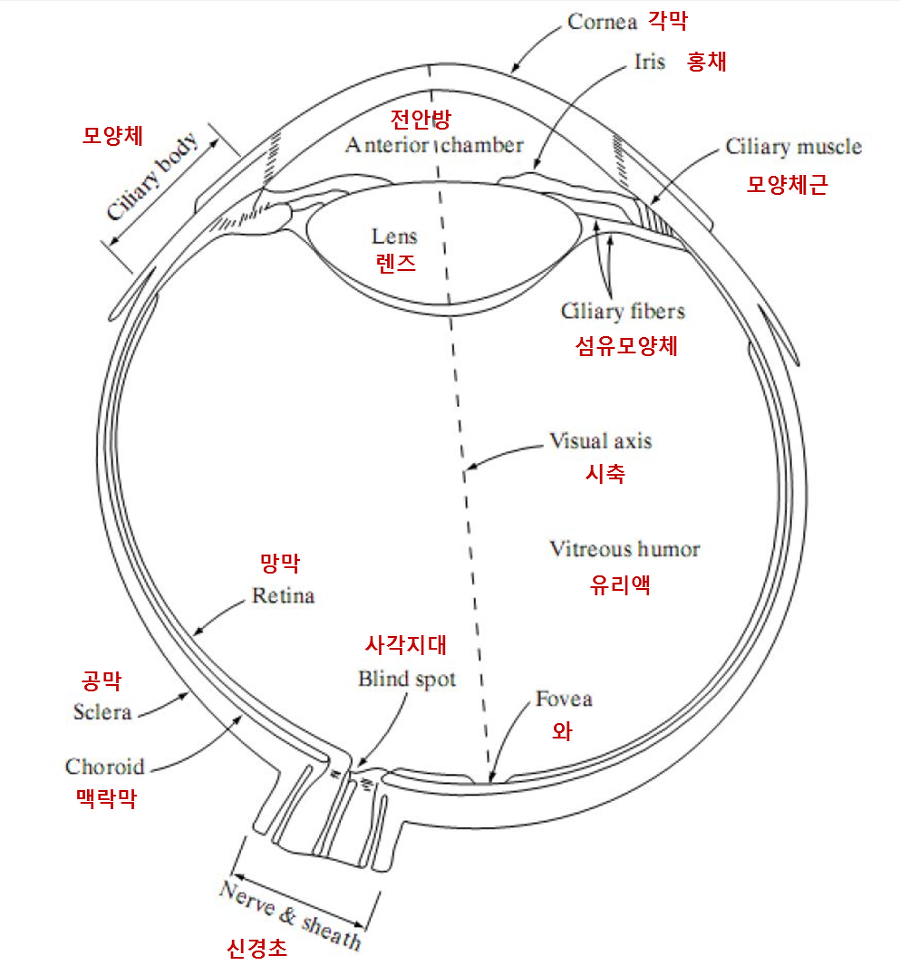
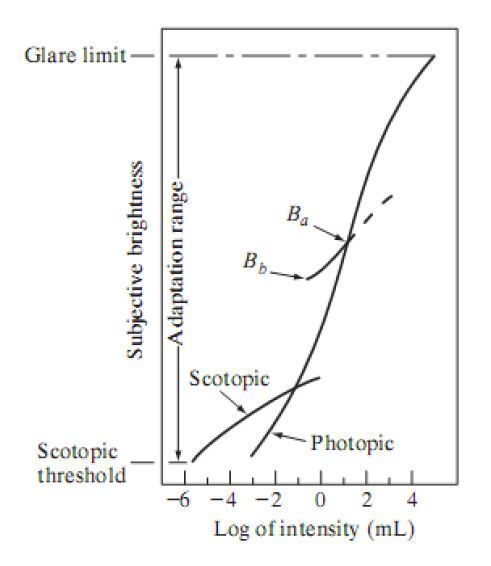
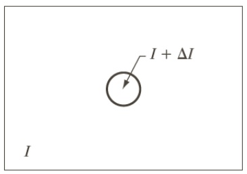
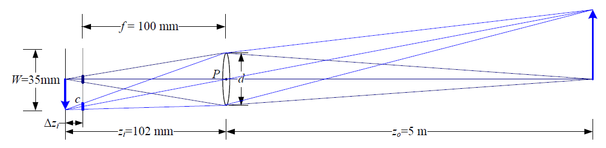
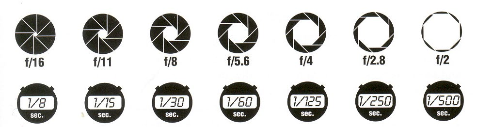

# Introduction to DIP

## Pixel : 픽셀(Pixel)이란 무엇이며, 픽셀의 크기가 작아질수록 어떤 장단점이 있는가?

- 픽셀(Pixel)이란 **이미지를 구성하는 최소 단위**로, 화소라고도 불린다. 픽셀은 각각이 색상 정보와 위치 정보를 가지고 있으며, 이를 조합하여 이미지를 구성힌다.
- 픽셀의 크기가 작아질수록 세밀한 이미지를 구성할 수 있지만, 필요한 저장 용량이 많아지고, 처리 속도가 느려질 수 있다. 또한, 작은 픽셀은 이미지 내의 노이즈와 불안정성을 증가시킬 수 있다.

## Image Digitization : Sampling & Quantization

- **샘플링(Sampling)**
  - Continuous한 데이터들 가운데 적당히 유한한 개수의 데이터를 뽑아내면서, 전체의 패턴을 추정하기 위한 데이터 수집 행위
  - **해상도와 관련**있는 개념이며, 연속적인 신호에서 **일정한 간격으로 샘플을 추출하여 pixel 단위로 나누는 과정**이다.
  - 샘플링은 이미지의 해상도를 줄이거나, 이미지에서 필요한 정보를 추출하는 등의 용도로 사용된다.
    - e.g., 영상에서 일정한 간격으로 픽셀을 추출
- **양자화(Quantization)**
  - **아날로그 형태로 Sampling한 데이터(신호)를 디지털화**하는 작업
  - **bit 수와 관련**있는 개념이며, 연속적인 신호를 분할하여 이산적인 값을 가지도록하는 과정이다.
  - e.g., 이미지에서 픽셀의 색상 값을 8bit의 0~255 사이의 정수 값으로 변환하는 것
- 샘플이 많을수록 해상도가 높아지며, 더 많은 비트 수를 표현할수록 해상도가 높아짐

## Image Enhancement

- 정보는 사라질 수 있어도, (외부의 개입 없이 스스로) 정보의 양은 결코 증가하지 않는다.
- Image Enhancement 시, 정보를 없애면서 특정 부분을 뚜렷하게 만든다.
- e.g.
  - Contrast stretching : Smoothing
  - Edge enhancement : Sharpening

## 디지털 영상 처리 시스템의 주요 구성 요소 (Components of an Image Processing System)

- 영상 습득 장치
  - 스캐너, 카메라 등
- 처리 장치
  - CPU, GPU 등
- 출력 장치
  - 모니터, 프린터 등

## 인간의 눈의 구조

- 각막 : 안구를 보호. 광선의 초기 초점 형성.
- 홍채 : 들어오는 빛의 양 조절.
- 수정체 (Flexible lens) : 상을 망막에 맺게 하는 볼록 렌즈 역할.
- 모양체 (**Ciliary body**) : 수정체 주위의 근육 조직이며, 수정체의 두께를 수정하는 역할. 모양체가 퇴화되면 근시와 원시가 발생할 수 있음.
- 망막 (Retina) : 영상을 감지하는 기관이며, 망막의 상이 맺히면 사물을 볼 수 있음. 원추세포(Cones)와 간상세포(Rods)라는 시세포가 분포.
  - **원추세포 (Cone cell)** : 세 종류의 시색소가 색에 따라 서로 다르게 반응.
  - **간상세포 (Rod cell)** : 빛의 밝기에 민감하지만 색을 잘 구분 못함.
- **중심와 (Fovea)** : **0°**, 원추세포(Cones)가 몰려있고, 간상세포(Rods)가 없음.
- **맹점 (Blind spot)** : 원추세포(Cones)와 간상세포(Rods)가 모두 없음.

### Cones VS. Rods.

- 원추세포 (Cone cell)
  - 색상을 감지하는 세포
  - 망막에는 세가지 종류의 원추세포가 있으며, 종류별로 장파장(Red), 중파장(Green), 단파장(Blue)에 반응
  - 원추세포에 이상이 생기면 색각장애가 나타남
- 간상세포 (Rod cell)
  - 빛의 밝기(명암)을 구분하는 세포

## Brightness Adaptation

사람의 눈은 밝기의 변화를 동시에 인지할 수 없고, 순차적으로 적응한다.

실제 실험에 의해 검증된 인간의 시각 시스템에 의해 인지된 밝기, 일명 주관적 밝기(subjective brightness)는 로그 함수로 나타낼 수 있다. 아래 그림은 이에 대한 결과 그래프이며 빛의 실제 세기에 대해 인간이 인지한 주관적인 밝기의 정도(subjective brightness)를 나타낸 것이다.

- 암순응 (Scotopic)
  - 눈이 갑자기 밝은 곳에서 어두운 곳으로 들어왔을 때
- 명순응 (Photopic)
  - 눈이 어두운 곳에서 밝은 곳으로 나올 때

여기서 한 가지 눈여겨 봐야 하는 것은 인간의 시각 시스템은 이렇게 동적으로 변환되는 범위에서 동시에 작동하지 않는다는 것이다. 오히려 전체 감각을 변화시켜 이러한 큰 변환을 달성한다. 즉 어두운 상황에서 암소시 시스템이 작동하다가 점점 밝아져서 명소시 시스템이 겹쳐서 발생하는 상황이 오면 그때는 명소시 시스템이 작동하게 된다. 이를 **밝기 적응(brightness adaptation)**이라 한다. 또한 어떤 주어진 조건하에서 시각 시스템의 현재의 감각 단계를 **밝기 적응 단계(brightness adaptation level)**라 한다.

## Brightness Discrimination - Weber ratio (the experiment)

- $\Delta I_{c} / I$ : 현재 밝기 대비 얼마나 바뀌어야 밝기 변화를 알아차릴 수 있을까?

## 간단한 이미지 형성 모델 (A Simple Image Formation Model)

- $\textbf{\textit{f}}(x,y) = \textbf{\textit{i}}(x,y) \textbf{\textit{r}}(x,y)$
  - 빛의 강도 = (광원 모델) \* (반사 모델)
- The illumination $(lm/m^{2})$
  - $0<\textbf{\textit{i}}(x,y) < 90000\ (\textrm{full sun})$
- The reflectance
  - $0< \textbf{\textit{r}}(x,y)<1$
  - 0이면 완전 흡수, 1이면 완전 반사

## DSLR (Digital Single Lens Reflex)

### Camera with Lenses

- 공식 : $\frac{1}{f} = \frac{1}{z_{i}}+\frac{1}{z_{o}}$
  - $z_{i}$ : 렌즈에서 물체까지 거리
  - $z_{o}$ : 상이 맺히는 거리

### 조리개 (Aperture)

- 공식
  - **조리개의 지름 = (초점거리 f) / (조리개 값 F)**
  - 주의 ⚠️
    - 조리개 값 (대문자 **F**) ≠ 초점거리 (소문자 **f**)
    - 조리개 값 (F) ≠ 조리개의 지름
- 조리개 값 (F) ↓ → 조리개의 지름 ↑ → 조리개의 크기 ↑ → 조리개를 통과하는 빛의 양 ↑ → 노출의 양 ↑ → 사진의 밝기 ↑
- 조리개 값 (F) ↓ → 조리개의 크기 ↑ → 초점거리 (f) 짧아짐 ↓ → 심도가 얕아짐 → 화각이 넓어짐

### 셔터 스피드 (Shutter Speed)

- 셔터 스피드 ↓ → 빛의 양 ↑ → 역동적인 사진 (흔들림)
- 셔터 스피드 ↑ → 빛의 양 ↓ → 빠른 움직임도 순간 포착한 사진

### 노출 (Exposure)

- Two main paramters
  - Shutter speed : 셔터를 얼마나 오랫동안 열었는가?
  - Aperture (area of lens) : 조리개가 얼마나 큰가?

### **Reciprocity** between **shutter speed** and **aperture**

**(조리개 값 F √2배 증가 → 조리개 크기 2배 감소) ↔ (셔터스피드 2배 증가)**

# References

1. 디지털영상처리설계 (ICE4027), 인하대학교 정보통신공학과 박인규
2. Digital Image Processing 4th Edition, Rafael C. Gonzalez and Richard E. Woods
3. [Computer Vision: Algorithms and Applications 2nd Edition, Richard Szeliski](https://szeliski.org/Book/)
4. [[디지털 영상처리] 디지털 영상 (2) — 끄적끄적 코딩](https://j3sung.tistory.com/410)
5. [Digital Image Fundamentals #시각 인지의 요소 — Learn Again! 러너게인](https://twlab.tistory.com/11)
