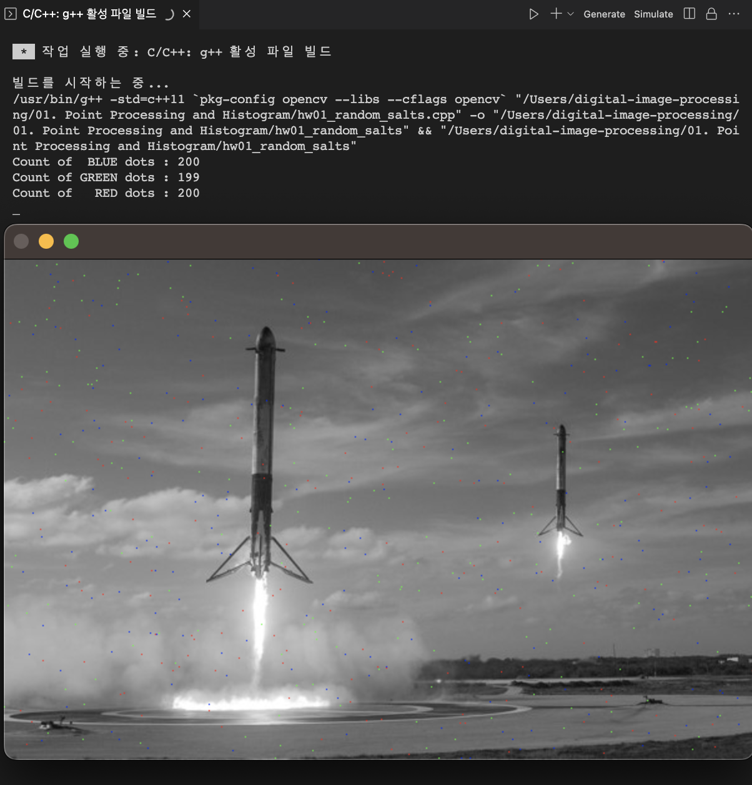
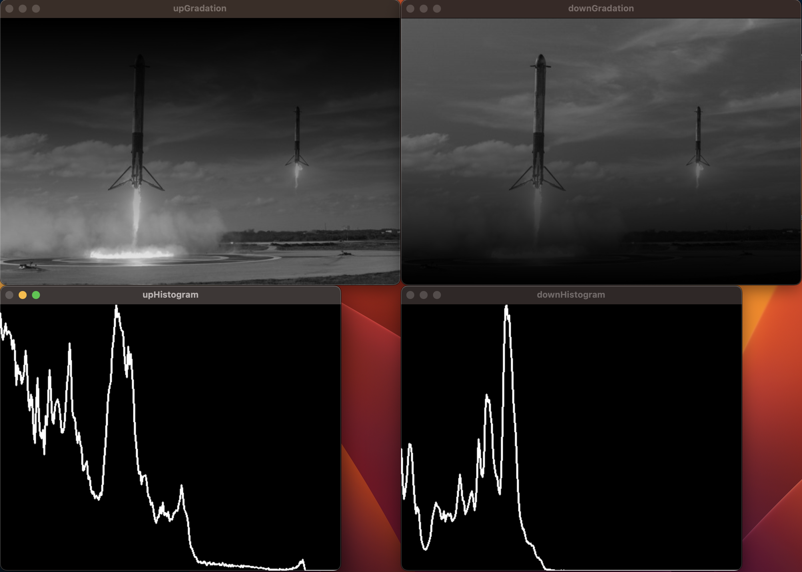
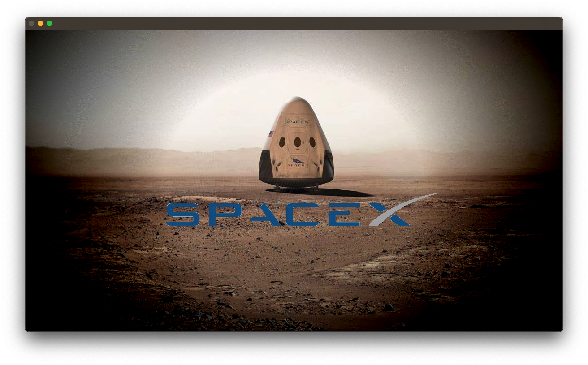

# Point Processing and Histogram

## 1. 개요

### hw01

- 주어진 영상(img1.jpg)에 빨강, 파랑, 초록 색의 점을 각각 설정한 개수만큼 무작위로 생성하는 프로그램을 작성할 것
- 앞서 생성한 영상에서 빨강, 파랑, 초록색의 점을 각각 카운트하는 프로그램을 작성하고 카운트 결과가 실제와 일치하는지 검증할 것

### hw02

- 주어진 영상을 이용해(img2.jpg) "위로 갈수록 점점 어두워지는 영상"과 "아래로 갈수록 점점 어두워지는 영상" 두 개를 생성하는 프로그램을 작성하고(픽셀 값 접근을 이용) 히스토그램 일치 여부를 확인 및 그러한 결과가 나온 이유를 분석할 것

### hw03

- img3.jpg, img4.jpg, img5.jpg을 이용해 제시한 영상을 완성할 것

## 2. 상세 설계 내용

### hw01) 영상에 RGB의 점을 각각 설정한 개수만큼 무작위로 생성하는 프로그램

```cpp
void spreadRGBSalts(Mat img, int num[])
{
    for (int color = 0; color < 3; color++)
    {

        for (int i = 0; i < num[color]; i++)
        {
            int x = rand() % img.cols;
            int y = rand() % img.rows;

            if (color == 0)
            {
                img.at<Vec3b>(y, x)[0] = 255; // blue
                img.at<Vec3b>(y, x)[1] = 0;
                img.at<Vec3b>(y, x)[2] = 0;
            }

            else if (color == 1)
            {
                img.at<Vec3b>(y, x)[0] = 0;
                img.at<Vec3b>(y, x)[1] = 255; // green
                img.at<Vec3b>(y, x)[2] = 0;
            }

            else if (color == 2)
            {
                img.at<Vec3b>(y, x)[0] = 0;
                img.at<Vec3b>(y, x)[1] = 0;
                img.at<Vec3b>(y, x)[2] = 255; // red
            }
        }
    }
}
```

spreadRGBSalts 함수는 img의 임의의 위치에 RGB 색상의 점을 찍는 함수이다. for문을 순회하면서 img 상의 임의의 좌표인 x와 y를 정하고, color가 0이면 blue, 1이면 green, 2이면 red 점을 찍는다.

### hw01) 앞서 생성한 영상에서 RGB의 점을 각각 카운트하는 프로그램

```cpp
void countRGBSalts(Mat img)
{
    int num[3] = {};

    for (int i = 0; i < img.rows; i++)
    {
        for (int j = 0; j < img.cols; j++)
        {
            if (img.at<Vec3b>(i, j)[0] == 255 && img.at<Vec3b>(i, j)[1] == 0 && img.at<Vec3b>(i, j)[2] == 0) // blue
            {
                num[0]++;
            }

            else if (img.at<Vec3b>(i, j)[0] == 0 && img.at<Vec3b>(i, j)[1] == 255 && img.at<Vec3b>(i, j)[2] == 0) // green
            {
                num[1]++;
            }
            else if (img.at<Vec3b>(i, j)[0] == 0 && img.at<Vec3b>(i, j)[1] == 0 && img.at<Vec3b>(i, j)[2] == 255) // red
            {
                num[2]++;
            }
        }
    }

    cout << "Count of  BLUE dots : " << num[0] << endl;
    cout << "Count of GREEN dots : " << num[1] << endl;
    cout << "Count of   RED dots : " << num[2] << endl;
}
```

countRGBSalts 함수는 픽셀 값 접근을 이용하여 img 속에서 찍힌 RGB 점의 개수를 세는 함수이다. 주어진 이미지가 grayscale이므로, 이미지에서 RGB 3채널의 색을 가지는 픽셀의 수를 계산함으로써 구현하였다.

### hw02) 픽셀 값 접근을 이용하여 "위로 갈수록 점점 어두워지는 영상"과 "아래로 갈수록 점점 어두워지는 영상" 두 개를 생성하는 프로그램을 작성하고, 히스토그램 일치 여부를 확인

```cpp
// 위로 갈수록 점점 어두워지는 영상을 만드는 함수
void upGradation(Mat img)
{
    for (int i = 0; i < img.rows; i++)
    {
        for (int j = 0; j < img.cols; j++)
        {
            img.at<uchar>(i, j) = img.at<uchar>(i, j) * ((double)i / img.rows);
        }
    }
}
```

위 upGradation 함수는 위로 갈수록 어두워지는 영상을 만드는 함수이다. 이중 for문을 이용하여 모든 픽셀 값에 대해 접근하고 각 행에 대해 i / img.rows를 곱해주었다. 이를 통해 위로 갈수록 더 낮은 값이 곱해지기 때문에, 점점 어두워지는 효과를 구현할 수 있었다.

```cpp
// 아래로 갈수록 점점 어두워지는 영상을 만드는 함수
void downGradation(Mat img)
{
    for (int i = 0; i < img.rows; i++)
    {
        for (int j = 0; j < img.cols; j++)
        {
            img.at<uchar>(i, j) = img.at<uchar>(i, j) * (1 - ((double)i / img.rows));
        }
    }
}
```

위 downGradation 함수는 아래로 갈수록 어두워지는 영상을 만드는 함수이다. 이중 for문을 이용하여 모든 픽셀 값에 대해 접근하고 각 행에 대해 1 - (i / img.rows)를 곱해주었다. upGradation 함수와 유사하지만, 아래로 갈수록 더 낮은 값이 곱해지기 때문에, 점점 어두워지는 효과를 구현할 수 있었다.

### hw03) img3.jpg, img4.jpg, img5.jpg을 이용해 제시한 영상 제작

img3.jpg, img4.jpg, img5.jpg은 각각 배경이 되는 사진, 비네팅 효과를 주기 위한 사진, 배경에 삽입할 로고사진이다.

만들고자 하는 영상은 img5.jpg에서 흰색 부분을 제외한 로고 부분만을 뽑아낸 뒤, img3.jpg에 img4.jpg를 산술 연산한 영상과 합친 영상이다.

img3.jpg와 img4.jpg를 산술 연산하기 위해서 아래와 같이 코드를 구현하였다.

```cpp
Mat srcImg = imread(SRC_PATH + "img3.jpg", 1);
Mat maskImg = imread(SRC_PATH + "img4.jpg", 1);
resize(maskImg, maskImg, Size(srcImg.cols, srcImg.rows)); // maskImg의 크기를 srcImg의 크기와 같도록 설정

Mat dstImg = srcImg - maskImg;
```

또한, img5.jpg에서 흰색 부분을 제외한 로고 부분만을 뽑아낸 뒤, img3.jpg에 img4.jpg를 산술 연산한 영상과 합치는 동작을 구현하기 위해 아래와 같은 insertTransparentLogo 함수를 설계하였다.

```cpp
Mat insertTransparentLogo(Mat background, Mat logo)
{
    int logoRows = background.rows / 2;
    int logoCols = background.cols / 4;

    Mat grayLogo;
    cvtColor(logo, grayLogo, CV_BGR2GRAY); // 흑백으로 만들어 grayLogo에 저장

    Mat binaryLogo;
    threshold(grayLogo, binaryLogo, 178, 255, THRESH_BINARY); // THRESH_BINARY로 영상을 이진화

    for (int i = 0; i < logo.rows; i++)
    {
        for (int j = 0; j < logo.cols; j++)
        {
            // binaryLogo에서 흰색(255)이 아닌 경우, background의 3채널 픽셀 데이터에 logo의 3채널 픽셀 데이터를 대입함
            // 참고 : https://diyver.tistory.com/99
            if (binaryLogo.at<uchar>(i, j) != 255) // grayscale 영상의 행렬 좌표로 픽셀 데이터를 접근할 때에는 <Vec3b> 대신에 <uchar>를 사용
            {
                background.at<Vec3b>(i + logoRows, j + logoCols)[0] = logo.at<Vec3b>(i, j)[0];
                background.at<Vec3b>(i + logoRows, j + logoCols)[1] = logo.at<Vec3b>(i, j)[1];
                background.at<Vec3b>(i + logoRows, j + logoCols)[2] = logo.at<Vec3b>(i, j)[2];
            }
        }
    }

    return background;
}
```

위 insertTransparentLogo 함수는 합성할 background 영상과 logo 영상을 파라미터로 받는다. 그 중 logo 영상의 흰색 바탕 부분을 제거하기 위해, grayscale로 변환한 후, THRESH_BINARY로 영상을 이진화하는 과정을 거친다. 이후, 이중 for문을 순회하면서 이진영상의 픽셀 데이터가 흰색(255)이 아닌 경우, background의 3채널 픽셀 데이터에 logo의 3채널 픽셀 데이터를 대입함으로써 영상을 합성한다.

## 3. 실행 결과

### hw01

앞서, 영상에 RGB의 점을 각각 설정한 개수만큼 무작위로 생성하는 함수인 spreadRGBSalts 함수와 생성한 영상에서 RGB의 점을 각각 카운트하는 함수인 countRGBSalts 함수를 구현하였다.

아래 사진은 위 함수들을 이용하여 img1.jpg에 빨강, 파랑, 초록색의 점을 각각 설정한 개수만큼 무작위로 생성한 후, 각각의 점들을 카운트한 결과를 나타낸 사진이다.



사진의 아랫부분을 확인해보면, 기존 img1.jpg에 빨강, 파랑, 초록색의 점이 무작위로 찍힌 것을 확인할 수 있다.

사진의 윗부분에는 countRGBSalts를 통해 각각의 점들을 카운트한 결과가 출력된 것을 확인할 수 있다.

### hw02

위로 갈수록 점점 어두워지는 영상을 만드는 upGradation 함수와 아래로 갈수록 점점 어두워지는 영상을 만드는 downGradation 함수를 통해 두가지의 영상을 생성했다. 아래 사진은 두 종류의 영상과 각각의 히스토그램을 나타낸 것이다.



왼쪽 윗 부분은 위로 갈수록 어두워지는 영상이며, 왼쪽 아랫 부분은 그 영상의 히스토그램이다. 마찬가지로, 오른쪽 윗 부분은 아래로 갈수록 어두워지는 영상이며, 오른쪽 아랫 부분은 그 영상의 히스토그램이다.

히스토그램은 픽셀 값의 분포를 나타낸 그래프를 의미하며, 가능한 모든 픽셀 레벨에 대한 카운트로 구할 수 있다.

생성한 히스토그램의 X축은 색의 강도(0~255), Y축은 X축에 해당하는 색의 개수를 의미한다. 두 히스토그램 모두 생성한 영상의 밝기의 분포와 일치하는 것을 확인할 수 있다.

### hw03



결과가 주어진 목표처럼 배경 영상에 비네팅 효과를 주고, 로고에서 흰색 부분 없이 영상이 합쳐진 것을 확인할 수 있다.

## 4. 결론 및 고찰

hw01에서 점의 개수를 200개로 설정하였을 때, 빨강색과 파랑색 점은 200개로 나타났지만, 초록색 점의 개수는 199개로 나타났다. 이는 초록색 점으로 찍힌 점 위에, 빨강색 점이 중복으로 덮어씌워지면서 개수가 줄어든 것으로 유추할 수 있다.

hw02에서 생성한 두 종류의 히스토그램은, 원본 영상인 img2.jpg의 상단과 하단에 밝기 변화를 주었기 때문에 서로 다른 모양을 가지는 것을 확인할 수 있다. 또한, 위로 갈수록 어두워지는 영상의 히스토그램을 보았을 때, 아래로 갈수록 어두워지는 영상의 히스토그램보다 밝은 영역의 분포가 많은 것을 확인할 수 있다. 이는 원본 영상(img2.jpg)의 하단 부분(로켓을 발사하면서 빛을 내는 부분)이 유지되었기 때문으로 보인다.
