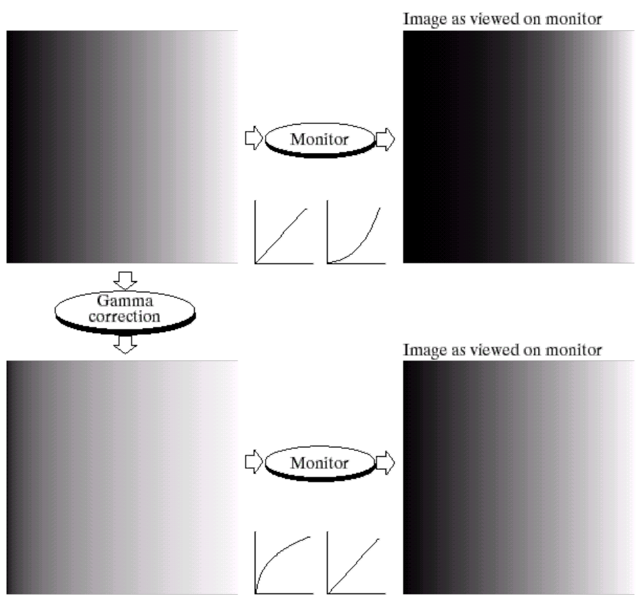

# Point Processing and Histogram

포인트 처리(Point processing)이란, 영상의 개별 픽셀 값을 조정하여, **주변 화소에 관계없이 독립적으로** 밝기나 대비를 변경하는 것을 말한다.

## Pixel Transforms

### Image negatives

### Log transform

 
(좌): $\mathcal{F.T.}$ / (우): $\log(\mathcal{F.T.})$

### Contrast Stretching

영상의 최소 및 최대 명암값을 직접 조정하는 작업

### Gray-Level Slicing

 

- A~B 구간에 속하는 밝기만 강조한다.
- 나머지 구간의 밝기는 낮추거나 강조한다.

### Gamma Correction

 
(**좌상단**): 원본 영상 / (**우상단**): 원본 영상을 모니터로 봤을 때 
(**좌하단**): 원본 영상을 Gamma correction으로 보정한 영상 / (**우하단**): 보정한 영상을 모니터로 봤을 때 - 역함수 관계가 되며 원본 영상과 유사해짐

### Bit-Plane Slicing

- 하나의 영상을 bit 단위로 쪼갤 수 있다.
  - e.g., Bit-Plane : 8 bit라면 영상을 8개로 쪼갤 수 있음

 

 
왼쪽에서부터 오른쪽 순서대로: 원본 영상, 0 (MSB), 1, 2, 3, 4, 5, 6, 7 (LSB)

- 큰 bit (MSB)일수록 인접한 영역과 같은 값을 가질 확률이 크다.

## Histogram Processing

영상의 히스토그램이란 영상에서 각 픽셀 값이 등장한 횟수의 분포를 나타내는 그래프이다. 히스토그램을 이용하면 영상의 명암 대비를 조절하거나, 노이즈 제거 등의 영상 처리를 수행할 수 있다.

- 낮은 대비의 영상은 주로 중간 부분에 픽셀값이 집중되어 있다
- 높은 대비의 영상은 낮은 대비의 영상에 비해 전체적으로 픽셀값이 분포되어 있다.

### 히스토그램 평활화 (Histogram Equalization)

- 히스토그램 평활화 (Histogram Equalization)는 이미지의 명암 대비를 향상시키기 위해, **히스토그램의 분포를 균등하게 만들어 평탄화**하는 방법이다. 이를 위해 각 픽셀의 밝기 값을 전체 영상에서 출현 빈도에 따라 정규화하는 작업을 수행한다.

#### 예제: 히스토그램 평활화 과정

사진 출처 : [Histogram Equalization (히스토그램 평활화) 알아보기 — gaussian37](https://gaussian37.github.io/vision-concept-histogram_equalization/)

- (1) 영상의 히스토그램 준비
  - 영상은 4bits/pixel, 해상도는 18X20 이라고 가정.

- (2) 히스토그램을 바탕으로 누적합 계산
  - `1` - Gray Level $i$ : 영상의 픽셀 값.
  - `2` - $n_{i}$ : 각 gray level의 빈도 수.
  - `3` - $\sum n_{i}$ : 빈도 수의 누적합. 누적합의 최종 결과는 해상도인 $360$과 같다.
  - `4` - $\frac{15}{360}\sum n_{i}$ : gray level의 총 갯수는 $15$개 (일반적 이미지에서는 8bit를 사용하므로 255) 이고, 누적합이 $360$이므로 각 gray level 별 누적합에 $\frac{15}{360}$을 곱해준다.
  - `5` - Round Value : `4`에서 계산한 결과를 반올림.

- (3) 균등하게 분포된 히스토그램 결과

#### Histogram Equalization을 통해 변환된 히스토그램이 균등(uniform)하지 않은 이유는 무엇인가?

- Histogram Equalization을 통해 변환된 히스토그램이 완전히 균등(uniform)하지 않은 이유는, 원본 이미지의 특성과 명암 분포에 따라 변환 과정에서 균등한 분포를 완벽하게 달성하기 어렵기 때문이다.

#### Histogram Equalization을 두 번 연속 수행하면 결과가 어떻게 될 것인가? 그 이유는 무엇인가?

- 첫번째 연산의 결과와 두번째 연산의 결과는 다를 수 있지만, 유사한 결과를 가질 것이다. 첫번째 연산에서 히스토그램이 이미 균일화되기 때문이다.
- 두번째 연산에서는 히스토그램의 분포가 미세하게 달라질 수 있지만, 첫번째 연산에서의 결과와 크게 달라지지 않을 것이다.

#### Contrast Stretching과 Histogram Equalization를 사용한 결과는 유사한가?

- Contrast Stretching은 Histogram Equalization과 유사한 결과를 얻을 수는 있지만, 두 방법은 다른 알고리즘을 사용하므로 결과는 다를 수 있다.

### 히스토그램 스트레칭 (Histogram Stretching)

- Contrast Stretching
  - 영상의 최소 및 최대 명암값을 직접 조정
- Histogram Stretching
  - 히스토그램의 최소 및 최대값을 0~255로 늘림

#### Histogram Stretching을 두 번 연속 수행하면 결과가 어떻게 될 것인가? 그 이유는 무엇인가?

- Histogram Stretching은 영상의 최대 최소 화소값을, 영상이 가질 수 있는 화소값의 최대 최소로 맵핑하면서 늘리는 과정이다.
- 8bits 영상이라고 가정할 때, 첫번째 연산을 수행하면, 영상의 최소 화소값은 0으로 맵핑되고 최대 화소값은 255로 맵핑된다.
- 두번째 연산을 수행할 때, 영상의 최대 최소 화소값은 첫번째 연산에서 이미 영상이 가질 수 있는 화소값의 최대 최소인 255와 0으로 맵핑되었으므로, 결과가 달라지지 않을 것이다.

#### Contrast Stretching이 Histogram Stretching과 유사한 결과를 얻을 수 있는가?

- Histogram Stretching은 특정한 알고리즘을 통해 이미지의 히스토그램을 변경하는 방법이고, Contrast Stretching은 이미지의 최소 및 최대 명암값을 직접 조정하는 방법이므로 다른 결과를 얻을 것이다.

#### Histogram Stretching과 Histogram Equalization를 사용한 결과는 유사한가?

- Histogram Stretching은 이미지의 최소 및 최대 명암값을 조정하여 이미지의 대비를 조정한다.
- 이에 비해 Histogram Equalization은 이미지의 명암 분포를 균등하게 만들어 이미지의 대비를 개선하는 방법이다.
- 두 방법은 서로 다른 방법이므로 결과도 다를 수 있다.

#### Histogram Stretching과 Histogram Equalization 중에서 일반적으로 영상의 명암대비를 더 잘 개선할 수 있는 방법은 무엇인가?

- Histogram Equalization이 영상의 명암대비를 더 잘 개선할 수 있는 방법이다.
- '명암대비를 더 잘 개선한다.'는 것은 영상의 어두운 영역과 밝은 영역의 차이를 명확하게 하는 것이다.
- Histogram Equalization은 영상의 픽셀 값 분포를 균등하게 평탄화시켜 전체 명암대비를 개선하고, 결과적으로 영상의 선명도를 향상시키는 효과가 있다.
- 반면, Histogram Stretching은 단순히 픽셀 값의 범위를 늘리는 방법이라 일부 영역의 명암대비 개선이 제한적일 수 있다. 영상의 히스토그램이 전체 범위에 걸쳐 균등하게 분포되어 있지 않은 경우, 명암대비가 개선되지 않을 수도 있다.

#### 어떤 경우에 Histogram Stretching과 Histogram Equalization 두 연산이 동일한 효과를 가질 것인가?

- 영상의 히스토그램이 화소값이 가질 수 있는 최대최소 범위에서 모두 고르게 분포되어 있는 경우에 두 연산이 동일한 효과를 가질 것이다.

# References

1. 디지털영상처리설계 (ICE4027), 인하대학교 정보통신공학과 박인규
2. Digital Image Processing 4th Edition, Rafael C. Gonzalez and Richard E. Woods
3. [Computer Vision: Algorithms and Applications 2nd Edition, Richard Szeliski](https://szeliski.org/Book/)
4. [디지털 영상 처리 - 밝기 변환 함수 — Everyday Image Processing](https://everyday-image-processing.tistory.com/128)
5. [디지털 영상 처리 - 히스토그램 평활화(Histogram Equalization) — Everyday Image Processing](https://everyday-image-processing.tistory.com/131)
6. [Histogram Equalization (히스토그램 평활화) 알아보기 — gaussian37](https://gaussian37.github.io/vision-concept-histogram_equalization/)
