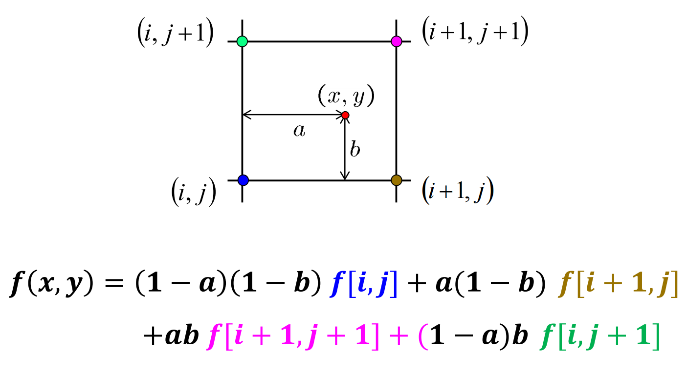

# Filtering in Spatial Domain

- Linear Filters
  - Gaussian Filter
- Non-Linear Filters
  - Sobel Filter
  - Median Filter
  - Bilateral Filter
- Pyramids
  - Gaussian Pyramid
  - Laplacian Pyramid

## Fundamentals of Spatial Filtering

### Convolution Filtering VS. Correlation Filtering

- Convolution은 두 개의 함수를 취해서 새로운 함수를 생성하는 연산이다.
  - 2D Convolution Filtering은 Convolution Filter가 **180도 뒤집혀서 (flipping)** 연산된다.
- 반면, Correlation은 두 함수 사이의 유사성을 측정하는 연산이다. 하나의 함수를 다른 함수와 비교하여 얼마나 유사한지 측정한다.
  - 2D Correlation Filtering은 Convolution Filtering과 동일하지만, Filter가 **flipping 되지 않는다**.

### Box Filtering

- 각 픽셀을 주변 이웃들의 평균으로 바꾼다.
- 날카로운 특징들을 제거하여 스무딩 효과를 준다.

## Filters

| 필터 이름        | 특징                                                                                                                                                                                                                                                        | 선형성 | 사용 목적                          | 연산량          | 장점                                                                                                                                                        | 단점                                                                                                                                                           |
| ---------------- | ----------------------------------------------------------------------------------------------------------------------------------------------------------------------------------------------------------------------------------------------------------- | ------ | ---------------------------------- | --------------- | ----------------------------------------------------------------------------------------------------------------------------------------------------------- | -------------------------------------------------------------------------------------------------------------------------------------------------------------- |
| Gaussian Filter  | - 부드러운 블러 효과를 가지며, 가우시안 분포를 기반으로 한다. - σ가 커질수록 블러 효과가 더 커진다. - Rotation Invariant: 영상이 회전해도 같은 값을 갖게 만들어준다. - Separability: 2차원 필터는 1차원 필터를 두 번 씌우는 것으로 대체할 수 있다. | 선형   | 블러 효과, 노이즈 제거             | 상대적으로 낮음 | - 이미지의 세부 특징을 보존하며 노이즈를 제거할 수 있음                                                                                                     | - blur가 심해질수록 세부적인 정보가 손실됨  - Edge 보존 효과가 낮을 수 있음                                                                                 |
| Sobel Filter     | - 이미지의 경계(Edge)를 검출하기 위해 이미지의 픽셀 값에 대한 그라디언트를 계산한다. - Edge를 계산하는 필터이므로, 필터의 합이 0이다.                                                                                                                    | 비선형 | Edge 검출, 경계 영역 검출          | 상대적으로 낮음 | - Edge 정보를 정확하게 추출하여 이미지의 특징을 강조  - 간단한 연산으로 빠른 처리 가능- 간단한 연산으로 빠른 처리 가능                                   | - 노이즈에 민감하며, 경계선이 뚜렷하지 않은 경우 성능이 저하됨                                                                                                 |
| Median Filter    | - 이미지의 중간값(median value)을 계산하여 smoothing을 수행한다.                                                                                                                                                                                            | 비선형 | 노이즈 제거, 픽셀 값의 극단치 제거 | 중간            | - Salt-and-Pepper 노이즈를 효과적으로 제거할 수 있음   - 경계선을 보존하는 데 유리함 (Gaussian Filter에 비해 노이즈를 제거한 이후에도 boundary가 명확함) | - 주변 픽셀 값의 중앙값을 사용하기 때문에 이웃 픽셀 값들의 영향을 받아 세부적인 특징이 흐려질 수 있음  - 필터 윈도우 크기에 따라 성능이 크게 달라질 수 있음 |
| Bilateral Filter | - 가우시안 필터와 유사하게 이미지를 smoothing하지만, 거리와 픽셀 값의 차이를 모두 고려하여 weight를 계산한다. - space weight, range weight 두 개의 파라미터를 가진다. (range weight가 무한대가 되면 Gaussian blur와 동일한 필터가 된다.)                 | 비선형 | 노이즈 제거, Edge 보존             | 높음            | - edge를 보존하면서 smoothing을 수행할 수 있음                                                                                                              | - 계산 복잡성이 높아 속도가 느릴 수 있음  - 노이즈에 따라 성능이 변할 수 있음  - 경계선의 부정확한 보존 가능성이 있음                                    |

### Practiacal Matters

- Gaussian Filter의 크기의 선택: Rule of thumb for Gaussian
  - Gaussian Filter의 크기를 정할 때, **필터의 절반이 σ의 3배가 되도록** 정한다.
- 영상의 edge 근방을 처리하는 방법
  - Clip filter
  - Wrap around
  - Copy edge
  - Reflect across edge

## Pyramids

Pyramids: 영상 자체의 스케일을 다중 해상도로 표현한 것이다.

| 필터/피라미드     | 정의                                                                                                                            | 사용 목적                                               | 연산 과정                                                                                                                | 장점                                                                                      | 단점                                                                  | 적용 분야                                               |
| ----------------- | ------------------------------------------------------------------------------------------------------------------------------- | ------------------------------------------------------- | ------------------------------------------------------------------------------------------------------------------------ | ----------------------------------------------------------------------------------------- | --------------------------------------------------------------------- | ------------------------------------------------------- |
| Gaussian Filter   | 이미지를 부드럽게 만들기 위한 필터. 주변 픽셀들의 가중치를 고려하여 중심 픽셀을 계산한다.                                       | 이미지 노이즈 제거, 부드러운 이미지 생성                | 입력 이미지와 Gaussian 커널을 합성곱 연산                                                                                | 노이즈 제거 효과가 좋으며, 이미지의 부드러운 느낌을 강조할 수 있다.                       | 이미지 선명도가 감소할 수 있음                                        | 이미지 노이즈 제거, 부드러운 이미지 생성, 이미지 전처리 |
| Gaussian Pyramid  | 이미지를 다양한 크기로 축소시키고, 세부 정보를 유지하는 피라미드.                                                               | 이미지의 다양한 해상도 표현, 이미지 피라미드 생성       | 이미지를 다운샘플링하여 다양한 해상도의 이미지 생성                                                                      | 이미지를 다양한 해상도로 변환하여 보다 정확한 이미지 분석 가능                            | 이미지의 크기를 줄이면서도 이미지의 세부 정보가 손실될 가능성이 있다. | 이미지 피라미드 생성, 이미지 크기 조절                  |
| Laplacian Pyramid | Gaussian Pyramid에서 생성된 이미지 피라미드에서 높은 해상도 이미지에서 낮은 해상도 이미지를 빼는 연산을 수행한 이미지 피라미드. | 레벨 간의 경계 정보 추출이나, 이미지를 복원하는 데 사용 | Gaussian Pyramid에서 생성된 이미지를 업샘플링하여 이미지를 보강한 후, Gaussian Pyramid에서 생성된 이미지와의 차이를 계산 | 레벨 간의 경계 정보를 강조한 이미지 생성하는 데 유용하며, 이미지 복원에도 사용할 수 있다. | 이미지를 재구성할 때, 정보 손실이 발생할 수 있음                      | 이미지 피라미드를 활용한 경계 검출, 이미지 복원         |

## Template Matching: 유사도 측정

- (1) Correlation
- (2) Zero-mean correlation
- (3) SSD; Sum of square difference
- (4) NCC; Normalized cross correlation

### (1) Correlation

- 템플릿 자체를 필터로 사용하는 Correlation 방식은 문제가 있다.
- Correlation의 결과값은 필터와 영상의 곱으로 이뤄지는데, 영상 자체의 값이 크다면, 결과값도 함께 커지게 된다.

### (2) Zero-mean correlation

- Correlation 방식을 보완하기 위해, 원본 영상에서 원본 영상의 평균값을 뺀 영상을 사용한다.
- 여전히 False Detections가 나타날 수 있다.

### (3) SSD; Sum of square difference

$$h[m,n]=\sum_{k, l}\left ( g[k,\ l]-f[m+k,\ n+l] \right )^{2}$$

- Correlation 방식이나 Zero-mean correlation 방식에 비해, False Detection이 나타나지 않는다.
- 수식이 간단하여 계산 속도가 빠르다.
- 하지만, 찾고자하는 부분이 다른 부분보다 어두울 경우, SSD는 밝기 변화와 대조 변화에 민감하기 때문에 결과가 완전히 부정확해질 수 있다.

### (4) NCC; Normalized cross correlation

$$h[m,n]=\frac{\textup{E}\left [ \left (f-m_{f}  \right )\left ( g-m_{g} \right ) \right ]}{\sigma_{f}\sigma_{g}}\\ = \frac{\sum_{k, l}\left ( g[k,\ l]-\bar{g}\right )\left ( f[m+k,\ n+l]-\bar{f}_{m,n} \right )}{\sqrt{\sum_{k, l}\left ( g[k,\ l]-\bar{g}\right )^{2}\cdot \sum_{k, l}\left ( f[m+k,\ n+l]-\bar{f}_{m,n}\right )^{2}}}$$

- SSD 방식보다 밝기 변화와 대조 변화에 강건해서, 성능이 좋다.
- 하지만 수식이 복잡하고 계산량이 많아 계산 속도가 느리다.

## Image Warping

Image Warping: 이미지의 domain(공간)을 변화시키는 것

 

### (1) Forward Warping

### (2) Backward Warping (=Inverse Warping)

#### Bilinear Interpolation

Backward Warping 기법은 원본 영상에서 픽셀값을 가져올 때, **Bilinear Interpolation** 기법을 사용한다.

