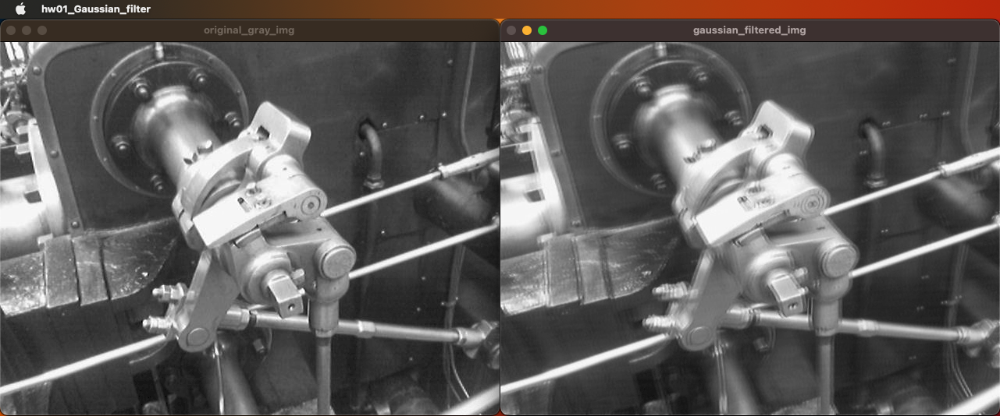
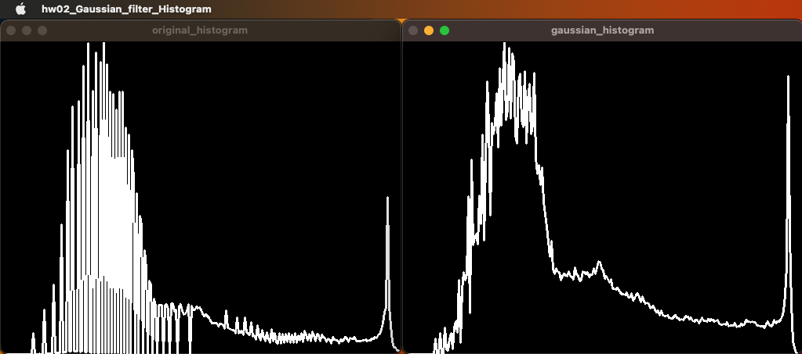
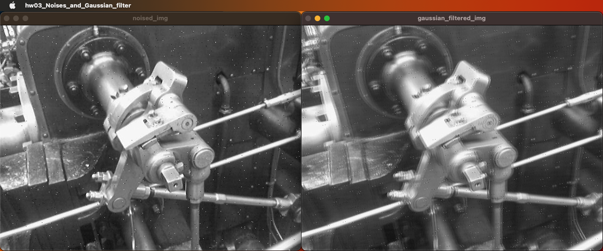
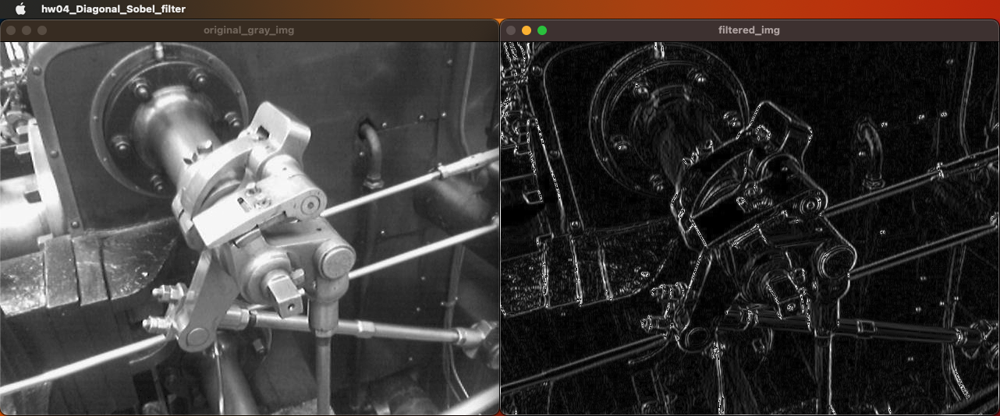
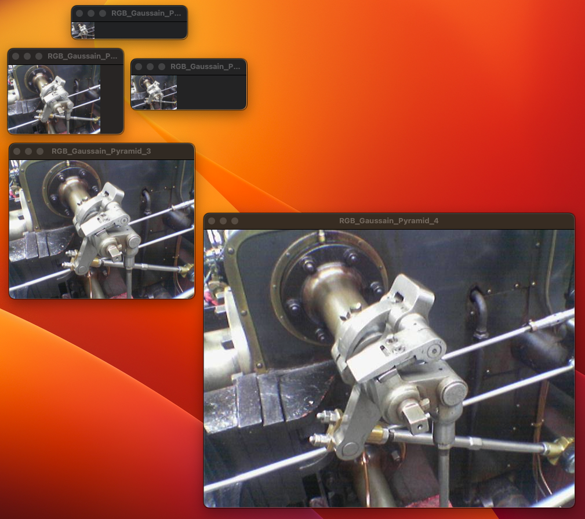
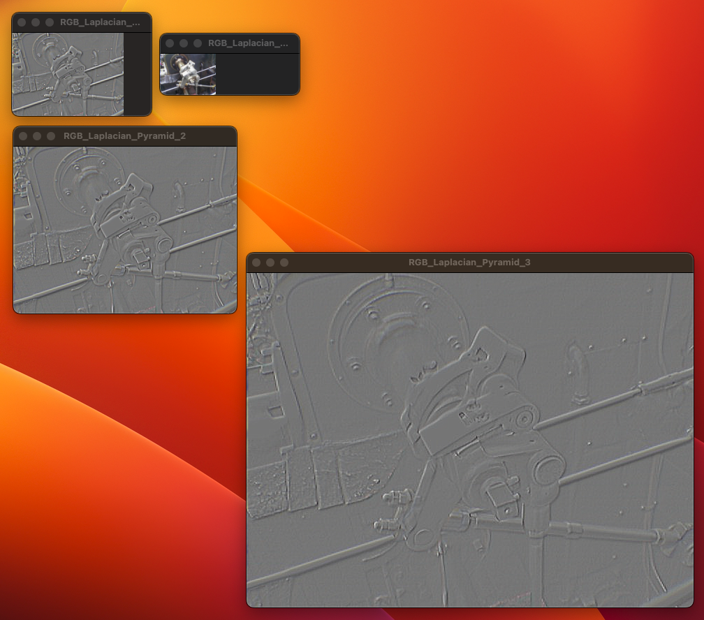
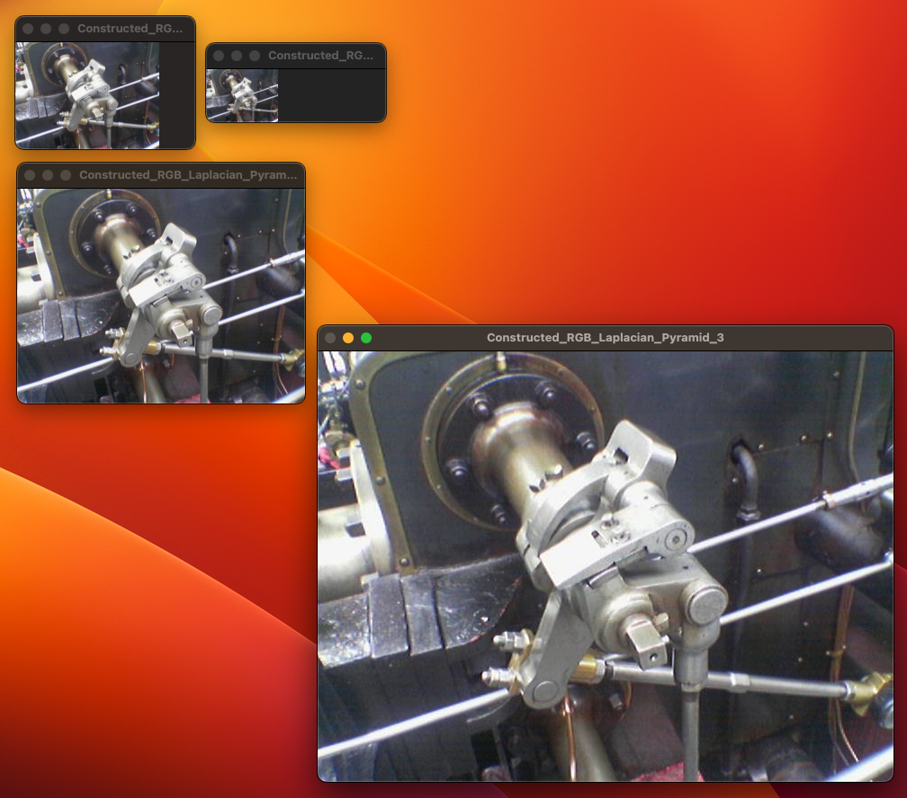

# Linear Filtering

## 1. 개요

- HW01 : 9x9 Gaussian filter를 구현하고 결과를 확인할 것
- HW02 : 9x9 Gaussian filter를 적용했을 때 히스토그램이 어떻게 변하는지 확인할 것
- HW03 : 영상에 Salt and pepper noise를 주고, 구현한 9x9 Gaussian filter를 적용해볼 것
- HW04 : 45도와 135도의 대각 에지를 검출하는 Sobel filter를 구현하고 결과를 확인할 것
- HW05 : 컬러영상에 대한 Gaussian pyramid를 구축하고 결과를 확인할 것
- HW06 : 컬러영상에 대한 Laplacian pyramid를 구축하고 복원을 수행한 결과를 확인할 것

## 2. 상세 설계 내용

### HW01 : 9x9 Gaussian filter를 구현하고 결과를 확인할 것

```cpp
double myKernelConv9x9(uchar *arr, double kernel[9][9], int x, int y, int width, int height)
{
    double sum = 0;
    double sumKernel = 0;

    // 특정 화소의 모든 이웃화소에 대해 계산하도록 반복문 구성
    for (int j = -4; j <= 4; j++)
    {
        for (int i = -4; i <= 4; i++)
        {
            if ((y + j) >= 0 && (y + j) < height && (x + i) >= 0 && (x + i) < width)
            // 영상 가장자리에서 영상 밖의 화소를 읽지 않도록 하는 조건문
            {
                sum += arr[(y + j) * width + (x + i)] * kernel[i + 3][j + 3];
                sumKernel += kernel[i + 3][j + 3];
            }
        }
    }
    if (sumKernel != 0)
    {
        // 합이 1로 정규화되도록 하여 영상의 밝기변화 방지
        return sum / sumKernel;
    }
    else
    {
        return sum;
    }
}
```

9x9 크기의 Gaussian filter를 적용하기 위해 9x9 크기의 convolution을 수행하는 myKernelConv9x9 함수를 위와 같이 설계하였다. 행과 열이 각각 9개이므로, 입력 파라미터 중 이차원 배열인 `kernel`의 크기를 9x9로 지정해주었다. 또한, 이중 for문을 -4부터 4까지 순회하도록 적용하였다.

아래는 9x9 크기의 Gaussian filter를 적용하여 영상에 Blur 효과를 구현할 수 있도록 설계한 myGaussianFilter9x9 함수이다.

```cpp
Mat myGaussianFilter9x9(Mat srcImg)
{
    int width = srcImg.cols;
    int height = srcImg.rows;

    double kernel[9][9]; // 9x9 형태의 Gaussian 마스크 배열
    double sigma = 0.1;
    double sum = 0;

    for (int x = -4; x <= 4; x++)
    {
        for (int y = -4; y <= 4; y++)
        {
            // G(x, y) = {1/(2*pi*sigma^2)} * e^{-(x^2+y^2)/(2*sigma^2)}
            kernel[x + 4][y + 4] = 1 / (2 * 3.14 * sigma * sigma) * exp(-(x * x + y * y) / (2 * sigma * sigma));
            sum = sum + kernel[x + 4][y + 4];
        }
    }

    Mat dstImg(srcImg.size(), CV_8UC1);
    uchar *srcData = srcImg.data;
    uchar *dstData = dstImg.data;

    for (int y = 0; y < height; y++)
    {
        for (int x = 0; x < width; x++)
        {
            dstData[y * width + x] = myKernelConv9x9(srcData, kernel, x, y, width, height);
            // 앞서 구현한 convolution에 마스크 배열을 입력해 사용
        }
    }

    return dstImg;
}
```

각 Gaussian filter의 값들은 가우스 분포 공식 ($G(x, y) = \frac{1}{2\pi\sigma^2} e^{-\frac{x^2+y^2}{2\sigma ^2}}$)을 이용하여 계산하였다. 계산 시에 sigma 값은 0.1을 대입하였다. 또한, 앞서 구현한 myKernelConv9x9 함수를 이용하여 filtering 기능을 수행하도록 구현하였다.

### HW02 : 9x9 Gaussian filter를 적용했을 때 히스토그램이 어떻게 변하는지 확인할 것

앞서 HW01에서는 영상에 9x9 크기의 Gaussian filter를 적용하는 함수를 설계하였다. HW02에서는 앞서 구현한 영상의 히스토그램을 확인하기 위해, 지난 실습에 구현한 getHistogram 함수를 그대로 사용하였다.

아래는 원본 영상과 9x9 크기의 Gaussian filter를 적용한 영상의 히스토그램을 확인하는 프로그램의 main 함수이다.

```cpp
int main()
{
    Mat original_gray_img = imread("gear.jpg", 0);
    Mat gaussian_filtered_img = myGaussianFilter9x9(original_gray_img);

    imshow("original_histogram", getHistogram(original_gray_img));
    imshow("gaussian_histogram", getHistogram(gaussian_filtered_img));
    waitKey(0);
    destroyWindow("original_histogram");
    destroyWindow("gaussian_histogram");

    return 0;
}
```

### HW03 : 영상에 Salt and pepper noise를 주고, 구현한 9x9 Gaussian filter를 적용해볼 것

```cpp
void spreadSaltsAndPepperNoises(Mat img, int num[])
{
    for (int color = 0; color < 2; color++)
    {
        for (int i = 0; i < num[color]; i++)
        {
            int x = rand() % img.cols;
            int y = rand() % img.rows;

            if (color == 0) // pepper (black noise)
            {
                if (img.channels() == 1) // grayscale
                {
                    img.at<uchar>(y, x) = 0;
                }
                else
                {
                    img.at<Vec3b>(y, x)[0] = 0;
                    img.at<Vec3b>(y, x)[1] = 0;
                    img.at<Vec3b>(y, x)[2] = 0;
                }
            }
            else if (color == 1) // salt (white noise)
            {
                if (img.channels() == 1) // grayscale
                {
                    img.at<uchar>(y, x) = 255;
                }
                else
                {
                    img.at<Vec3b>(y, x)[0] = 255;
                    img.at<Vec3b>(y, x)[1] = 255;
                    img.at<Vec3b>(y, x)[2] = 255;
                }
            }
        }
    }
}
```

spreadSaltsAndPepperNoises 함수는 픽셀 값 접근을 이용하여 img의 임의의 위치에 흰색(salts)과 검정색(peppers) 점을 찍는 함수이다. for문을 순회하면서 img 상의 임의의 좌표인 x와 y를 정하고, color가 0이면 검정색, 1이면 흰색 점을 찍는다.

### HW04 : 45도와 135도의 대각 에지를 검출하는 Sobel filter를 구현하고 결과를 확인할 것

아래 함수는 45도 및 135도의 대각 edge를 검출하는 Sobel filter를 구현한 것이다.

```cpp
Mat myDiagonalSobelFilter(Mat srcImg)
{
    int kernel45[3][3] = {0, 1, 2,
                          1, 0, -1,
                          -2, -1, 0}; // 3x3 형태의 45도 대각선 방향 Sobel 마스크 배열
    int kernel135[3][3] = {2, 1, 0,
                           -1, 0, 1,
                           0, -1, -2}; // 3x3 형태의 135도 대각선 방향 Sobel 마스크 배열

    Mat dstImg(srcImg.size(), CV_8UC1);
    uchar *srcData = srcImg.data;
    uchar *dstData = dstImg.data;
    int width = srcImg.cols;
    int height = srcImg.rows;

    for (int y = 0; y < height; y++)
    {
        for (int x = 0; x < width; x++)
        {
            dstData[y * width + x] = (abs(myKernelConv3x3(srcData, kernel45, x, y, width, height)) +
                                      abs(myKernelConv3x3(srcData, kernel135, x, y, width, height))) /
                                     2;
            // 두 에지 결과의 절대값 합 형태로 최종결과 도출
        }
    }

    return dstImg;
}
```

Edge를 찾을 때에는 영상의 밝기 변화가 발생하는 곳을 찾게 된다. 따라서 45도 및 135도의 대각방향의 에지를 찾기 위한 커널인 `kernel45`와 `kernel135`를 위와 같이 적절히 초기화하여 Sobel filter를 설계하였다. 이때, 각 kernel의 합이 0이 되므로 1로 정규화하는 과정은 생략하였다.

45도 방향과 135도 방향에 대한 에지 검출을 별도로 수행하고, 이를 절대값 합 형태로 합성해서 최종적인 에지를 구하도록 설계하였다. 이때 Sobel filter의 크기가 3x3이므로, 크기에 맞는 convolution 함수를 사용하여 최종 결과를 도출하였다.

### HW05 : 컬러영상에 대한 Gaussian pyramid를 구축하고 결과를 확인할 것

```cpp
int myRGBKernelConv3x3(uchar *arr, int kernel[3][3], int x, int y, int width, int height)
{
    int sum = 0;
    int sumKernel = 0;

    // 특정 화소의 모든 이웃화소에 대해 계산하도록 반복문 구성
    for (int j = -1; j <= 1; j++)
    {
        for (int i = -1; i <= 1; i++)
        {
            if ((y + j) >= 0 && (y + j) < 3 * height && (x + i) >= 0 && (x + i) < 3 * width)
            // 영상 가장자리에서 영상 밖의 화소를 읽지 않도록 하는 조건문
            {
                sum += arr[(y + 3 * j) * width + (x + 3 * i)] * kernel[i + 1][j + 1];
                sumKernel += kernel[i + 1][j + 1];
            }
        }
    }
    if (sumKernel != 0)
    {
        // 합이 1로 정규화되도록 하여 영상의 밝기변화 방지
        return sum / sumKernel;
    }
    else
    {
        return sum;
    }
}
```

위 함수는 컬러 영상에서 3x3 크기의 convolution을 수행하는 함수이다. 기존 myKernelConv3x3 함수와 다르게, myRGBKernelConv3x3 함수는 컬러 영상에 대해 작동하며, 입력 영상의 각 채널에서 픽셀의 R, G, B 값을 모두 고려하여 개별적으로 convolution 연산을 수행한다.

myRGBKernelConv3x3 함수에서는 픽셀의 좌표를 계산할 때 입력 영상의 가로, 세로 크기의 3배만큼의 범위 내에서 계산한다. 이는 convolution을 수행할 때, 이웃 픽셀을 고려할 때 픽셀의 좌표를 중심으로 3x3 영역을 확인해야 하기 때문이다. 따라서 픽셀의 좌표가 입력 영상의 가장자리에 위치할 때에도, 컨볼루션을 수행할 수 있도록 범위를 조정해주었다.

<br>

```cpp
Mat myRGBGaussianFilter(Mat srcImg)
{
    int width = srcImg.cols;
    int height = srcImg.rows;
    int kernel[3][3] = {1, 2, 1,
                        2, 4, 2,
                        1, 2, 1}; // 3x3 형태의 Gaussian 마스크 배열

    Mat dstImg(srcImg.size(), CV_8UC3);
    uchar *srcData = srcImg.data;
    uchar *dstData = dstImg.data;

    for (int y = 0; y < 3 * height; y += 3)
    {
        for (int x = 0; x < 3 * width; x += 3)
        {
            // 앞서 구현한 convolution에 마스크 배열을 입력해 사용
            dstData[y * width + x] = myRGBKernelConv3x3(srcData, kernel, x, y, width, height);
            dstData[y * width + x + 1] = myRGBKernelConv3x3(srcData, kernel, x + 1, y, width, height);
            dstData[y * width + x + 2] = myRGBKernelConv3x3(srcData, kernel, x + 2, y, width, height);
        }
    }

    return dstImg;
}
```

위 함수는 RGB 영상에 대해 3x3 크기의 Gaussian filter를 적용하도록 설계한 함수이다. 입력 영상의 각 채널(R, G, B)에 대해 개별적으로 convolution 연산을 수행하며, 구현된 convolution 함수(myRGBKernelConv3x3)을 활용하여 마스크 배열과 입력 영상에서 픽셀 값을 가져와 필터링을 수행한다.

<br>

```cpp
Mat myRGBDownSampling(Mat srcImg)
{
    int width = srcImg.cols / 2;
    int height = srcImg.rows / 2;
    Mat dstImg(height, width, CV_8UC3); // 가로 세로가 입력 영상의 절반인 영상을 먼저 생성
    uchar *srcData = srcImg.data;
    uchar *dstData = dstImg.data;

    for (int y = 0; y < 3 * height; y += 3)
    {
        for (int x = 0; x < 3 * width; x += 3)
        {
            // 2배 간격으로 인덱싱 해 큰 영상을 작은 영상에 대입할 수 있음
            dstData[y * width + x] = srcData[(y * 2) * (width * 2) + (x * 2)];
            dstData[y * width + x + 1] = srcData[(y * 2) * (width * 2) + (x * 2) + 1];
            dstData[y * width + x + 2] = srcData[(y * 2) * (width * 2) + (x * 2) + 2];
        }
    }
    return dstImg;
}
```

위 함수는 입력된 컬러 영상을 2배로 down sampling하여 출력하는 함수이다. 컬러 영상의 3채널 픽셀값을 저장하기 위해, 영상을 불러올 때 데이터 형식을 CV_8UC3으로 지정하였다. 3채널의 각 픽셀 값들을 저장하기 위해서 3을 곱해주고, 값에 +0, +1, +2를 해주어 각 채널의 픽셀 값에 접근할 수 있게 설계하였다.

입력 영상을 2x2 픽셀 블록으로 나누어 대표값을 새로운 픽셀 값으로 사용하여 크기를 줄이므로, 입력 영상과 크기가 다른 출력 영상을 생성하며, 영상의 크기가 1/4로 줄어든다는 특징이 있다.

<br>

```cpp
vector<Mat> myRGBGaussainPyramid(Mat srcImg)
{
    vector<Mat> Vec; // 여러 영상을 모아서 저장하기 위해 STL의 vector 컨테이너 사용

    Vec.push_back(srcImg);
    for (int i = 0; i < 4; i++)
    {
        srcImg = myRGBGaussianFilter(srcImg);
        srcImg = myRGBDownSampling(srcImg);

        Vec.push_back(srcImg); // vector 컨테이너에 하나씩 처리결과를 삽입
    }

    return Vec;
}
```

위 함수는 컬러 영상에 대해 Gaussian Pyramid를 생성하는 함수이다. 먼저 원본 영상에 대해 Gaussian filtering 작업을 수행하여 영상을 평활화시킨 다음, down sampling 작업을 평활화된 영상에 수행하여 더 작은 버전의 영상을 만든다. 즉, 입력으로 들어온 srcImg를 4단계까지 축소시키면서 Gaussian filter를 적용해 `vector<Mat>` 형태로 각 단계의 영상을 저장하고 반환한다.

### HW06 : 컬러영상에 대한 Laplacian pyramid를 구축하고 복원을 수행한 결과를 확인할 것

```cpp
vector<Mat> myRGBLaplacianPyramid(Mat srcImg)
{
    vector<Mat> Vec; // 여러 영상을 모아서 저장하기 위해 STL의 vector 컨테이너 사용

    for (int i = 0; i < 4; i++)
    {
        if (i != 3)
        {
            Mat highImg = srcImg; // 수행하기 이전 영상을 백업
            srcImg = myRGBGaussianFilter(srcImg);
            srcImg = myRGBDownSampling(srcImg);

            Mat lowImg = srcImg;
            resize(lowImg, lowImg, highImg.size());
            // 작아진 영상을 백업한 영상의 크기로 확대

            Vec.push_back(highImg - lowImg + 128);
            // 차 영상을 컨테이너에 삽입
            // 128을 더해준 것은 차 영상에서 오버플로우를 방지하기 위함
        }
        else
        {
            Vec.push_back(srcImg); // vector 컨테이너에 하나씩 처리결과를 삽입
        }
    }

    return Vec;
}
```

위 함수는 3채널의 입력 영상에 대해 Laplacian pyramid를 수행하고, 각 단계에서 차 영상을 계산하여 STL의 vector 컨테이너에 저장하는 함수이다. 차 영상 계산 시 크기가 다른 두 영상 간의 연산을 수행하므로, 작은 영상을 늘리는 과정을 포함하여 설계하였다.

## 3. 실행 결과

### HW01 : 9x9 Gaussian filter를 구현하고 결과를 확인할 것



왼쪽 영상은 Gaussian filter를 적용하기 전의 흑백 영상이며, 오른쪽 영상은 sigma 값이 0.1일 때에 9x9 Gaussian filter를 적용한 영상이다. 왼쪽 영상과 비교해본다면, 오른쪽 영상에 흐림 효과가 나타난 것을 확인할 수 있었다.

### HW02 : 9x9 Gaussian filter를 적용했을 때 히스토그램이 어떻게 변하는지 확인할 것



왼쪽 히스토그램은 원본 영상의 히스토그램이며, 오른쪽 히스토그램은 9x9 크기의 Gaussian filter를 적용한 영상의 히스토그램이다.

오른쪽 히스토그램을 확인할 때, Gaussian filter를 통해 픽셀 값들이 필터링되며 정제된 모습을 확인할 수 있다.

### HW03 : 영상에 Salt and pepper noise를 주고, 구현한 9x9 Gaussian filter를 적용해볼 것



두 영상 모두 Salt and Pepper noise가 포함된 영상이다.

그러나 왼쪽 영상은 Gaussian filter를 적용하기 전 영상이며, 오른쪽 영상은 9x9 Gaussian filter를 적용한 영상이다.<br>
두 영상 모두 Salt and Pepper noise가 잘 적용된 것을 확인할 수 있다. 또한, 오른쪽 영상을 왼쪽 영상과 비교해본다면, 오른쪽 영상에는 흐림 효과가 나타난 것을 확인할 수 있었다.

### HW04 : 45도와 135도의 대각 에지를 검출하는 Sobel filter를 구현하고 결과를 확인할 것



왼쪽 영상은 Sobel filter를 적용하기 전의 흑백 영상이며, 오른쪽 영상은 9x9 크기의 Sobel filter를 적용한 영상이다. 이때 Sobel filter는 45도 및 135도의 대각 에지를 검출할 수 있도록 설계하였으며, 영상에서 대각선 방향으로 밝기 변화가 나타난 부분이 잘 검출된 것을 확인할 수 있었다.

### HW05 : 컬러영상에 대한 Gaussian pyramid를 구축하고 결과를 확인할 것



실행 결과, 점차 작은 해상도의 영상이 반복적으로 생성된 것을 확인할 수 있다.

### HW06 : 컬러영상에 대한 Laplacian pyramid를 구축하고 복원을 수행한 결과를 확인할 것



위 사진은 컬러영상에 대한 Laplacian pyramid를 구축한 결과이다. 원본 영상과 다양한 크기의 경계선 정보가 포함된 영상들로 구성된 피라미드가 생성된 것을 확인할 수 있다. 크기가 가장 작은 영상은 차 영상이 아니기 때문에 그대로 출력되었다.



위 영상은 Laplacian pyramid를 복원한 결과이다.

## 4. 결론 및 고찰

HW01에서는 가우스 분포 공식을 통해 9x9 크기의 Gaussian filter를 구현하여 영상에 적용해보았다. 구현한 함수를 실행할 때에 sigma 값을 비교하면서 실행해보았는데, sigma 값이 작아질수록 흐림 효과가 뚜렷해지는 것을 확인할 수 있었다. HW02에서 원본 영상과 필터를 거친 영상을 히스토그램으로 확인해본 결과, 필터링된 영상의 히스토그램이 정제된 형태를 가진다는 것을 확인하였다.

HW03에선 Salt and Pepper noise를 적용시킨 후, 9x9 Gaussian filter를 적용시켜보았다. 실행 결과, Salt and Pepper noise가 적용된 이미지는 Gaussian filter를 통과해도 흰색과 검정색 노이즈들이 남아 있는 것을 확인할 수 있었다. 오히려, 노이즈들 역시 Blur처리되면서 여러개로 확산되는 것을 확인하였다. 이것으로 Gaussian filtering은 Salt and Pepper noise를 없애기에는 부적절하다는 것을 유추할 수 있다.

HW04에서는 대각선 방향의 에지를 검출하는 3x3 크기의 Sobel filter를 영상에 적용시켜보았다. 원본 영상과 Sobel filter를 거친 영상을 비교해보았을 때, 가로 세로 방향의 에지보다는 대각선 방향의 에지가 부각되며 잘 검출된 것을 확인할 수 있었다.

HW5와 HW6에서는 컬러 영상에 대해 여러 방식의 피라미드를 생성했다. Gaussian pyramid를 구축하는 HW5의 결과를 통해, Gaussian pyramid가 영상을 축소할 때 발생하는 노이즈를 제거하고, 영상의 정보를 보존하는 것을 확인할 수 있었다. HW6에서는 영상을 상세하게 분해하여 경계선 정보를 추출하기 위해 Laplacian pyramid를 구축하고 복원을 수행하였다.<br>
HW5와 HW6을 통해, Gaussian pyramid와 Laplacian pyramid는 모두 영상을 다양한 해상도로 분해하여 처리하는데 사용되지만, Gaussian pyramid는 영상을 줄이는 과정에서 평활화를 수행하고, Laplacian pyramid는 영상을 상세하게 분해하여 경계선 정보를 추출한다는 차이점을 확인할 수 있었다.
