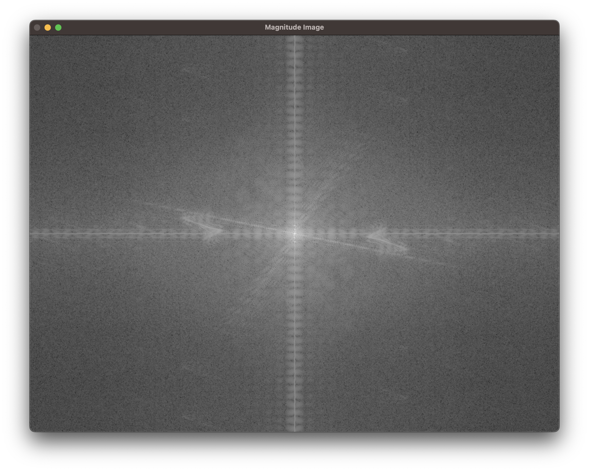
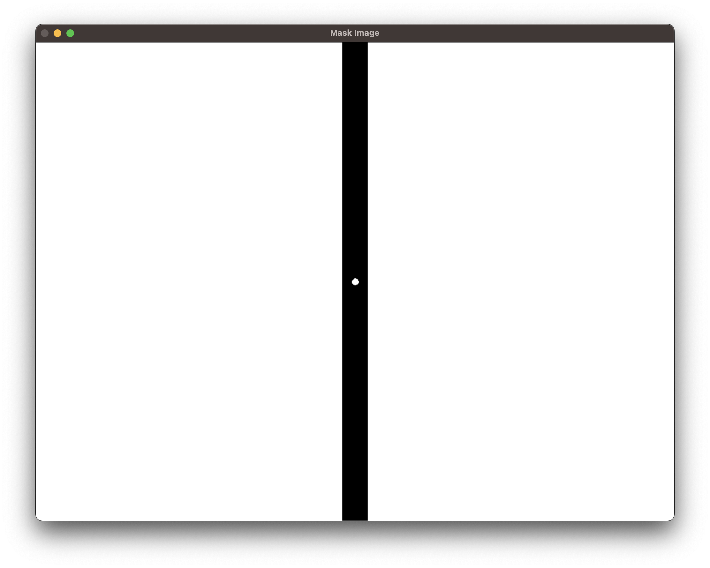
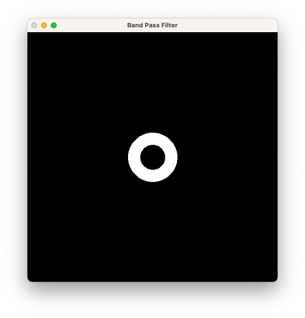
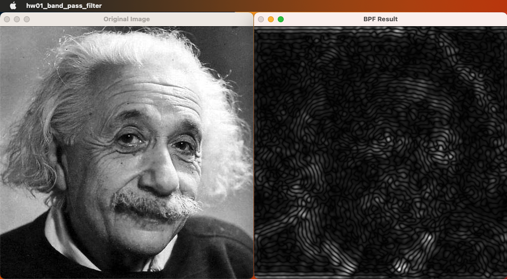
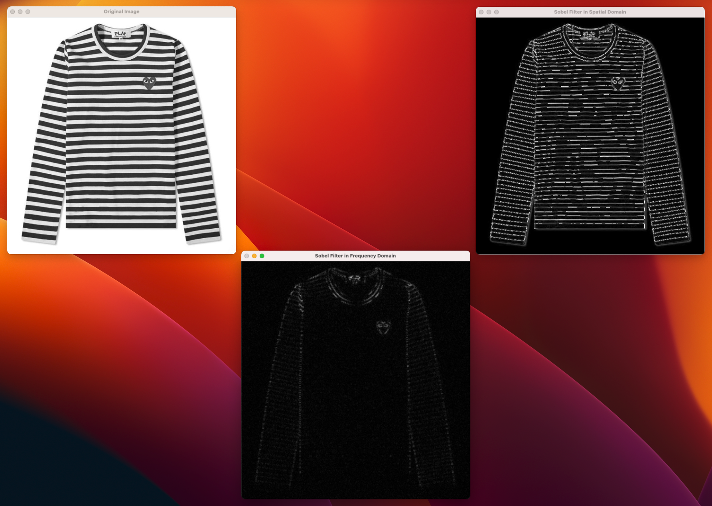
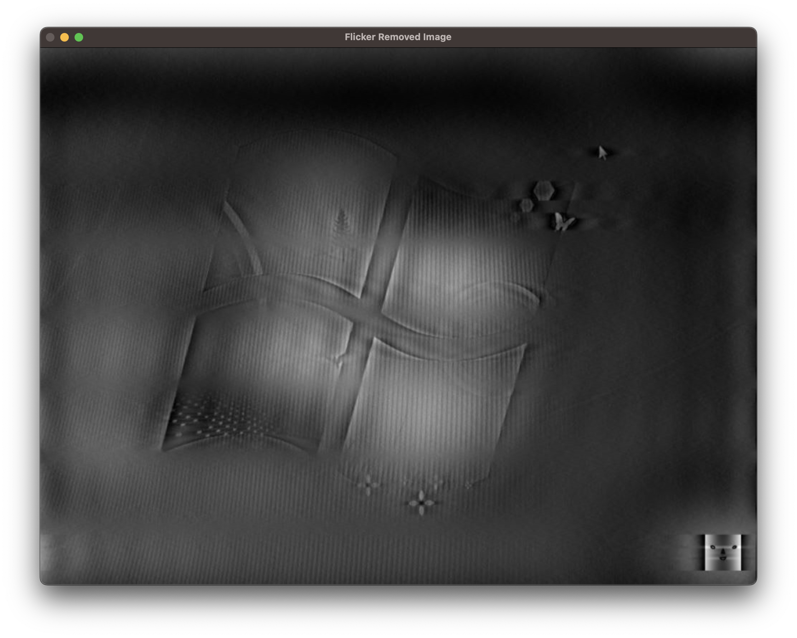

# Filtering in Frequency Domain

## 1. 개요

- HW01 : img1.jpg에 Band Pass Filter를 적용할 것
- HW02 : Spatial domain, frequency domain 각각에서 Sobel filter를 구현하고 img2.jpg에 대해 비교할 것
- HW03 : img3.jpg에서 나타나는 flickering 현상을 frequency domain filtering을 통해 제거할 것

## 2. 상세 설계 내용

### HW01 : img1.jpg에 Band Pass Filter를 적용할 것

Band Pass Filter를 "img1.jpg"에 적용하기 위해, doLPF() 함수를 수정하여 Band Pass Filter를 구현하는 새로운 doBPF() 함수를 설계하였다. doBPF() 함수의 코드는 아래와 같다.

```cpp
// Band Pass Filtering (BPF)
Mat doBPF(Mat srcImg)
{
    // < DFT >
    Mat padImg = padding(srcImg);
    Mat complexImg = doDft(padImg);
    Mat centerComplexImg = centralize(complexImg);
    Mat magImg = getMagnitude(centerComplexImg);
    Mat phaImg = getPhase(centerComplexImg);

    // <BPF>
    double minVal, maxVal;
    Point minLoc, maxLoc;
    minMaxLoc(magImg, &minVal, &maxVal, &minLoc, &maxLoc);
    normalize(magImg, magImg, 0, 1, NORM_MINMAX);

    Mat maskImg = Mat::zeros(magImg.size(), CV_32F);
    circle(maskImg, Point(maskImg.cols / 2, maskImg.rows / 2), 50, Scalar::all(1), -1, -1, 0);
    circle(maskImg, Point(maskImg.cols / 2, maskImg.rows / 2), 25, Scalar::all(0), -1, -1, 0);
    imshow("Band Pass Filter", maskImg);
    waitKey(0);
    destroyAllWindows();

    Mat magImg2;
    multiply(magImg, maskImg, magImg2);

    // < IDFT >
    normalize(magImg2, magImg2, (float)minVal, (float)maxVal, NORM_MINMAX);
    Mat complexImg2 = setComplex(magImg2, phaImg);
    Mat dstImg = doIdft(complexImg2);

    return myNormalize(dstImg);
}
```

LPF에서는 하나의 원이 마스크로서 사용되었었다. 하지만 BPF를 구현한 위 함수에서는 마스크 영상에 두 개의 원을 적용하여 생성하였다. 반지름이 50인 첫 번째 원은 저주파를 차단하는 용도로 사용되고, 반지름이 25인 두 번째 원은 고주파를 차단하는 용도로 사용되어 중간 범위의 주파수만 통과할 수 있도록 구현했다.

### HW02 : Spatial domain, frequency domain 각각에서 Sobel filter를 구현하고 img2.jpg에 대해 비교할 것

Spatial domain에서 Sobel filter를 구현한 함수는 지난 <Linear Filtering> 프로젝트에서 설계한 코드와 동일한 함수를 사용하였으므로 생략한다.

아래 함수는 frequency domain에서 Sobel filter를 구현한 함수이다.

```cpp
Mat mySobelFilterInFrequencyDomain(Mat srcImg)
{
    Mat padImg = padding(srcImg);
    Mat complexImg = doDft(padImg);
    Mat centerComplexImg = centralize(complexImg);
    Mat magImg = getMagnitude(centerComplexImg);
    Mat phaImg = getPhase(centerComplexImg);

    double minVal, maxVal;
    Point minLoc, maxLoc;
    minMaxLoc(magImg, &minVal, &maxVal, &minLoc, &maxLoc);
    magImg /= maxVal; // normalize the magnitude image

    Mat sobelX = Mat::zeros(srcImg.size(), CV_32F);
    sobelX.at<float>(0, 0) = -1;
    sobelX.at<float>(0, 2) = 1;
    sobelX.at<float>(1, 0) = -2;
    sobelX.at<float>(1, 2) = 2;
    sobelX.at<float>(2, 0) = -1;
    sobelX.at<float>(2, 2) = 1;
    Mat padImg_sobelX = padding(sobelX);
    Mat complexImg_sobelX = doDft(padImg_sobelX);
    Mat centerComplexImg_sobelX = centralize(complexImg_sobelX);
    Mat magImg_sobelX = getMagnitude(centerComplexImg_sobelX);
    Mat phaImg_sobelX = getPhase(centerComplexImg_sobelX);
    magImg_sobelX /= maxVal; // normalize the magnitude image

    Mat sobelY = Mat::zeros(srcImg.size(), CV_32F);
    sobelY.at<float>(0, 0) = -1;
    sobelY.at<float>(0, 1) = -2;
    sobelY.at<float>(0, 2) = -1;
    sobelY.at<float>(2, 0) = 1;
    sobelY.at<float>(2, 1) = 2;
    sobelY.at<float>(2, 2) = 1;
    Mat padImg_sobelY = padding(sobelY);
    Mat complexImg_sobelY = doDft(padImg_sobelY);
    Mat centerComplexImg_sobelY = centralize(complexImg_sobelY);
    Mat magImg_sobelY = getMagnitude(centerComplexImg_sobelY);
    Mat phaImg_sobelY = getPhase(centerComplexImg_sobelY);
    magImg_sobelY /= maxVal; // normalize the magnitude image

    Mat magImgX;
    multiply(magImg, magImg_sobelX, magImgX);
    Mat magImgXY;
    multiply(magImgX, magImg_sobelY, magImgXY);

    Mat complexImgXY = setComplex(magImgXY, phaImg);
    Mat dstImg = doIdft(complexImgXY);

    return myNormalize(dstImg);
}
```

위 함수의 동작 과정을 순서대로 나타내면 아래와 같다.

1. 주어진 이미지를 frequency domain으로 변환한다.
2. Sobel filter를 frequency domain에서 생성한다.
3. 주어진 이미지의 frequency domain에서 Sobel filter의 frequency domain을 곱한다.
4. 결과 이미지를 inverse Fourier transform을 사용하여 spatial domain으로 변환한다.
5. 변환된 이미지를 반환한다.

### HW03 : img3.jpg에서 나타나는 flickering 현상을 frequency domain filtering을 통해 제거할 것

Flicker 현상은 디지털 영상에서 발생하는 문제 중 하나로, 화면이 빠르게 번갈아가며 번쩍거리는 현상을 의미한다.

Frequency Domain Filtering을 통해 flicker 현상을 제거하기 위해, 먼저 grayscale의 img3.jpg 영상을 FFT(fast Fourier transform)을 이용하여 주파수 도메인으로 변환하였다. 변환된 주파수 도메인에서 flicker가 발생하는 주파수 대역을 탐지하기 위해, img3.jpg의 magnitude 영상을 확인하였다.



원본 영상에서 나타난 가로 줄무늬 flicker 현상을 제거하기 위해서, 수직 방향으로 Frequency Domain Filtering을 적용해야 한다는 것을 확인할 수 있다. 이를 위해 2D FFT로 변환한 영상에서 수직 주파수 대역을 필터링하는 mask를 설계하였다. 이때, 영상의 정가운데에 있는 DC값을 보존해주었다. 밝기 정보를 나타내는 2차원 신호에서의 0 주파수 성분을 의미하는 DC 값을 만약 지우게 된다면, 영상 전체의 밝기가 바뀌게 되어 원래 영상과는 다른 결과물이 나오게 될 것이기 때문이다.

이 같은 내용을 바탕으로 flicker를 지우는 함수를 아래와 같이 설계하였다.

```cpp
Mat removeFlicker(Mat srcImg)
{
    Mat padImg = padding(srcImg);
    Mat complexImg = doDft(padImg);
    Mat centerComplexImg = centralize(complexImg);
    Mat magImg = getMagnitude(centerComplexImg);
    Mat phaImg = getPhase(centerComplexImg);

    double minVal, maxVal;
    Point minLoc, maxLoc;
    minMaxLoc(magImg, &minVal, &maxVal, &minLoc, &maxLoc);
    normalize(magImg, magImg, 0, 1, NORM_MINMAX);

    Mat maskImg = Mat::ones(magImg.size(), CV_32F);
    rectangle(maskImg, Rect(Point(maskImg.cols / 2 - 20, 0), Point(maskImg.cols / 2 + 20, maskImg.rows)), Scalar::all(0), -1);
    circle(maskImg, Point(maskImg.cols / 2, maskImg.rows / 2), 5, Scalar::all(1), -1, -1, 0);
    imshow("Mask Image", maskImg);

    Mat maskedMagImg;
    multiply(magImg, maskImg, maskedMagImg);
    imshow("Masked Magnitude Image", maskedMagImg);

    normalize(maskedMagImg, maskedMagImg, (float)minVal, (float)maxVal, NORM_MINMAX);
    Mat complexImg2 = setComplex(maskedMagImg, phaImg);
    Mat dstImg = doIdft(complexImg2);
    return myNormalize(dstImg);
}
```

removeFlicker() 함수에서 구현한 mask는 아래와 같다.



아래 영상은 위 mask 영상을 magnitude 영상과 함께 나타낸 것이다.


## 3. 실행 결과

### HW01 : img1.jpg에 Band Pass Filter를 적용할 것



위 영상은 앞서 설계한 doBPF() 함수를 통해 설계된 마스크 영상이다. 코드에서 구현한대로 반지름이 50과 25인 두 개의 원이 생성된 것을 확인할 수 있다.

아래 영상들은 hw01_band_pass_filter.cpp를 실행한 결과이다.



실행 결과의 왼쪽 영상은 원본 영상인 img1.jpg이다. 오른쪽 영상은 원본 영상이 Band Pass Filter를 통과한 이후의 영상이다. 영상 속 인물의 전체 외곽이 유지가 되었지만, 세부 정보가 거의 사라진 것을 확인할 수 있다.

### HW02 : Spatial domain, frequency domain 각각에서 Sobel filter를 구현하고 img2.jpg에 대해 비교할 것



왼쪽 위 영상은 원본 영상인 img2.jpg이다. 오른쪽 위 영상은 Frequency domain에서 구현한 Sobel filter를 통과한 영상이며, 가운데 아래 영상은 Spatial domain에서 구현한 Sobel filter를 통과한 영상이다.
Sobel Filtering을 적용한 결과로써 원본 영상에서 가장자리 부분이 강조된 영상들이 생성되었다. 특히, 가로 방향의 에지가 강조되었다.

### HW03 : img3.jpg에서 나타나는 flickering 현상을 frequency domain filtering을 통해 제거할 것



위 영상은 앞서 설계한 removeFlicker() 함수를 사용하여 img3.jpg에 나타난 flicker를 제거한 영상이다. 원본 영상에서 나타났던 flicker가 완화된 것을 확인할 수 있다.

## 4. 결론 및 고찰

HW01에서는 img1.jpg에 Band Pass Filter를 적용하는 함수를 구현하고, 결과를 확인하였다. 결과를 확인해보았을 때, 영상이 Band Pass Filter의 통과 대역 내에 주파수가 있는 부분은 보존되고, 통과 대역 외부에 주파수가 있는 부분은 감쇠되거나 제거되었다는 것을 유추할 수 있었다.

HW02에서는 img2.jpg에 주파수 영역과 공간 영역에서 구현한 Sobel filter를 각각 적용해보았다. Sobel Filter를 적용한 결과들을 원본 영상과 비교했을 때, 가로 방향의 에지가 강조된 것을 확인할 수 있었다. 그런데, 주파수 영역과 공간 영역 각각에서 구현한 Sobel filter를 통과한 영상의 결과가 같을 것이라고 예상했지만, 미묘하게 다른 것을 확인할 수 있었다. 결과가 다른 점에 대해서 아래와 같은 두가지 이유들을 생각해보았다.<br>
첫째, 주파수 영역에서 필터링할 때 영상은 주파수 영역으로 변환되고 필터 커널로 곱해진 다음 공간 영역으로 다시 변환된다. 이 과정을 프로그래밍으로 구현하면서 반올림 오류 및 부동소수점 문제가 포함되면서 영상 표현이 미세하게 달라질 수 있을 것이다. <br>
둘째, 영상의 모든 고주파 성분을 필터링할 수 없다. 영상의 고주파 구성 요소는 세부 정보와 에지 정보를 제공한다. 따라서 주파수 영역과 공간 영역 필터링 결과 사이에 약간의 차이가 있을 수 있을 것이다.

마지막으로, HW03에서는 주파수 영역에서의 필터링으로 영상에서 나타난 flicker를 없애주는 함수를 설계하였다. 원본 영상의 특성에 맞게 mask를 설계하여 필터링한 결과, flicker가 부분적으로 없어진 것을 확인할 수 있었다. 필터링을 통해 flicker를 완전히 제거하기 위해 노력하였으나, 다른 고주파 성분에 대해서도 영향을 미쳐서 영상이 손상되었었다. 따라서, 영상의 다른 성질을 유지하면서 flicker를 완전히 제거하는 것은 어렵다는 것을 알 수 있었다.
