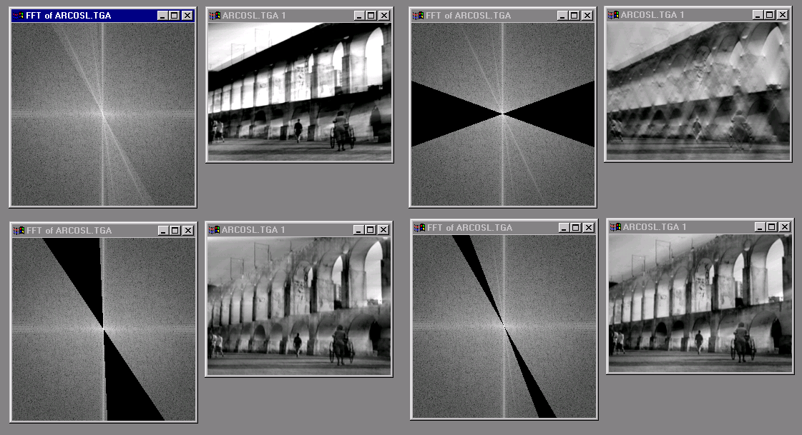
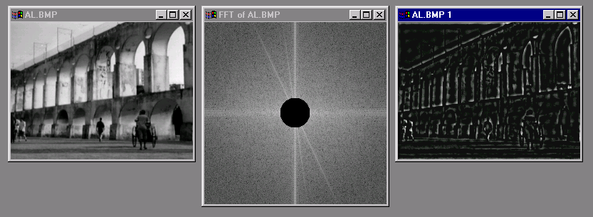

# Filtering in Frequency Domain

## Phase and Magnitude

- 모든 자연적인 영상은 비슷한 magnitude를 가진다.
  - 일반적으로 주파수 공간에서는 저주파 공간(원점)에 많은 에 에너지가 모여 있기 때문이다. - 일반적인 자연 영상은 저주파 대역에 위치하고, magnitude의 원점에는 저주파 성분들의 합이 모여 있기 때문에, 원점에 많은 에너지가 모여 있는 것처럼 보인다.
- magnitude가 유사하므로, phase의 영향이 더 크다.

### Example (1)

#### Input cheetah image

#### Magnitude transform of the cheetah

#### Phase transform of the cheetah

### Example (2)

#### Input zebra image

#### Magnitude transform of the zebra

#### Phase transform of the zebra

### Example (3): Reconstruction with zebra phase and cheetah magnitude

### Example (4): Reconstruction with cheetah phase and zebra magnitude

### Change Spectrum (magnitude only), then Reconstruct

## Highpass Filtering & Lowpass Filtering

 

- Highpass Filtering
  - 고주파 성분을 강조하고, 저주파 성분을 제거하는 필터링 방법이다.
  - **이미지의 선명도를 높이거나, 경계선을 강조하는 효과**가 있다.
    - 영상에서의 고주파 부분은 edge와 corner이므로 해당 부분만 남게 된다.
- Lowpass Filtering
  - 저주파 성분을 강조하고, 고주파 성분을 제거하는 필터링 방법이다.
  - **이미지의 부드러운 효과를 주거나, 블러링 효과를 내는데 사용**된다.

## The Convolution Theorem

$$\mathcal{F}\left [ g \ast h  \right ] = \mathcal{F}\left [ g \right ]\mathcal{F}\left [ h \right ]$$

- 공간 영역의 컨볼루션은 주파수 영역의 곱셈과 같다.

# References

1. 디지털영상처리설계 (ICE4027), 인하대학교 정보통신공학과 박인규
2. Digital Image Processing 4th Edition, Rafael C. Gonzalez and Richard E. Woods
3. [Computer Vision: Algorithms and Applications 2nd Edition, Richard Szeliski](https://szeliski.org/Book/)
