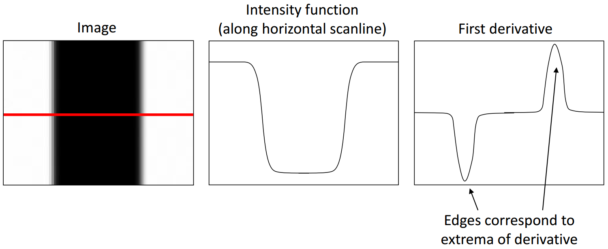
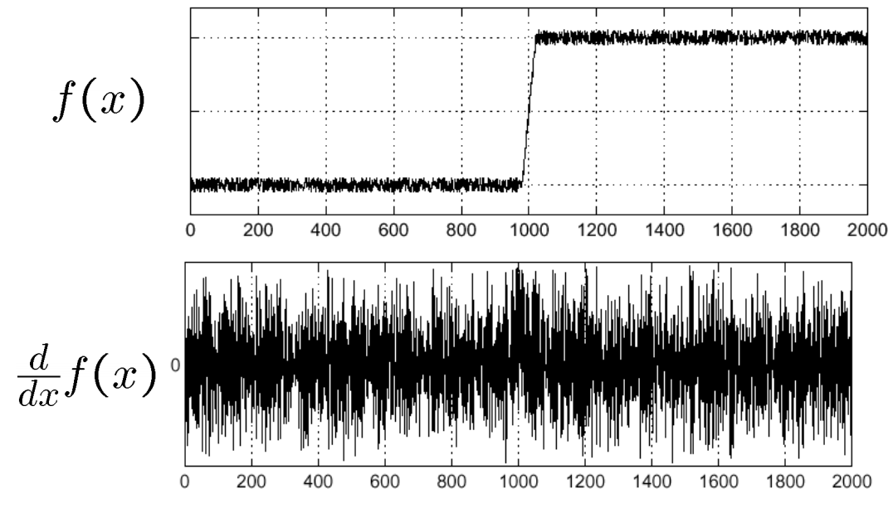
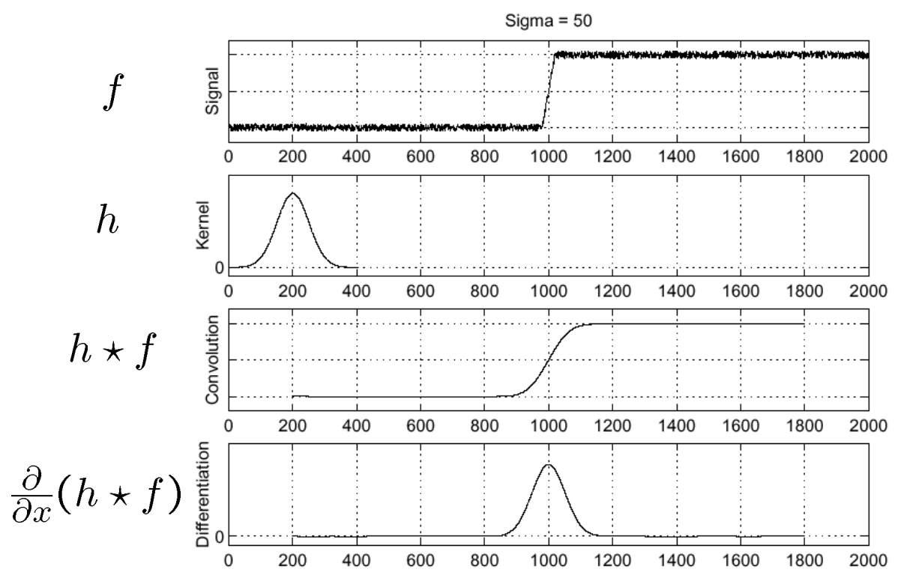
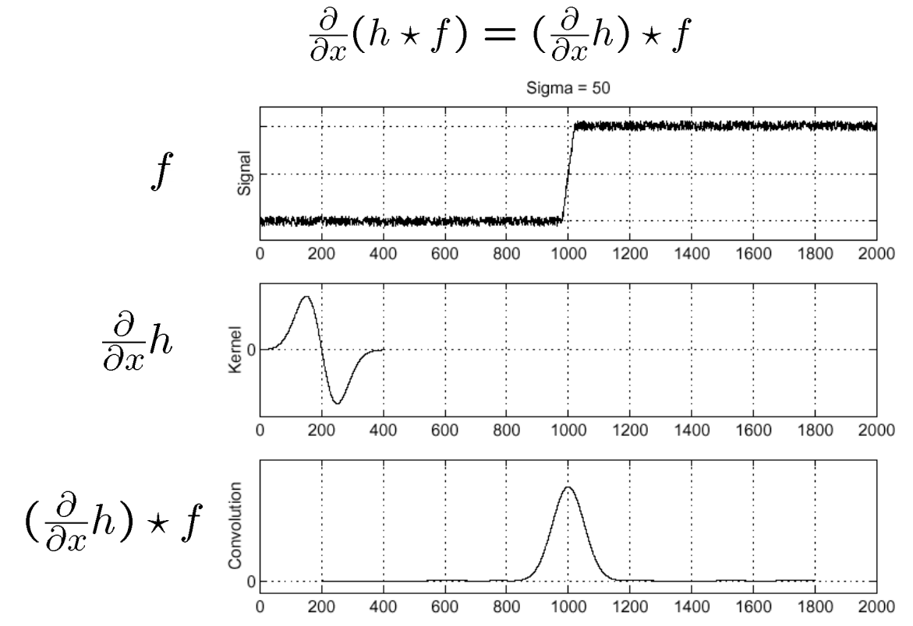
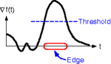
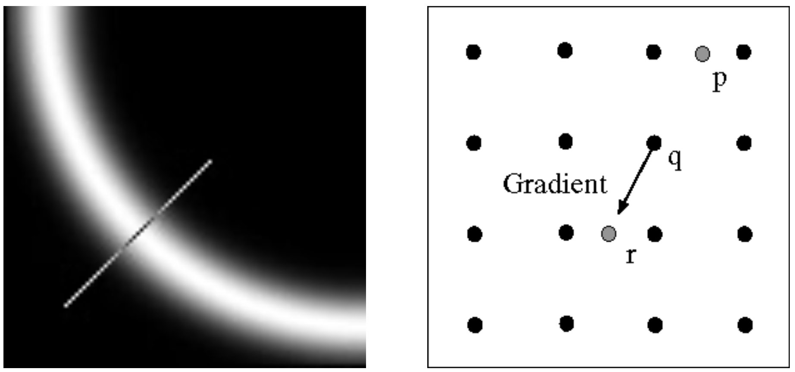

# Edge Detection

- Edge Detection이란 영상에서 물체와 배경 사이의 경계 부분을 찾는 과정이다.
- Edge는 영상의 밝기가 급격하게 변화하는 곳으로서, 이 지점을 찾아내는 것이 Edge Detection의 목적이다.

## Edge의 발생 원인

- 반사의 특성으로 인한 밝기 차이
- 거리(Depth)의 차이로 인한 경계
- 그림자로 인한 경계
- 모양의 변화

## Edge Detection



- Edge는 영상의 밝기가 급격하게 변화하는 곳이므로, 영상을 미분한 후, 미분치의 극대 극소점을 찾으면 Edge를 찾을 수 있다.
  - $\nabla f = \left [ \frac{\partial f}{\partial x},\ \frac{\partial f}{\partial y} \right ]$
- Edge의 세기는 Gradient의 Magnitude에 따라 결정된다.
  - $\left \| \nabla f \right \| = \sqrt{\left (\frac{\partial f}{\partial x}  \right )^{2} + \left (\frac{\partial f}{\partial y}  \right )^{2}}$

<br>



- 영상에서는 항상 노이즈가 존재한다.
- 노이즈는 미분하면 증폭이 된다.
- 따라서 노이즈 필터링을 먼저 해주어야 한다.

### How to detect the edge?

#### Solution 1: Smooth First



- Edge는 $\frac{\partial}{\partial x}\left ( h \ast f \right )$의 극대점에 위치한다.

#### Solution 2: Using the Derivative Thorem of Covolution



- Derivative of Gaussian Filter를 사용하면서 두 번 연산할 필요가 없어졌다.
- Derivative of Gaussian Filter는 Sobel Filter로 근사 가능하다.

#### Solution 3: Laplacian of Gaussian (LoG) Filter


- Gaussian을 두 번 미분한 필터를 사용한다.
- Edge는 부호가 (+)에서 (-)로 바뀌는 곳이나, (-)에서 (+)로 바뀌는 곳에 있다.
- 실질적으로 잘 쓰이지는 않는다고 한다.

### Gradient Magnitude Thresholding



```python
if pixel < threshold:
    value = 0
else:
    value = 1
```

### NMS; Non-maximum Suprression (for Thinning)

- Edge를 얇게 만들어주기 위해, Thresholding 이후 **Thinning** 과정을 거친다.
  - 찾은 edge에는 여러 픽셀들이 뭉쳐있으므르, 얇게 만드는 Thinning 작업이 필요하다.
- 픽셀이 그라데이션 방향을 따라 local maximum 값인지 확인하고 edge의 너비에 걸쳐 single max를 선택한다.
  - 보간된 픽셀 p와 r을 확인해야 한다.
  - 정수좌표계에서는 픽셀이 정확한 위치에 없을 수도 있다.
    - Sol: Linear Interpolation (선형보간법)


