# Median and Edge Filtering

## 1. 개요

- HW01 : salt_pepper2.png에 대해서 3x3, 5x5의 Mean 필터를 적용해보고 결과를 분석할 것
  - 잘 나오지 않았다면 그 이유와 함께 결과를 개선해볼 것
- HW02 : rock.png에 대해서 Bilateral 필터를 적용해볼 것
  - 아래 table을 참고하여 기존 gaussian 필터와의 차이를 분석해볼 것
  - 
- HW03 : Canny Edge Detection 함수의 파라미터를 조절해 여러 결과를 도출하고 파라미터에 따라서 처리시간이 달라지는 이유를 정확히 서술할 것

## 2. 상세 설계 내용

### HW01 : salt_pepper2.png에 대해서 3x3, 5x5의 Mean 필터를 적용해보고 결과를 분석할 것

```cpp
void myMedian(const Mat &src_img, Mat &dst_img, const Size &kn_size)
{
    dst_img = Mat::zeros(src_img.size(), CV_8UC1);

    int wd = src_img.cols;    // src_img의 행, 256
    int hg = src_img.rows;    // src_img의 행, 256
    int kwd = kn_size.width;  // kernel의 size
    int khg = kn_size.height; // kernel의 size
    int rad_w = kwd / 2;      // kn_size의 절반, 중간값 indexing에 사용
    int rad_h = khg / 2;      // kn_size의 절반, 중간값 indexing에 사용

    uchar *src_data = (uchar *)src_img.data;
    uchar *dst_data = (uchar *)dst_img.data;

    float *table = new float[kwd + khg](); // 커널 테이블 동적할당
    float tmp;
    float median;

    // < 픽셀 인덱싱 (가장자리 제외) >
    for (int c = rad_w + 1; c < wd - rad_w; c++)
    {
        for (int r = rad_h + 1; r < hg - rad_h; r++)
        {
            // 중간값 indexing
            tmp = 0.f;
            for (int kc = -rad_w; kc <= rad_w; kc++)
            {
                for (int kr = -rad_h; kr <= rad_h; kr++)
                {
                    tmp = (float)src_data[(r + kr) * wd + (c + kc)]; // 원본 영상의 데이터를 tmp에 저장
                    table[(kr + rad_h) * kwd + (kc + rad_w)] = tmp;  // 테이블에 tmp 저장
                }
            }
            sort(table, table + (kwd * khg));     // 커널 table 정렬
            median = table[(kwd * khg) / 2];      // 중간값 선택
            dst_data[r * wd + c] = (uchar)median; // 가장 큰 값을 중간 값으로 대체
        }
    }
    delete[] table; // 동적할당 해제
}
```

위 코드는 myMedian 함수의 코드로, 영상에 Median 필터링을 수행하는 함수이다. Median 필터는 영상의 각 픽셀을 중심으로 정해진 크기의 커널(마스크) 내의 픽셀들의 중간값(median)으로 해당 픽셀을 대체하는 필터이다.

함수의 동작은 다음과 같다:

1. src_img로부터 입력 영상의 크기를 가져와 dst_img로 사용할 출력 영상을 0으로 초기화한다.
2. 입력 영상과 커널 크기를 나타내는 kn_size로부터 필요한 변수들을 추출한다. 입력 영상의 행과 열의 크기를 wd와 hg에 저장하고, 커널의 가로와 세로 크기를 kwd와 khg에 저장한다. 또한 커널 크기의 절반을 rad_w와 rad_h에 저장한다.
3. 입력 영상과 출력 영상의 데이터 포인터를 uchar 형태로 변환하여 src_data와 dst_data에 저장한다. 이는 영상 데이터에 직접 접근하기 위한 포인터이다.
4. 커널의 크기만큼 동적으로 table이라는 float 형태의 배열을 동적으로 할당한다. 이 배열은 커널 내의 픽셀 값을 저장할 용도로 사용된다.
5. 입력 영상의 픽셀을 순회하면서 Median 필터링을 수행한다. 이때, 반복문은 가장자리를 제외한 영상의 픽셀을 순회한다.
6. 현재 픽셀의 인접 픽셀들의 값을 table에 저장한다. 이를 위해 중첩 반복문을 사용하여 커널 내의 픽셀들의 값을 src_data에서 가져와 table에 저장한다.
7. table에 저장된 픽셀 값들을 정렬한다. 여기서는 C++의 표준 라이브러리인 <algorithm> 헤더의 sort 함수를 사용한다.
8. 정렬된 table에서 중간값(median)을 선택하여 dst_data에 저장한다. 이는 가장 큰 값을 중간 값으로 대체하는 Median 필터링의 동작이다.
9. 모든 픽셀에 대해 Median 필터링이 수행된 후, 동적으로 할당한 table을 해제한다.

<br>

```cpp
void doMedianEx()
{
    cout << "--- doMedianEx() ---" << endl;

    // < 입력 >
    Mat src_img = imread("salt_pepper2.png", 0);
    if (!src_img.data)
        printf("No image data\n");

    // < Median 필터링 수행 >
    Mat filtered_3x3_img;
    Mat filtered_5x5_img;

    myMedian(src_img, filtered_3x3_img, Size(3, 3));
    myMedian(src_img, filtered_5x5_img, Size(5, 5));

    // < 출력 >
    Mat temp_img;
    Mat dst_img;
    hconcat(src_img, filtered_3x3_img, temp_img);
    hconcat(temp_img, filtered_5x5_img, dst_img);

    imshow("Median Filtered Salt and Pepper Noises", dst_img);

    waitKey(0);
    destroyAllWindows();
}
```

위 doMedianEx() 함수는 myMedian() 함수를 호출하여 Median 필터링을 수행하는 예시 코드로, 다음과 같은 동작을 수행한다:

1. src_img에 "salt_pepper2.png" 파일을 읽어와 저장한다.
2. myMedian() 함수를 사용하여 입력 영상에 대해 3x3 크기와 5x5 크기의 Median 필터링을 수행하고, 결과를 filtered_3x3_img와 filtered_5x5_img에 저장한다.
3. 입력 영상, 3x3 Median 필터링 결과, 5x5 Median 필터링 결과를 가로로 이어 붙인 후, "Median Filtered Salt and Pepper Noises"라는 윈도우 창에 표시한다. 표시 후, 키 입력이 있을 때까지 대기하고, 윈도우 창을 닫고 프로그램을 종료한다.

### HW02 : rock.png에 대해서 Bilateral 필터를 적용해볼 것

Bilateral 필터는 Gaussian 필터와 유사하지만, 주변 픽셀들의 거리와 강도 차이를 고려하여 에지 보존과 잡음 감소를 동시에 수행하는 특징이 있다. Bilateral 필터는 Gaussian 필터와는 다른 두 가지 파라미터 range sigma와 spatial sigma를 사용하여 필터링을 수행한다. Range sigma는 중심 픽셀과 주변 픽셀의 픽셀 강도 차이를 고려하는 가중치의 범위를 제어하는 파라미터이고, Spatial sigma는 중심 픽셀과 주변 픽셀의 거리에 대한 가중치의 범위를 제어하는 파라미터이다. 기존의 Gaussian 필터는 거리에 대한 가중치만을 고려하여 필터링을 수행하는 반면, Bilateral 필터는 거리와 강도 차이에 대한 두 가지 가중치를 함께 고려한다.

<br>

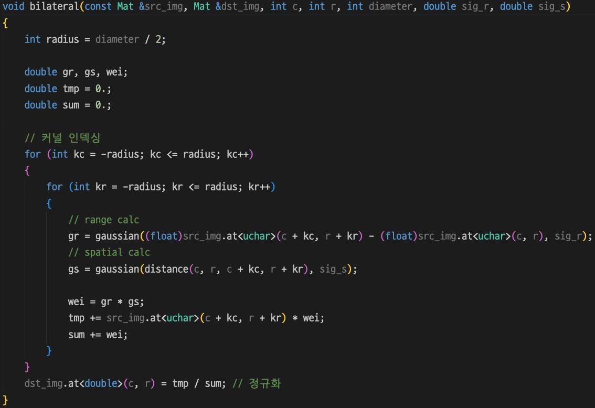

위 bilateral 함수는 주어진 영상에 대해 Bilateral Filtering을 수행하는 함수로, 주어진 픽셀의 주변 영역에 대해 sig_r와 sig_s를 곱하여 가중 평균을 구하여 결과 영상에 저장하는 기능을 수행한다.


위 myBilateral 함수는 bilateral 함수를 호출하여 영상에 대해 양방향 필터링을 수행하는 함수로, 입력 영상에 대해 가장자리를 제외한 픽셀들에 대해 bilateral 함수를 호출하여 결과 영상에 저장하는 기능을 수행한다.

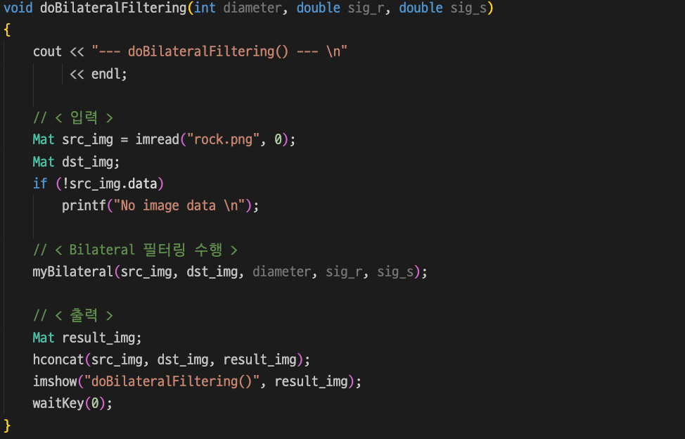

doBilateralFiltering 함수는 입력 영상을 읽어들여 myBilateral 함수를 호출하여 양방향 필터링을 수행하고, 결과 영상을 출력하는 함수로, 양방향 필터링에 사용되는 필터의 지름(diameter)과 sig_r, sig_s를 인자로 받아 처리한다. 결과 영상은 입력 영상과 양방향 필터링이 적용된 영상을 가로로 연결하여 출력한다.

### HW03 : Canny Edge Detection 함수의 파라미터를 조절해 여러 결과를 도출하고 파라미터에 따라서 처리시간이 달라지는 이유를 정확히 서술할 것

Canny Edge Detection은 영상에서 경계선(edge)을 찾는 기술로, 높은 정확도와 뛰어난 성능을 가지고 있다. 이 Canny Edge Detection 기능을 수행하는 함수를 구현하기 위해 필요한 여러 함수들을 구현하였다. 구현한 함수들의 목록을 아래에 나타내었다.

- `nonMaximumSuppression`
- `followEdges`
- `edgeDetect`
- `doCannyEdgeDetection`

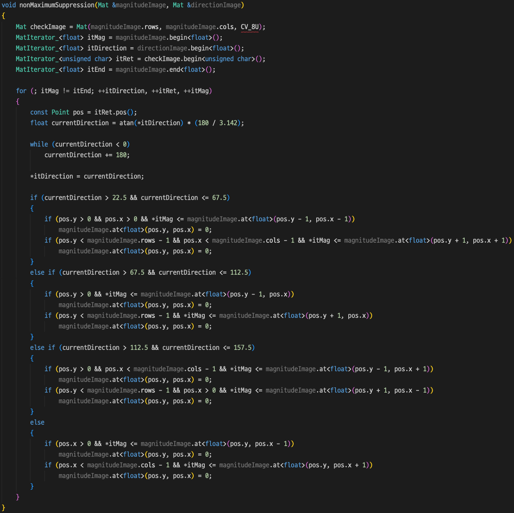

위 함수는 nonMaximumSuppression 함수로, 비최대치 억제(non-maximum suppression) 기법을 적용하여 edge 픽셀을 강조하는 함수이다. 함수는 입력 영상에서 edge 픽셀의 강도를 비교하여 edge가 아닌 픽셀을 제거한다.

<br>

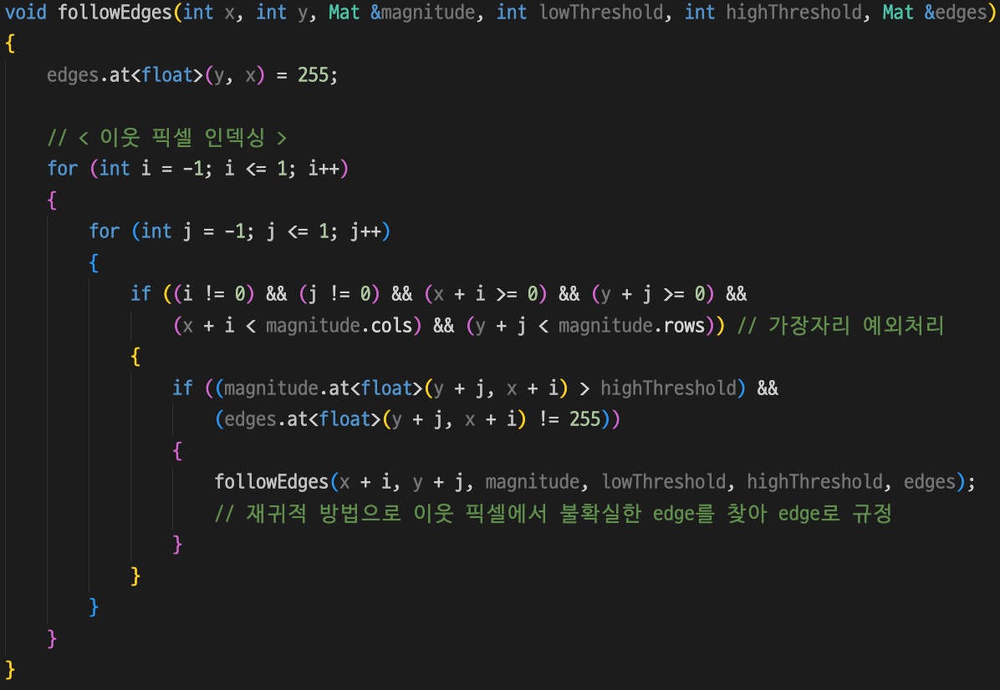

위 함수는 followEdges 함수로, 비최대치 억제가 끝난 후에 강한 edge 따라 edge 픽셀을 따라가며 연결된 edge 픽셀들을 찾아내는 함수이다. 입력으로 받는 파라미터 중, x와 y는 현재 픽셀의 좌표, magnitude는 edge 강도 값을 가진 영상, lowThreshold와 highThreshold는 edge 검출에 사용되는 임계값, edges는 연결된 edge 픽셀들이 표시되는 영상을 의미한다.

<br>

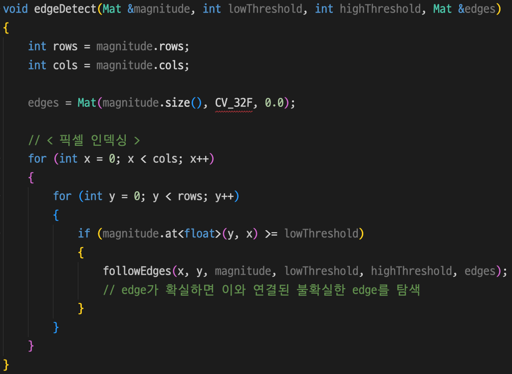

위 함수는 edgeDetect 함수로, edge의 magnitude 값을 입력으로 받아 lowThreshold와 highThreshold에 따라 이진화된 edge 영상을 생성하는 함수이다. edges는 생성된 이진화된 edge 영상을 저장하는 영상이다.

<br>

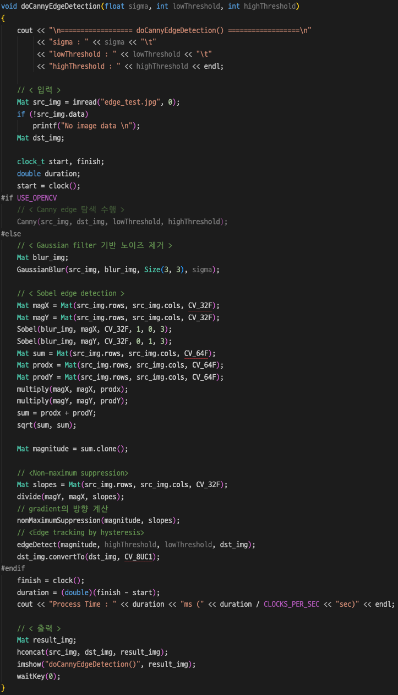

위 doCannyEdgeDetection 함수는 Canny Edge Detection 알고리즘을 구현한 함수로, 입력 영상에 Canny Edge Detection 알고리즘을 적용하여 edge를 검출하고 결과를 출력한다. sigma는 Gaussian 필터의 표준 편차 값, lowThreshold와 highThreshold는 edge 검출에 사용되는 임계값이다.

함수 내에서는 입력 영상에 Gaussian blur 필터를 적용하여 영상을 흐리게 만들고, 그레이디언트(Gradient)를 계산하여 경사 강도와 방향을 얻는다. 그 다음, 비최대치 억제(non-maximum suppression)를 수행하여 edge 후보를 추출하고, 히스테리시스 임계값(hysteresis thresholding)을 적용하여 최종적인 edge를 결정한다.

doCannyEdgeDetection 함수의 구체적인 동작은 다음과 같다:

1. 입력 영상에 Gaussian blur 필터를 적용하여 영상을 흐리게 만든다.
2. x축 및 y축 방향으로 영상의 그레디언트(경사 강도와 방향)를 계산한다.
3. 그레디언트를 이용하여 비최대치 억제를 수행하여 edge 후보를 추출한다. 비최대치 억제는 edge 픽셀이 그레디언트 방향에서 가장 강한지를 검사하여, 가장 강한 경우에만 edge로 선택하고 그 외에는 edge를 제거하는 작업이다.
4. 히스테리시스 임계값을 적용하여 최종적인 edge를 결정한다. 히스테리시스 임계값은 저 임계값과 고 임계값을 이용하여, 고 임계값보다 큰 경사 강도를 갖는 픽셀은 edge로 선택하고, 저 임계값과 고 임계값 사이의 경사 강도를 갖는 픽셀은 주변 픽셀의 경사 강도에 따라 edge로 선택하거나 제거하는 작업이다.
5. 최종적인 edge 결과를 반환한다.

## 3. 실행 결과

### HW01 : salt_pepper2.png에 대해서 3x3, 5x5의 Mean 필터를 적용해보고 결과를 분석할 것

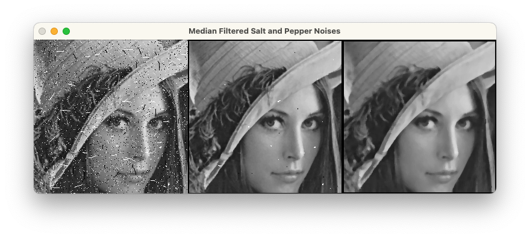

세 개의 영상 중 첫번째 영상은 Salt and Pepper 노이즈가 포함된 원본 영상이며, 두번째 영상과 세번째 영상은 원본 영상이 각각 3x3 Median Filter와 5x5 Median Filter를 통해 필터링된 영상이다.

3x3 크기의 필터는 주변 3x3 영역의 평균값을 사용하여 픽셀을 대체한다. 3x3 Median 필터로 필터링된 영상은 대부분의 노이즈가 사라졌지만, 약간의 Salt and Pepper 노이즈가 남아있는 것을 확인 할 수 있다. 결과적으로 영상의 노이즈가 줄어들고, 픽셀 값들이 부드럽게 블러(blur)처리되어 영상이 더 흐릿하게 보인다. 즉, 영상의 선명도가 낮아지고, 고주파 성분이 감소하면서 부드러운 효과가 나타났다.

그러나, 5x5 Median 필터를 사용하여 필터링한 영상은 모든 Salt and Pepper 노이즈가 사라졌지만, 영상의 선명도가 3x3 Median Filter에 비해 더 낮아진 것을 확인할 수 있다. 5x5 크기의 필터는 주변 5x5 영역의 평균값을 사용하여 픽셀을 대체한다. 3x3 필터에 비해 더 큰 영역을 고려하기 때문에, 더 강한 블러 효과가 나타난다.

### HW02 : rock.png에 대해서 Bilateral 필터를 적용해볼 것

diameter가 클수록 더 넓은 범위의 픽셀에 접근할 수 있으므로, diameter 값을 15로 지정하여 실험을 진행하였다. 또한, range sigma를 의미하는 sig_r의 값은 25로, spatial sigma를 의미하는 sig_s의 값은 18로 놓고 실험을 진행하였을 때, 아래와 같은 결과를 얻을 수 있었다.

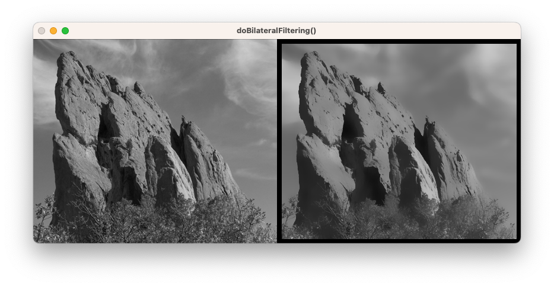

위 사진을 보았을 때, blur 효과를 통해 노이즈를 제거하면서도 edge를 보존한 결과를 얻을 수 있었다.


위 table은 range sigma 값과 spatial sigma 값에 따른 Bilateral 필터링의 결과를 나타낸 것이다. 가장 오른쪽 열은 range sigma 값이 무한대일 때의 결과인데, 이것은 Gaussian 필터링의 결과로 해석할 수 있다.

이번 실험에서의 Bilateral 필터링의 결과와 위 table에서의 Gaussian 필터링의 결과를 비교해보았을 때, Bilateral 필터와 Gaussian 필터 둘 다 영상의 노이즈를 감소시키거나 영상을 부드럽게 만든다는 것을 확인할 수 있다. 하지만, Bilateral 필터는 노이즈를 제거하면서 영상의 선명한 경계를 보존한다는 것을 확인할 수 있다. 따라서, 영상의 선명한 경계가 중요한 경우에 Bilateral 필터링이 효과적으로 사용될 수 있다는 것을 유추할 수 있다.

### HW03 : Canny Edge Detection 함수의 파라미터를 조절해 여러 결과를 도출하고 파라미터에 따라서 처리시간이 달라지는 이유를 정확히 서술할 것

HW03의 첫번째 실험으로, highThreshold를 160으로 고정하고 lowThreshold를 50, 100, 150으로 변화를 주어 Canny Edge Detection 함수를 실행시켜보았다. 첫번째 실험과 두번째 실험 모두 sigma 값은 'Rule of thumb for Gaussian'에 따라, 3x3 크기의 필터에 적합한 sigma 값인 0.5를 사용했다.

<br>
<br>


위 사진들은 위에서부터 순서대로 lowThreshold가 50일 때, 100일 때, 150일 때의 Canny Edge Detection 결과이다. 위 사진들을 통해 lowThreshold가 높아질수록, edge의 정밀도가 미세하게나마 낮아지는 것을 확인할 수 있다. 또한, 아래 사진은 첫번째 실험에서 Canny Edge Detection 함수의 파라미터를 조절하면서 결과를 도출했을 때의 처리시간을 출력한 것이다.

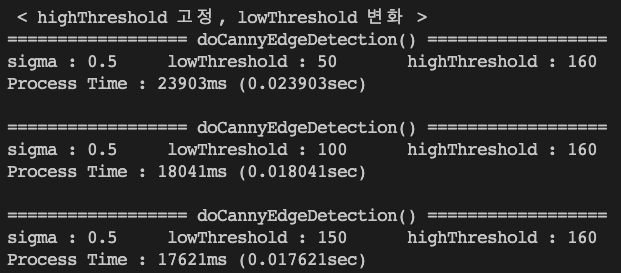

highThreshold를 고정하고 lowThreshold를 변화시킨 첫번째 실험에서는, lowThreshold 값이 높아질수록 처리시간이 짧아지는 것을 확인할 수 있다.

<br>

HW03의 두번째 실험으로, lowThreshold를 150으로 고정하고 highThreshold를 80, 160, 240으로 변화를 주어 Canny Edge Detection 함수를 실행시켜보았다.

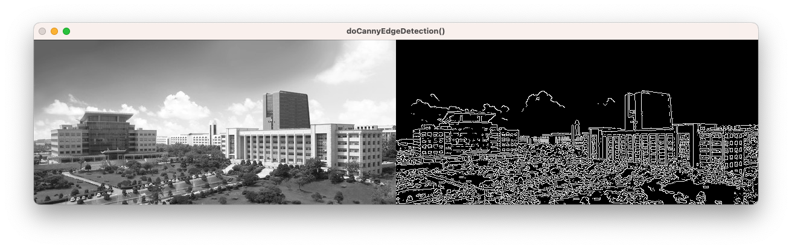<br>
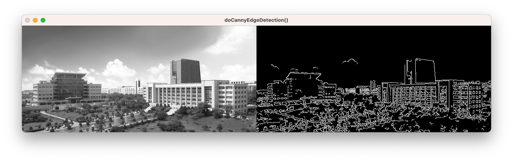<br>
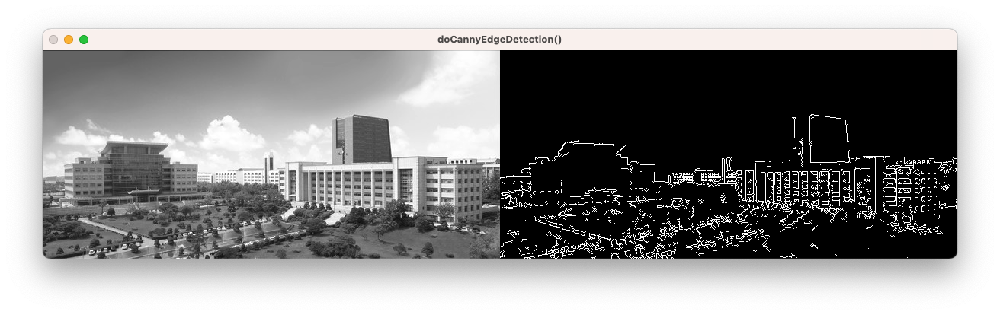

위 사진들은 위에서부터 순서대로 highThreshold가 80일 때, 160일 때, 240일 때의 Canny Edge Detection 결과이다. 위 사진들을 통해 lowThreshold가 높아질수록 검출된 edge의 개수가 급격하게 줄어드는 것을 확인할 수 있다. 또한, 아래 사진은 두번째 실험에서 Canny Edge Detection 함수의 파라미터를 조절하면서 결과를 도출했을 때의 처리시간을 출력한 것이다.

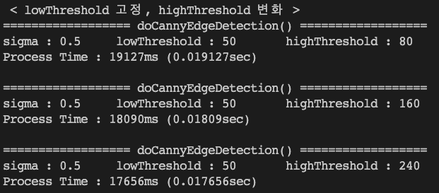

lowThreshold를 고정하고 highThreshold를 변화시킨 두번째 실험에서는, highThreshold 값이 높아질수록 처리시간이 짧아지는 것을 확인할 수 있다.

## 4. 결론 및 고찰

HW01에서는 Salt and Pepper 노이즈를 포함하는 영상에 대해 3x3과 5x5 크기의 Median 필터를 적용해보고 결과를 분석해보았다. 필터링된 영상을 확인했을 때, 노이즈가 줄어들고 영상이 흐려지며 선명도를 낮아진 것을 확인하였다. 또한, 필터의 크기가 커짐에 따라 영상가 더 흐려지는 효과가 나타난다는 것을 확인하였다. 다만, Salt and Pepper 노이즈에 강건한 Median 필터를 사용했음에도 불구하고, 3x3 크기의 Median 필터를 사용했을 때의 결과에서 Salt and Pepper 노이즈가 남아있었다. 필터링된 영상에서 노이즈가 남아있었던 부분을 원본 영상과 비교했을 때, 원본 영상에서 동일한 부분이 노이즈가 뭉쳐져있는 것을 확인할 수 있었다. 필터의 크기가 5x5에 비해 작은 3x3 필터를 사용했을 때, 뭉쳐진 노이즈에서의 중간값이 여전히 노이즈의 값을 따라갔기 때문에 노이즈가 사라지지 않은 것으로 추측된다.

HW02에서는 영상에 Bilateral 필터를 적용한 결과를 분석해보았다. 직접 구현한 Bilateral 필터를 사용하였을 때, Gaussian 필터에 비해 실행속도가 확연하게 느린 것을 체감할 수 있었다. 이는 필터링을 하는 런타임에 Bilateral 필터의 계수를 결정하므로 계산량이 많기 때문이다.

HW03에서는 영상에서 edge를 검출하는데 주로 사용되는 기술인 Canny Edge Detection 기술을 C++로 구현하고, 해당 함수에서 사용되는 lowThreshold와 highThreshold 두 threshold 값을 비교해보면서 결과를 도출하였다. lowThreshold는 edge로 간주되는 최소 강도를, highThreshold는 강한 edge로 간주되는 최소 강도를 나타낸다.<br>
두가지 실험을 종합하였을 때, edge의 검출 여부와 강도는 threshold 값에 따라 달라진다는 것을 확인할 수 있었다. 예를 들어, lowThreshold를 낮추면 더 많은 edge가 검출되고, threshold2를 높이면 강한 edge만 검출되게 된다. 즉, 두 threshold 값 사이의 범위가 작을수록 edge가 더 강하게 검출되고, 범위가 클수록 edge가 더 많이 검출된다는 것을 확인하였다. <br>
또한, 처리시간은 threshold 값에 따라 달라질 수 있다는 것을 확인하였다. 높은 threshold 값을 사용하면 더 강한 edge만을 검출하기 때문에 처리시간이 더 짧아질 수 있다. 반대로, 낮은 threshold 값을 사용하면 더 많은 edge를 검출해야 하므로 처리시간이 더 길어질 수 있다.
