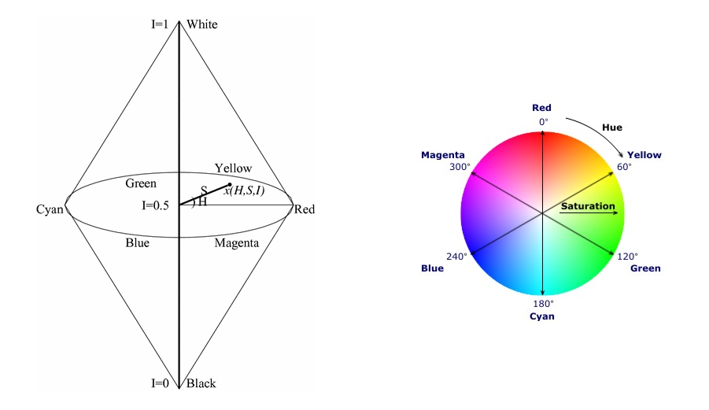

# [Color Processing](#color-processing) and [Clustering](#clustering)

## Color Processing

### 색의 3속성

- 색상 (색의 종류)
  - Hue
- 명도 (색이 얼마나 밝은지)
  - Brightness, value
- 채도 (색이 얼마나 진하고 순수한지)
  - Purity, saturation, chroma

### CIE XYZ Color Model

#### CIE primary colors

#### Normalized (by total energy) XYZ values

 

- $x$, $y$ : chromaticity values (색을 결정하는 근본적인 값)
- $Y$ : luminance (빛)

#### Chromaticity Diagram

### CMYK Color Model

- Three primary colors
  - Cyan
    - Red 흡수 = Green, Blue 반사
  - Magenta
    - Green 흡수 = Red, Blue 반사
  - Yellow
    - Blue 흡수 = Red, Green 반사
- 혼합 사례
  - Cyan + Magenta
    - Red, Green 흡수 = Blue 반사
  - Cyan + Yellow
    - Red, Blue 흡수 = Green 반사

### YIQ Color Model

- Y 신호만을 사용하던 과거 흑백 TV와의 호환성을 유지하면서 컬러 신호를 표현하기 위해 I, Q 추가
  - I: Orange-Cyan (Flesh tone; 살색)
  - Q: Green-Magenta

### HSV Color Model

- 원색의 조합이 아닌 인간 직관에 보다 유사한 특성 이용
  - Hue, Saturation, Value (색의 3요소)

### HSI Color Model

- 사람의 인지 모델과 유사
  - Hue, Saturation, Intensity(Lightness)
- HSV 모델과 유사하며, HSV 모델과 함께 computer vision에서 많이 이용됨

## Clustering

### K-Means Clustering

$$\mathbf{c}^{\ast}, \mathbf{\delta}^{\ast} = \textup{argmin}_{c,\delta} \ \frac{1}{N}\sum_{j}^{N}\sum_{i}^{K}\delta_{ij}\mathit{\mathbf{d}\left (  \mathbf{c}_i, \mathbf{x}_j \right )^{2}}$$

- Iteratively re-assign points to the nearest cluster center
  - Goal: cluster to minimize variance in data given-clusters
- Steps
  - 1): Randomly select K centers
  - 2): [Expectation Step] Assign each point to nearest center
  - 3): [Minimize Step] Compute new center (mean) for each cluster
  - 4): Repeat from the [Expectation Step] to the [Minimize Step] until coverage

#### Hyperparater of K-Means Clustering

- K (군집의 수): 3, 5, ...
- Initial center: Randomly select, Greedily choose, ...
- Distance measures: L2 Norm, ..., ?
- Maximum of iterations

#### Pros & Cons of K-Means Clustering

- Pros
  - 간단하고 빠르다.
  - 구현하기 쉽다.
- Cons
  - 수렴이 보장되지 않는다.
    - 수렴한다해도, global minimum이 아닌 local minimum으로 수렴할 가능성이 있다.
  - 초기 중심값 위치에 따라 원하는 결과가 나오지 않을 수도 있다.
  - 이상치(outlier) 데이터에 민감하다.
  - 정규화되지 않은 데이터들은 바로 사용할 수 없다.
  - 계산량이 많아 속도가 느리다. ($O(KNd)$ for $N$ $d$-dimensional points)

# References

1. 디지털영상처리설계 (ICE4027), 인하대학교 정보통신공학과 박인규
2. Digital Image Processing 4th Edition, Rafael C. Gonzalez and Richard E. Woods
3. [Computer Vision: Algorithms and Applications 2nd Edition, Richard Szeliski](https://szeliski.org/Book/)
4. [CIE 1931 color space — Wikipedia](https://en.wikipedia.org/wiki/CIE_1931_color_space)
5. [Color Model (RGB vs CMYK vs HSI ) — Suyeon's Blog](https://suyeon96.tistory.com/3#HSI)
6. [YIQ — Wikipedia](https://en.wikipedia.org/wiki/YIQ)
