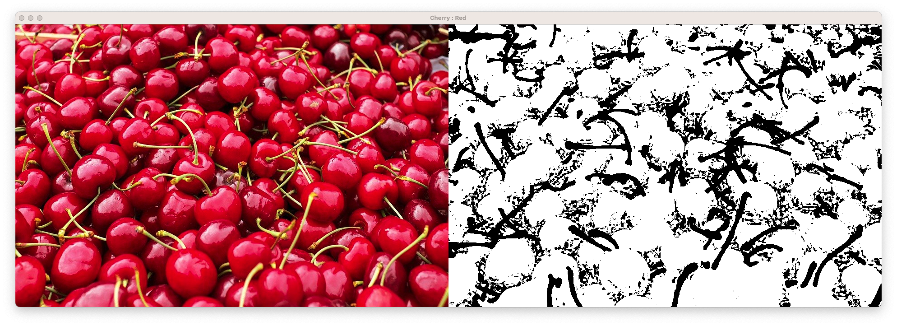
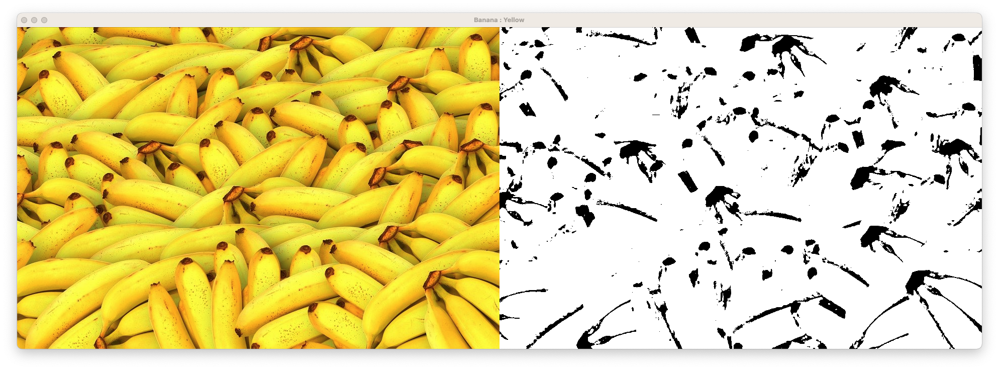
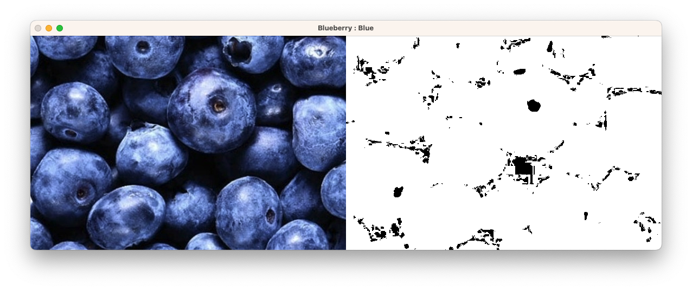
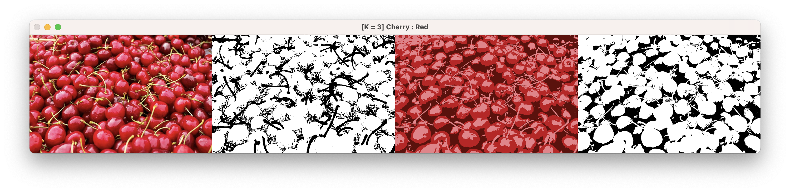
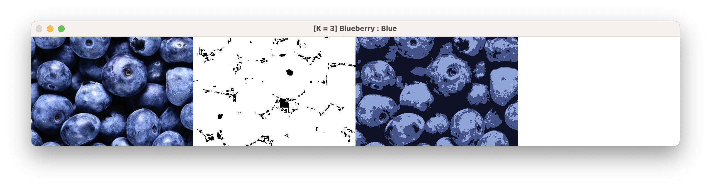
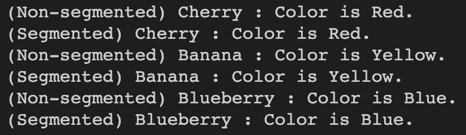

# Color Processing and Clustering

## 1. 개요

- HW01: 임의의 과일 사진을 입력했을 때 해당 과일의 색을 문자로 출력하고 과일 영역을 컬러로 정확히 추출하는 코드를 구현
- HW02: beach.jpg에 대해 군집 간 평균 색으로 segmentation을 수행하는 K-means clustering 수행
- HW03: 임의의 과일 사진에 대해 K-means clustering 기법으로 segmentation을 수행한 후, 과일 영역의 컬러 추출 알고리즘을 수행

## 2. 상세 설계 내용

### HW01: 임의의 과일 사진을 입력했을 때 해당 과일의 색을 문자로 출력하고 과일 영역을 컬러로 정확히 추출하는 코드를 구현

```cpp
Mat myBgr2Hsv(Mat src_img)
{
    double b, g, r, h, s, v;
    Mat hsv_img(src_img.size(), src_img.type());
    for (int y = 0; y < src_img.rows; y++)
    {
        for (int x = 0; x < src_img.cols; x++)
        {
            b = (double)src_img.at<Vec3b>(y, x)[0];
            g = (double)src_img.at<Vec3b>(y, x)[1];
            r = (double)src_img.at<Vec3b>(y, x)[2];

            vector<double> vec = {r, g, b};
            double min_value = *min_element(vec.begin(), vec.end());
            double max_value = *max_element(vec.begin(), vec.end());

            v = max_value;
            if (v == 0)
                s = 0;
            else
                s = (max_value - min_value) / max_value;

            if (max_value == r)
                h = 0 + (g - b) / (max_value - min_value);
            else if (max_value == g)
                h = 2 + (b - r) / (max_value - min_value);
            else
                h = 4 + (r - g) / (max_value - min_value);
            h *= 60;

            if (h < 0)
                h += 360;

            h /= 2;
            s *= 255;

            h = std::max(0.0, std::min(255.0, h));
            s = std::max(0.0, std::min(255.0, s));
            v = std::max(0.0, std::min(255.0, v));

            hsv_img.at<Vec3b>(y, x)[0] = (uchar)h;
            hsv_img.at<Vec3b>(y, x)[1] = (uchar)s;
            hsv_img.at<Vec3b>(y, x)[2] = (uchar)v;
        }
    }
    return hsv_img;
}
```

<!--  -->

위 코드는 BGR 이미지를 HSV 이미지로 변환하는 함수이다.<br>
myBgr2Hsv 함수는 먼저, 각 픽셀의 B, G, R 값을 이용하여 해당 픽셀의 H, S, V 값을 계산한다. 다음으로, 계산된 H, S, V 값을 이용하여 새로운 HSV 이미지를 생성하고, 해당 픽셀에 대한 값으로 설정한다. 그렇게 변환된 HSV 이미지를 반환한다.

<br>

```cpp
Mat myInRange(Mat hsv_img)
{
    Mat dst_img(hsv_img.size(), hsv_img.type());

    int img_color[5] = {0, 0, 0, 0, 0};
    for (int y = 0; y < hsv_img.rows; y++)
    {
        for (int x = 0; x < hsv_img.cols; x++)
        {
            if (0 < hsv_img.at<Vec3b>(y, x)[0] && hsv_img.at<Vec3b>(y, x)[0] <= 20) // Red
            {
                img_color[0]++;
            }
            else if (20 < hsv_img.at<Vec3b>(y, x)[0] && hsv_img.at<Vec3b>(y, x)[0] <= 40) // Yellow
            {
                img_color[1]++;
            }
            else if (40 < hsv_img.at<Vec3b>(y, x)[0] && hsv_img.at<Vec3b>(y, x)[0] <= 70) // Green
            {
                img_color[2]++;
            }
            else if (70 < hsv_img.at<Vec3b>(y, x)[0] && hsv_img.at<Vec3b>(y, x)[0] <= 120) // Blue
            {
                img_color[3]++;
            }
            else if (120 < hsv_img.at<Vec3b>(y, x)[0] && hsv_img.at<Vec3b>(y, x)[0] <= 160) // Purple
            {
                img_color[4]++;
            }
            else if (160 < hsv_img.at<Vec3b>(y, x)[0] && hsv_img.at<Vec3b>(y, x)[0] <= 180) // Red
            {
                img_color[0]++;
            }
        }
    }

    int maximum_color = max({img_color[0], img_color[1], img_color[2], img_color[3], img_color[4]});

    if (maximum_color == img_color[0])
    {
        cout << "Color is Red." << endl;
        for (int y = 0; y < hsv_img.rows; y++)
        {
            for (int x = 0; x < hsv_img.cols; x++)
            {
                if (0 < hsv_img.at<Vec3b>(y, x)[0] && hsv_img.at<Vec3b>(y, x)[0] <= 20)
                {
                    dst_img.at<Vec3b>(y, x)[0] = 255;
                    dst_img.at<Vec3b>(y, x)[1] = 255;
                    dst_img.at<Vec3b>(y, x)[2] = 255;
                }
                else
                {
                    dst_img.at<Vec3b>(y, x)[0] = 0;
                    dst_img.at<Vec3b>(y, x)[1] = 0;
                    dst_img.at<Vec3b>(y, x)[2] = 0;
                }

                if (160 < hsv_img.at<Vec3b>(y, x)[0] && hsv_img.at<Vec3b>(y, x)[0] <= 180)
                {
                    dst_img.at<Vec3b>(y, x)[0] = 255;
                    dst_img.at<Vec3b>(y, x)[1] = 255;
                    dst_img.at<Vec3b>(y, x)[2] = 255;
                }
                else
                {
                    dst_img.at<Vec3b>(y, x)[0] = 0;
                    dst_img.at<Vec3b>(y, x)[1] = 0;
                    dst_img.at<Vec3b>(y, x)[2] = 0;
                }
            }
        }
    }
    else if (maximum_color == img_color[1])
    {
        cout << "Color is Yellow." << endl;
        for (int y = 0; y < hsv_img.rows; y++)
        {
            for (int x = 0; x < hsv_img.cols; x++)
            {
                if (20 < hsv_img.at<Vec3b>(y, x)[0] && hsv_img.at<Vec3b>(y, x)[0] <= 40)
                {
                    dst_img.at<Vec3b>(y, x)[0] = 255;
                    dst_img.at<Vec3b>(y, x)[1] = 255;
                    dst_img.at<Vec3b>(y, x)[2] = 255;
                }
                else
                {
                    dst_img.at<Vec3b>(y, x)[0] = 0;
                    dst_img.at<Vec3b>(y, x)[1] = 0;
                    dst_img.at<Vec3b>(y, x)[2] = 0;
                }
            }
        }
    }
    else if (maximum_color == img_color[2])
    {
        cout << "Color is Green." << endl;
        for (int y = 0; y < hsv_img.rows; y++)
        {
            for (int x = 0; x < hsv_img.cols; x++)
            {
                if (40 < hsv_img.at<Vec3b>(y, x)[0] && hsv_img.at<Vec3b>(y, x)[0] <= 70)
                {
                    dst_img.at<Vec3b>(y, x)[0] = 255;
                    dst_img.at<Vec3b>(y, x)[1] = 255;
                    dst_img.at<Vec3b>(y, x)[2] = 255;
                }
                else
                {
                    dst_img.at<Vec3b>(y, x)[0] = 0;
                    dst_img.at<Vec3b>(y, x)[1] = 0;
                    dst_img.at<Vec3b>(y, x)[2] = 0;
                }
            }
        }
    }
    else if (maximum_color == img_color[3])
    {
        cout << "Color is Blue." << endl;
        for (int y = 0; y < hsv_img.rows; y++)
        {
            for (int x = 0; x < hsv_img.cols; x++)
            {
                if (70 < hsv_img.at<Vec3b>(y, x)[0] && hsv_img.at<Vec3b>(y, x)[0] <= 120)
                {
                    dst_img.at<Vec3b>(y, x)[0] = 255;
                    dst_img.at<Vec3b>(y, x)[1] = 255;
                    dst_img.at<Vec3b>(y, x)[2] = 255;
                }
                else
                {
                    dst_img.at<Vec3b>(y, x)[0] = 0;
                    dst_img.at<Vec3b>(y, x)[1] = 0;
                    dst_img.at<Vec3b>(y, x)[2] = 0;
                }
            }
        }
    }

    else if (maximum_color == img_color[4])
    {
        cout << "Color is Purple." << endl;

        for (int y = 0; y < hsv_img.rows; y++)
        {
            for (int x = 0; x < hsv_img.cols; x++)
            {
                if (120 < hsv_img.at<Vec3b>(y, x)[0] && hsv_img.at<Vec3b>(y, x)[0] <= 160)
                {
                    dst_img.at<Vec3b>(y, x)[0] = 255;
                    dst_img.at<Vec3b>(y, x)[1] = 255;
                    dst_img.at<Vec3b>(y, x)[2] = 255;
                }
                else
                {
                    dst_img.at<Vec3b>(y, x)[0] = 0;
                    dst_img.at<Vec3b>(y, x)[1] = 0;
                    dst_img.at<Vec3b>(y, x)[2] = 0;
                }
            }
        }
    }

    return dst_img;
}
```

위 코드는 HSV 색공간에서 과일 이미지의 색상 범위를 분석하여 특정 색상을 강조하는 함수이다. <br>
먼저, dst_img를 초기화하여 hsv_img와 같은 크기와 타입의 행렬을 생성한다.
다음으로, hsv_img 내의 모든 픽셀에 대해 H값을 검사하여 범위에 해당하는 색상이면 img_color 배열에서 해당 색상 값을 증가시킨다.
그 후, img_color 배열 중 가장 큰 값을 maximum_color로 설정한다. maximum_color가 가장 큰 img_color 배열의 인덱스에 따라, 과일의 색상이 무슨 색인지 출력하고, 해당 색상 범위에 해당하는 픽셀만 흰색으로 변경하여 dst_img를 생성한다.

### HW02: beach.jpg에 대해 군집 간 평균 색으로 segmentation을 수행하는 K-means clustering 수행

```cpp
// OpenCV kmeans() 함수를 이용한 k-means clustering
Mat segmentationByAverageWithCVKMeans(Mat src_img, int k)
{
    //< 2차원 영상 -> 1차원 벡터 >
    Mat samples(src_img.rows * src_img.cols, src_img.channels(), CV_32F);
    for (int y = 0; y < src_img.rows; y++)
    {
        for (int x = 0; x < src_img.cols; x++)
        {
            if (src_img.channels() == 3)
            {
                for (int z = 0; z < src_img.channels(); z++)
                {
                    samples.at<float>(y + x * src_img.rows, z) = (float)src_img.at<Vec3b>(y, x)[z];
                }
            }
            else
            {
                samples.at<float>(y + x * src_img.rows) = (float)src_img.at<uchar>(y, x);
            }
        }
    }

    //< OpenCV K-means 수행 >
    Mat labels;  // 군집판별 결과가 담길 1차원 벡터
    Mat centers; // 각 군집의 중앙값 (대표값)
    int attempts = 5;
    kmeans(samples, k, labels,
           TermCriteria(CV_TERMCRIT_ITER | CV_TERMCRIT_EPS, 10000, 0.0001),
           attempts, KMEANS_PP_CENTERS,
           centers);

    // < 1차원 벡터 -> 2차원 영상 >
    Mat dst_img(src_img.size(), src_img.type());
    vector<Vec3f> mean_colors(k); // 각 군집의 평균 색상을 저장할 벡터
    vector<int> count(k, 0);      // 각 군집 내 픽셀 수를 저장할 벡터

    // 각 군집 내 픽셀 값을 추출하여 평균값을 계산
    for (int y = 0; y < src_img.rows; y++)
    {
        for (int x = 0; x < src_img.cols; x++)
        {
            int cluster_idx = labels.at<int>(y + x * src_img.rows, 0);
            if (src_img.channels() == 3)
            {
                for (int z = 0; z < src_img.channels(); z++)
                {
                    // 군집 판별 결과에 따라 각 군집의 평균값으로 결과를 생성하기 위해 총합을 먼저 구함
                    mean_colors[cluster_idx][z] += src_img.at<Vec3b>(y, x)[z];
                }
            }
            else
            {
                mean_colors[cluster_idx][0] += src_img.at<uchar>(y, x);
            }
            count[cluster_idx]++;
        }
    }

    // 각 군집 내의 픽셀 값의 평균을 계산하여 결과 생성
    for (int i = 0; i < k; i++)
    {
        if (count[i] == 0)
            continue;
        mean_colors[i] /= count[i];

        if (src_img.channels() == 3)
        {
            Vec3b color(mean_colors[i][0], mean_colors[i][1], mean_colors[i][2]);
            for (int y = 0; y < src_img.rows; y++)
            {
                for (int x = 0; x < src_img.cols; x++)
                {
                    int cluster_idx = labels.at<int>(y + x * src_img.rows, 0);
                    if (cluster_idx == i)
                    {
                        dst_img.at<Vec3b>(y, x) = color;
                    }
                }
            }
        }
        else
        {
            uchar gray = static_cast<uchar>(mean_colors[i][0]);
            for (int y = 0; y < src_img.rows; y++)
            {
                for (int x = 0; x < src_img.cols; x++)
                {
                    int cluster_idx = labels.at<int>(y + x * src_img.rows, 0);
                    if (cluster_idx == i)
                    {
                        dst_img.at<uchar>(y, x) = gray;
                    }
                }
            }
        }
    }

    return dst_img;
}
```

위 코드는 OpenCV의 kmeans() 함수를 이용하여 K-means clustering을 통한 segmentation을 수행하는 함수이다. Segmentation을 수행할 때에는 군집 간 평균색을 군집의 대표색으로 하는 segmentation을 수행하도록 코드를 구현하였다.

군집의 평균색을 구하기 위해, mean_colors 벡터에 누적하고, 각 군집에 속한 픽셀 수를 저장하는 count 벡터를 이용하여 각 군집의 평균 색깔을 구하였다. 그 후엔 각 군집의 평균 색깔을 이용하여 결과 이미지를 생성하였다.

### HW03: 임의의 과일 사진에 대해 K-means clustering 기법으로 segmentation을 수행한 후, 과일 영역의 컬러 추출 알고리즘을 수행

[HW01](#hw01-임의의-과일-사진을-입력했을-때-해당-과일의-색을-문자로-출력하고-과일-영역을-컬러로-정확히-추출하는-코드를-구현)에서 구현한 `myBgr2Hsv` 함수 및 `myInRange` 함수, 그리고 [HW02](#hw02-beachjpg에-대해-군집-간-평균-색으로-segmentation을-수행하는-k-means-clustering-수행)에서 구현한 `segmentationByAverageWithCVKMeans` 함수를 사용하여 K-means clustering 기법으로 segmentation을 수행한 후, 과일 영역의 컬러 추출 알고리즘을 수행하였다.

사용된 main 함수의 코드는 아래와 같다.

```cpp
int main()
{
    Mat src_img, hsv_img, dst_img, res_img, segmented_img;

    src_img = imread("cherry.jpeg", 1);
    cout << "(Non-segmented) Cherry : ";
    hsv_img = myBgr2Hsv(src_img);
    dst_img = myInRange(hsv_img);
    hconcat(src_img, dst_img, res_img);
    segmented_img = segmentationByAverageWithCVKMeans(src_img, 3);
    hconcat(res_img, segmented_img, res_img);
    cout << "(Segmented) Cherry : ";
    hsv_img = myBgr2Hsv(segmented_img);
    dst_img = myInRange(hsv_img);
    hconcat(res_img, dst_img, res_img);
    imshow("[K = 3] Cherry : Red", res_img);

    src_img = imread("banana.jpeg", 1);
    cout << "(Non-segmented) Banana : ";
    hsv_img = myBgr2Hsv(src_img);
    dst_img = myInRange(hsv_img);
    hconcat(src_img, dst_img, res_img);
    segmented_img = segmentationByAverageWithCVKMeans(src_img, 3);
    hconcat(res_img, segmented_img, res_img);
    cout << "(Segmented) Banana : ";
    hsv_img = myBgr2Hsv(segmented_img);
    dst_img = myInRange(hsv_img);
    hconcat(res_img, dst_img, res_img);
    imshow("[K = 3] Banana : Yellow", res_img);

    src_img = imread("blueberry.jpeg", 1);
    cout << "(Non-segmented) Blueberry : ";
    hsv_img = myBgr2Hsv(src_img);
    dst_img = myInRange(hsv_img);
    hconcat(src_img, dst_img, res_img);
    segmented_img = segmentationByAverageWithCVKMeans(src_img, 3);
    hconcat(res_img, segmented_img, res_img);
    cout << "(Segmented) Blueberry : ";
    hsv_img = myBgr2Hsv(segmented_img);
    dst_img = myInRange(hsv_img);
    hconcat(res_img, dst_img, res_img);
    imshow("[K = 3] Blueberry : Blue", res_img);

    waitKey(0);
    destroyAllWindows();
    return 0;
}
```

## 3. 실행 결과

### HW01: 임의의 과일 사진을 입력했을 때 해당 과일의 색을 문자로 출력하고 과일 영역을 컬러로 정확히 추출하는 코드를 구현

구현한 코드의 검증을 위해, 각기 다른 세 가지 색상의 과일 사진을 준비하여 실험해보았다.







위 사진들은 위에서부터 순서대로 체리(빨강색), 바나나(노랑색), 블루베리(파랑색)을 분석한 결과이다. 각 결과의 왼쪽 이미지는 분석에 사용된 원본 이미지이고, 오른쪽 이미지는 myInRange 함수를 이용하여 검출한 색상의 영역만 흰 색으로 표시한 것이다.


프로그램의 출력문을 확인했을 때, 구현한 함수가 각 과일의 색상을 잘 탐지하는 것을 확인할 수 있다.

### HW02: beach.jpg에 대해 군집 간 평균 색으로 segmentation을 수행하는 K-means clustering 수행


위 사진은 K = 3, 5, 7, 9일 때의 군집 간 평균 색으로 segmentation을 수행하는 K-means clustering의 결과이다. 가장 왼쪽의 사진은 원본 사진인 beach.jpg이며, 두번째 사진부터 각각 K = 3, 5, 7, 9일 때 K-means clustering의 결과이다.

K 값이 높아질수록 segmentation의 결과가 원본 사진과 유사해보이는 것을 확인할 수 있다.

### HW03: 임의의 과일 사진에 대해 K-means clustering 기법으로 segmentation을 수행한 후, 과일 영역의 컬러 추출 알고리즘을 수행

구현한 코드의 검증을 위해, [HW01](#hw01-ec9e84ec9d98ec9d98-eab3bcec9dbc-ec82aceca784ec9d84-ec9e85eba0a5ed9688ec9d84-eb958c-ed95b4eb8bb9-eab3bcec9dbcec9d98-ec8389ec9d84-ebacb8ec9e90eba19c-ecb69ceba0a5ed9598eab3a0-eab3bcec9dbc-ec9881ec97adec9d84-ecbbaceb9faceba19c-eca095ed9995ed9e88-ecb694ecb69ced9598eb8a94-ecbd94eb939ceba5bc-eab5aced9884-1)에서 사용했던 세 가지 색상의 과일 사진으로 실험해보았다.






위 사진들은 위에서부터 순서대로 체리(빨강색), 바나나(노랑색), 블루베리(파랑색)을 분석한 결과이다. 각 결과의 첫번째 이미지는 분석에 사용된 원본 이미지이고, 두번째 이미지는 myInRange 함수를 이용하여 검출한 색상의 영역만 흰 색으로 표시한 것이다. 세번째 이미지는 K = 3일 때의 K-means Clustering으로 Segmentation 한 결과이고, 4번째는 Segmentation 한 결과를 HSV로 변환한 뒤, myInRange 함수를 이용하여 검출한 색상의 영역을 흰 색으로 표시한 것이다.

3이라는 다소 낮은 K 값을 사용했을 때, 삼진화(trinary) 된 K-means Clustering의 결과가 myInRange 함수를 거치면서 이진화(binary) 된 것을 확인할 수 있다.

다만, 블루베리의 결과가 모두 흰 색을 띄는데, 이는 삼진화(trinary) 된 K-means Clustering의 결과가 모두 Blue 영역이라고 판단해서 흰 색으로 처리되었다.



프로그램의 출력문을 확인했을 때, 구현한 함수가 segment 된 이미지를 입력을 주었을 때도 각 과일의 색상을 잘 탐지하는 것을 확인할 수 있다.
