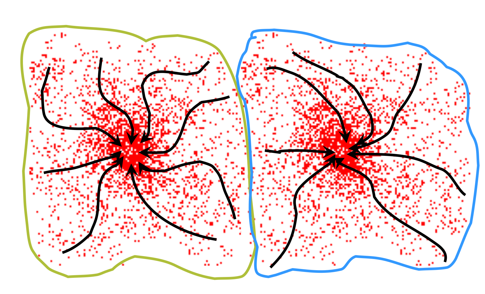
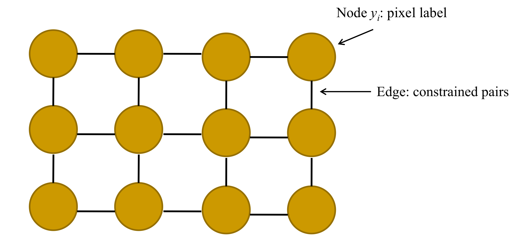
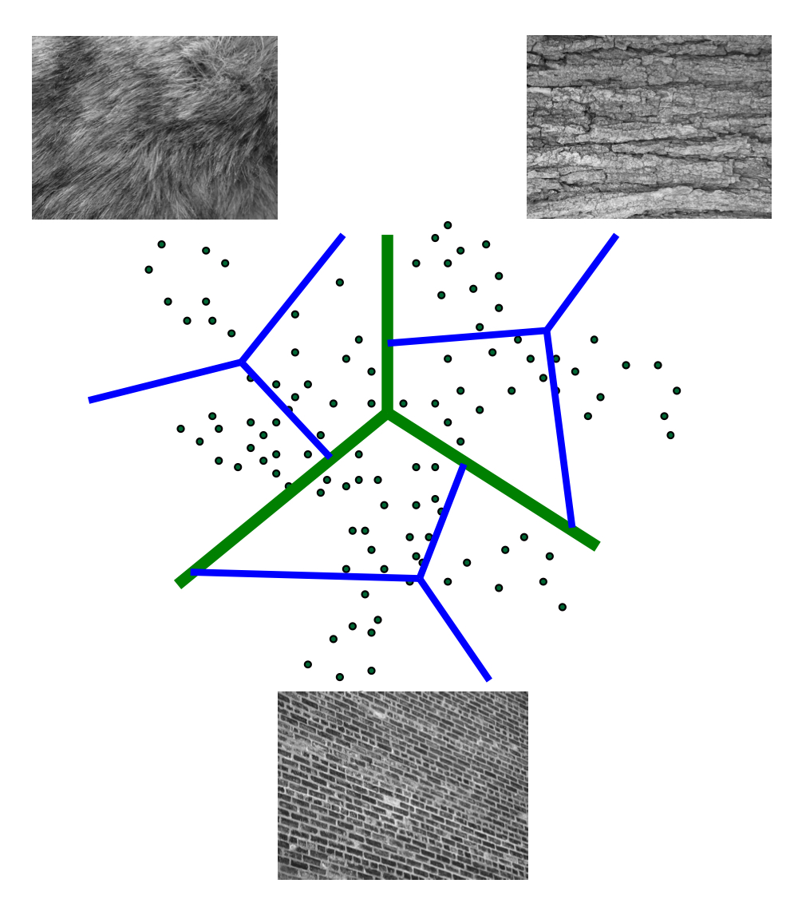

# Clustering and Segmentation

## K-Means Clustering

$$\mathbf{c}^{\ast}, \mathbf{\delta}^{\ast} = \textup{argmin}_{c,\delta} \ \frac{1}{N}\sum_{j}^{N}\sum_{i}^{K}\delta_{ij}\mathit{\mathbf{d}\left (  \mathbf{c}_i, \mathbf{x}_j \right )^{2}}$$

- Iteratively re-assign points to the nearest cluster center
  - Goal: cluster to minimize variance in data given-clusters
- Steps
  - 1): Randomly select K centers
  - 2): [Expectation Step] Assign each point to nearest center
  - 3): [Minimize Step] Compute new center (mean) for each cluster
  - 4): Repeat from the [Expectation Step] to the [Minimize Step] until coverage

### Hyperparater of K-Means Clustering

- K (군집의 수): 3, 5, ...
- Initial center: Randomly select, Greedily choose, ...
- Distance measures: L2 Norm, ..., ?
- Maximum of iterations

### Pros & Cons of K-Means Clustering

- Pros
  - 간단하고 빠르다.
  - 구현하기 쉽다.
- Cons
  - 수렴이 보장되지 않는다.
    - 수렴한다해도, global minimum이 아닌 local minimum으로 수렴할 가능성이 있다.
  - 초기 중심값 위치에 따라 원하는 결과가 나오지 않을 수도 있다.
  - 이상치(outlier) 데이터에 민감하다.
  - 정규화되지 않은 데이터들은 바로 사용할 수 없다.
  - 계산량이 많아 속도가 느리다. ($O(KNd)$ for $N$ $d$-dimensional points)

## Image Segmentation

- Edge-based
  - Active Contour models
    - Snakes
    - Level sets
    - ...
- Region-based
  - [Mean Shift](#mean-shift)
  - Lazy Snapping
  - ...

## Mean Shift

데이터 분포의 밀도에 의한 **mode**를 찾는 algorithm. (mode: 신호의 peak 지점)

### Kernel Density Estimation

- Mixture of Gaussian
  - 기본이 되는 분포의 종합을 통해 데이터의 분포를 추정하는 방법
  - 여러 개의 가우시안이라는 kernel function을 합쳐서 density function을 만들어내는 방법
    - 각각의 가우시안은 하나의 cluster를 의미한다.

### Real Modality Analysis

일단 시작포인트(=mode)를 많이 주고, 수렴하는 곳의 개수를 세어본다.

### Attraction Basin

- Attraction Basin: the region for which all trajectories lead to the same mode
- Cluster: all data points in the attraction basin of a mode

### Mean Shift Algorithm

Mean Shift 알고리즘 자체는 Segmentation을 수행하기 보다도, **signal 혹은 vector들을 clustering**하는 알고리즘이다.

1. Choose kernel and bandwidth
2. For each point:
   1. Center a window on that point
   2. Computte the mean of the data in the search window
   3. Center the search window at the new mean location
   4. Repeat (ii)~(iii) until convergence
3. Assign points that lead to nearby modes to the same cluster

### **Mean Shift Pros and Cons**

- Pros
  - **K-Means clustering과 달리 군집의 개수를 지정할 필요가 없음**
  - 일반적인 세그멘테이션에 좋음 (Good general-purpose segmentation)
  - General **mode-finding algorithm** (useful for other porblems such as finding most common surface normal)
  - **영역의 수와 모양에 있어서 유연 (Flexible in number and shape of regions)**
  - **이상치(outlier) 데이터에 강건함 (Robust to outliers)**
- Cons
  - **kernel 사이즈를 미리 정해야 함**
  - K-Means clustering에 비해 느림
    - **계산량이 많아** 고차원 데이터에는 적합하지 않음
  - 주변 영역의 균질성들이 고려되지 않음.
    - Mean Shift는 화소 단위의 알고리즘임.
    - 영상의 기본 특징은 low-pass signal이 강하기 때문에 영상 전체에서 밝기는 유사함.
    - Mean Shift는 이러한 특징들이 전혀 고려되지 않음.
- When to use it
  - Oversegmentation에 유용
    - superpixel들을 다시 grouping
  - Multiple segmentations

## MAP (Maximum A Posteriori probability) MRF (Markov Random Field)

$$P(\mathbf{y}| \theta, data) = \frac{1}{Z} \prod_{i=1..N} p_1(y_i| \theta, data) \prod_{i,j \in edges} p_2(y_i, y_j| \theta, data)$$

- $P(\mathbf{y}| \theta, data)$: posterior probability
- $p_1(y_i| \theta, data)$: likelihood probability
  - 각각의 화소가 어떤 라벨을 가질지에 대한 확률
- $p_2(y_i, y_j| \theta, data)$: prior probability
  - 선험적인 (prior experience) 정보

### Energy minimization

$$Energy(\mathbf{y}| \theta, data) = \sum_{i} \psi_1(y_i| \theta, data) + \sum_{i,j \in edges} \psi_2(y_i, y_j| \theta, data)$$

- $Energy(\mathbf{y}| \theta, data)$: energy
- $\psi_1(y_i| \theta, data)$: Data term or unary term (cost of assignment of label $y_i$)
- $\psi_2(y_i, y_j| \theta, data)$: Smoothness term or pairwise term (cost of pairwise assignment $y_i$, $y_j$)

### Markov Random Fields

## Solving MRFs with **Graph Cuts**

- Graph Cuts는 Markov Random Fields의 대표적인 기법으로, 최솟값을 만들어주는 $\theta$를 찾는 알고리즘 기법 중 하나이다.
- boundary를 지정하면 결과가 나온다.

### Pros and Cons of Graph Cuts

- Pros
  - Can incorporate data likehoods and priors
  - Applies to a wide range of problems (stereo, image labeling, recognition)
- Cons
  - 시간이 오래 걸림
  - Not alwayas applicable
  - Need unary terms (not used for bottom-up segmentation)

## Texture (질감)

> Regular or stochastic patterns caused by bumps, grooves, and/or markings

- 유사한 pattern을 가지고 있는 texture를 묶어주면 segmentation이 된다.
- Texture를 알고 있으면 영상의 Material, Orientation, Scale 등을 알아낼 수 있다.

### Texture Representation

- Compute responses of blobs and edges using filter bank

#### Filter Banks

- 필터들을 모아놓은 것
- e.g.,
  - LM (Leung and Malik) filter bank
  - Schmid filter bank
  - Maximum Response (MR) filter bank

#### Visual Dictionary using Texture

1. Sample patches from a texture database
   - e.g., 8-dimensional texture vectors
2. Cluster the patches
   - Cluster centers are the dictionary
   - Assign a codeword (number) to each new texture patch, according to the nearest cluster
3. Classify new texture

# References

1. 디지털영상처리설계 (ICE4027), 인하대학교 정보통신공학과 박인규
2. Digital Image Processing 4th Edition, Rafael C. Gonzalez and Richard E. Woods
3. [Computer Vision: Algorithms and Applications 2nd Edition, Richard Szeliski](https://szeliski.org/Book/)
