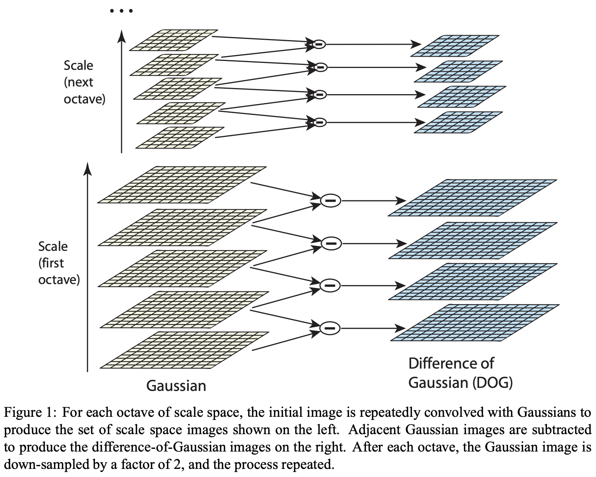
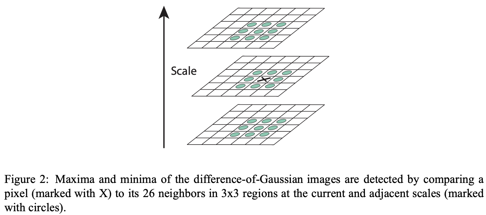
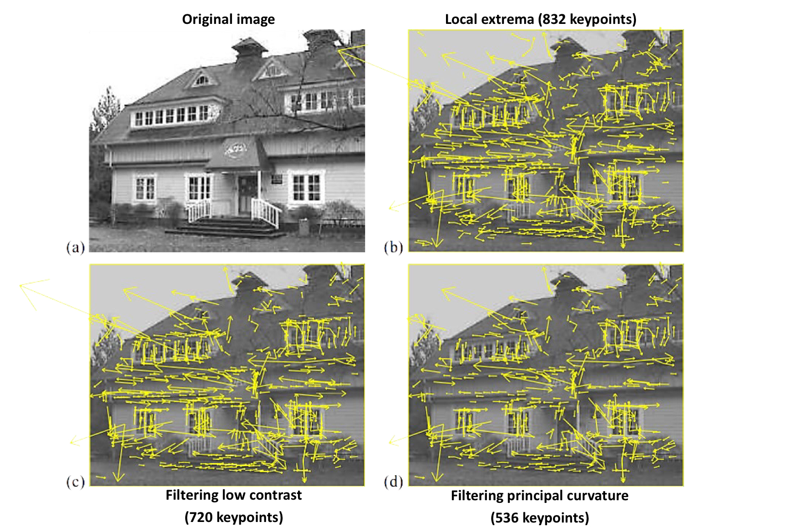
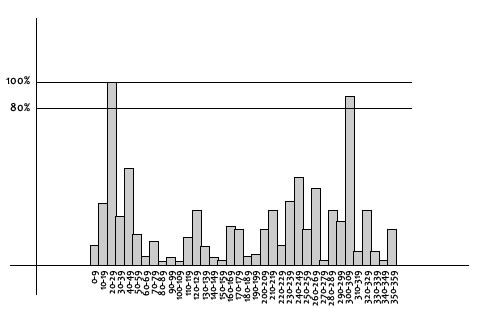
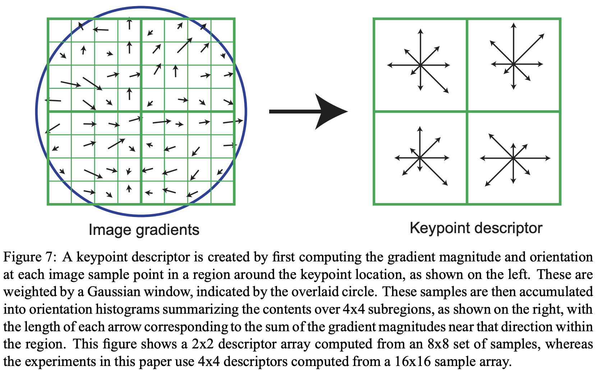
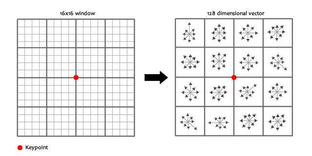

# Local Feature Detection and Matching

## Feature Detection Procedure

1. Find a set of **distinctive keypoints** (e.g. corners, blobs)
2. Define a **supporting region** around each keypoint in a scale or affine invariant manner
3. Extract and **normalize** the region content
4. Compute a **descriptor** from the normalized region
5. **Match** the local descriptors

## Example of Local Features

- Edges
- **Corners** (e.g., [Harris](#harris-corner-detector))
  - Location + orientation
- **Blobs** (e.g., [SIFT; Scale Invariant Feature Transform](#sift-scale-invariant-feature-transform))
  - Corner + scale

## Corner Features

- Points in 2D image with **high curvature (높은 곡률)**
- Doesn't necessarily correspond to real 3D corner
- Take place at **junctions (분기점)**, highly **textured** surface, **occlusion boundary**, etc.

### Corner Features - Why?

- Corner points are **stable & unique** feature
  - 변형이 생겨도 corner point가 바뀌지 않음
  - local한 관점에서 uniqu함으로 특징을 표현하는데 적합함
- Robust to **lighting** and **viewpoint** changes
- Position shifting from the corner yields large **variation** in appearance

## Harris Corner Detector

Change of intensity for the shift $\Delta \mathbf{u}$ at $I(x, y)$:
$$E_{AC}(\Delta \mathbf{u}) = \sum_{i} w(\mathbf{x_i}) [I_0(\mathbf{x_i} + \Delta \mathbf{u}) - I_0(\mathbf{x_i})]^2$$

- $\Delta \mathbf{u}$: shift의 양
- $I_0(\mathbf{x_i})$: intensity at $\mathbf{x_i}$
  - shift 되기 전 window
- $I_0(\mathbf{x_i} + \Delta \mathbf{u})$: Shifted intensity
  - shift 되고 난 후 window
- $w(\mathbf{x_i})$: Window function (e.g., Gaussian)

### Harris Detector Formulation

$$
\begin{align*}
  E_{AC}(\Delta \mathbf{u}) &= \sum_{i} w(\mathbf{x_i}) [I_0(\mathbf{x_i} + \Delta \mathbf{u}) - I_0(\mathbf{x_i})]^2 \\
  &\approx \sum_{i} w(\mathbf{x_i}) [I_0(\mathbf{x_i}) + \nabla I_0(\mathbf{x_i}) \Delta \mathbf{u}  - I_0(\mathbf{x_i})]^2 \\
  &= \sum_{i} w(\mathbf{x_i}) [\nabla I_0(\mathbf{x_i}) \Delta \mathbf{u} ]^2 \\
  &= \Delta \mathbf{u}^T \mathbf{A} \Delta \mathbf{u}
\end{align*}
$$

$$
where \quad \nabla I_0=\left( \frac{\partial{I_0}}{\partial{x}}, \frac{\partial{I_0}}{\partial{y}} \right)^{T} = \left ( I_x, I_y \right )^{T},\quad \mathbf{A}=\sum_{x, y}  \left ( w(x, y) \begin{bmatrix}
I_x^2 &  I_xI_y\\
I_xI_y & I_y^2 \\
\end{bmatrix} \right )
$$

 

- cf) - Math: Taylor expansion of $I_0(\mathbf{x_i} + \Delta \mathbf{u})$:
  $$I_0(\mathbf{x_i} + \Delta \mathbf{u}) \approx I_0(\mathbf{x_i}) + \nabla I_0(\mathbf{x_i}) \Delta \mathbf{u} $$
  - $\nabla I_0(\mathbf{x_i})$: gradient at $\mathbf{x_i}$

 

- cf) - Math: Quadratic form

$$
\begin{align*}
  f(x,y) &=
    \begin{pmatrix}
    x & y \\
    \end{pmatrix} \
    \mathbf{A} \
    \begin{pmatrix}
    x \\ y
    \end{pmatrix} \\
    &= ax^2 + bxy + cy^2 \\
  \end{align*}
$$

- $\mathbf{A}$ is a $2\times 2$ matrix computed from image derivatives:

$$
\begin{align*}
  \mathbf{A} &= \sum_{x, y}  \left ( w(x, y) \begin{bmatrix}
  I_x^2 &  I_xI_y\\
  I_xI_y & I_y^2 \\
  \end{bmatrix} \right ) \\
  &= \begin{bmatrix}
  \sum I_xI_x & \sum I_xI_y \\
  \sum I_xI_y & \sum I_yI_y \\
  \end{bmatrix}
  = \begin{bmatrix}
  \lambda_1 & 0 \\
  0 & \lambda_2 \\
  \end{bmatrix} \\
\end{align*}
$$

  <!-- &= \sum \begin{bmatrix}
  I_x \\
  I_y \\
  \end{bmatrix}
  \begin{bmatrix}
  I_x & I_y \\
  \end{bmatrix} \\ -->

### What does Matrix $\mathbf{A}$ reveal?

$$
\begin{align*}
  \mathbf{A}
  &= \begin{bmatrix}
  \sum I_xI_x & \sum I_xI_y \\
  \sum I_xI_y & \sum I_yI_y \\
  \end{bmatrix}
\end{align*}
$$

#### Axis-aligned Case

(가정) axis-aligned : $I_xI_y$가 무시할 수 있을 만큼 작은 값이라고 가정

$$
\begin{align*}
  \mathbf{A}
  &= \begin{bmatrix}
  \sum I_xI_x & \sum I_xI_y \\
  \sum I_xI_y & \sum I_yI_y \\
  \end{bmatrix}
  = \begin{bmatrix}
  \lambda_1 & 0 \\
  0 & \lambda_2 \\
  \end{bmatrix} \\
\end{align*}
$$

$\lambda_1$, $\lambda_2$ : 대각 원소 (eigenvalue)

- Flat
  - $\lambda_1$, $\lambda_2$ are small
- Linear Edge
  - $\lambda_1$ is large, $\lambda_2$ is small
  - Or $\lambda_1$ is small, $\lambda_2$ is large
- Corner
  - $\lambda_1$, $\lambda_2$ are large

#### General Case

- Since $\mathbf{A}$ is **symmetric**, we have **orthogonal diagonalization**:

$$
\mathbf{A} = \mathbf{P}^{-1}
\begin{bmatrix}
\lambda_1 & 0 \\
0 & \lambda_2 \\
\end{bmatrix}
\mathbf{P}
$$

- $\mathbf{P}$: orthogonal matrix
- $\lambda_1$, $\lambda_2$: eigenvalues of $\mathbf{A}$
- Orthogonal matrix $\mathbf{P}$ gives us **alignment rotation** to the principal axis
- After alignment, we can view **eigenvalue matrix** as the previous case $\mathbf{A}$ (axis-aligned case)

### Interpreting the Eigenvalues

#### Corner Response Function (CRF)

$$R = \mathrm{det}(\mathbf{A}) - \alpha (\mathrm{trace}(\mathbf{A}))^2 = \lambda_1 \lambda_2 - \alpha (\lambda_1 + \lambda_2)^2$$

- cf) Math - $\mathrm{trace}(\mathbf{A})$:
  - $\mathbf{A}$의 대각 원소들의 합
- cf) Math - 잊어버리기 쉬운 선형대수 속 성질들
  - $\mathrm{det}(\mathbf{A}) = \lambda_1 \lambda_2$
  - $\mathrm{trace}(\mathbf{A}) = \lambda_1 + \lambda_2$

### Harris Corner Detector

- Algorithm steps:
  1. Compute $\mathbf{A}$ matrix within all image windows to get their $R$ scores by $\mathrm{det}(\mathbf{A})$ and $\mathrm{trace}(\mathbf{A})$
  2. Find points with large corner response ( $R>threshold$ )
  3. Take the points of local maxima of $R$ (non-maximum suppression)
- Properties
  - Rotation invariance
  - Not invariant to image scale
- Harris Corner Detector의 단점
  - 계산량이 많다.
  - RTS 중 Scaling에 취약하다.

## SIFT (Scale Invariant Feature Transform)

- (1) [Scale-space extrema detection](#1-scale-space-extrema-detection)
  - 이미지의 크기를 변화시켜 극대점, 극소점 detection -> keypoint candidates 찾음
- (2) [Keypoint localization](#2-keypoint-localization)
  - feature matching 시 불안정할 keypoint 제거 및 keypoint를 정확하게 위치시킴
- (3) [Orientation assignment](#3-orientation-assignment)
  - 각 keypoint들의 direction, magnitude등의 orientation 결정
- (4) [Keypoint descriptor](#4-keypoint-descriptor)
  - keypoint를 표현하기 위한 descriptor 생성

### (1) Scale-space extrema detection

#### < Simulating scale changes by image pyramid >

- Use scale space function
  - $L(x, y, \sigma) = G(x, y, \sigma) * I(x, y)$
    - $I(x, y)$: input image
    - $L(x, y, \sigma)$: scale space of image
    - $G(x, y, \sigma)$: Gaussian filter
- Incrementally convolve image with Gaussian separated by constant $k$
  - $L(x, y, \sigma) = G(x, y, k, \sigma) * I(x, y)$
    - $k = 2^{1/s}$
    - $s$: number of interval in an octave (한 옥타브에 몇 개가 있는지)

#### < Obtain LoG approximation efficiently using **DoG** (Difference of Gaussian) >

- LoG can be approximated by a Difference of two Gaussians (DoG) at different scales
  - $\nabla^2 G_{\sigma} \approx G_{\sigma 1} - G_{\sigma 2}$
  - DoG와 LoG가 유사하다.

#### < Find local extrema in scale space >

- Find extrema by 3D NMS (nonmax-suppression)
  - Compare a pixel with **26 pixels** in current and adjacent scales
  - Select as keypoint (extrema) **if larger of smaller than all 26 pixels**

### (2) Keypoint localization

- Use Taylor expansion function for subpixel localization accuracy and reject extrema with **low contrast**
- **DoG has strong response along edge**, eliminate extrema that **localized on edge**, with 2x2 second moment matrix
- Eigenvalues of H are proportional to the principal curvatures
  - Hessian matrix :

$$
\mathbf{H} = \begin{bmatrix}
  D_{xx} & D_{xy} \\
  D_{xy} & D_{yy}
\end{bmatrix}
$$

- Reject extrema if **the ratio of principal curvature** ($r$) is beyond threshold (e.g. $r>10$)
  - $\mathrm{Trace}(\mathbf{H}) = D_{xx} + D_{yy} = \alpha + \beta$
  - $\mathrm{Det}(\mathbf{H}) = D_{xx} D_{yy} - D_{xy}^2 = \alpha \beta$
  - $\frac{\mathrm{Trace}(\mathbf{H})^2}{\mathrm{Det}(\mathbf{H})} = \frac{(\alpha + \beta)^2}{\alpha \beta} < \frac{(r+1)^2}{r}$, $r = \frac{\alpha}{\beta}$
    - 원하는 것은 $\alpha$와 $\beta$가 유사, 즉 $r \fallingdotseq 1$

화살표의 크기는 $\sigma$의 크기를 의미하고, 화살표의 방향은 keypoint의 방향([orientation](#3-orientation-assignment))을 의미한다.

### (3) Orientation assignment

Gradient의 크기와 방향을 구하고 아래와 같이 가로축이 방향, 세로축이 크기인 Histogram을 그린다. 아래의 Histogram에서 가장 큰 값을 가지는 방향(각도)을 keypoint의 방향으로 설정한다.

하지만, 1등과 2등의 차이가 얼마 나지 않는다면?

그럴 때는 1등과 2등의 값을 가지는 방향을 모두 살려서 blob을 만들어준다. (multiple-blob)

### (4) Keypoint descriptor

- SIFT descriptor is **histogram** of relative strength and orientation of gradient distribution
- Image gradient makes the descriptor **robust** to small geometric changes and variation in lighting

- The resulting feature vector length is 128 (= 8 orientations x 4x4 grid)

### Final SIFT Features

- Each SIFT feature will consist of
  - 128 dimensional descriptors
  - Scale (size of region)
  - Orientation
  - 2D coordinates (위치)

## Feature Matching

### Distance between Local Descriptors

- SSD (sum of squared difference)
  - $d(\mathbf{x}, \mathbf{y})_{SSD}\coloneqq  \left\| \mathbf{x} - \mathbf{y} \right\|^{2}$
- NCC (normalized cross correlation)
  - $d(\mathbf{x}, \mathbf{y})\_{NCC}\coloneqq  \frac{\mathrm{COV}(\mathbf{x}, \mathbf{y})}{ \sigma_{\mathbf{x}} \sigma_{\mathbf{y}} }$

### Feature Matching Strategies

- Threshold based matching
  - Two features are matched if the distance between them is smaller than a threshold
  - May resulting in **multiple matches**
- Nearest neighbor matching (NN)
  - A pair of feature is matched if the **distance of nearest neighbor** below some threshold
  - **Single match** result
- Nearest neighbor distance ratio (NNDR)
  - $\left\| D*{\mathbf{A}} - D*{\mathbf{B}} \right\| \mathbf{/} \left\| D*{\mathbf{A}} - D*{\mathbf{C}} \right\| < \tau $
  - Features are matched if the ratio of distance of nearest neighbor and second nearest neighbor is below threshold $\tau$
  - **Single match** result

# References

1. 디지털영상처리설계 (ICE4027), 인하대학교 정보통신공학과 박인규
2. Digital Image Processing 4th Edition, Rafael C. Gonzalez and Richard E. Woods
3. [Computer Vision: Algorithms and Applications 2nd Edition, Richard Szeliski](https://szeliski.org/Book/)
4. [CSE/EE486 Computer Vision I](https://www.cse.psu.edu/~rtc12/CSE486/), [Lecture 06: Corner Detection](https://www.cse.psu.edu/~rtc12/CSE486/lecture06.pdf), CSE Department, Penn State University, Instructor: Robert Collins
5. [Lowe, D. G. (2004). Distinctive image features from scale-invariant keypoints. International journal of computer vision, 60, 91-110.](https://www.cs.ubc.ca/~lowe/papers/ijcv04.pdf)
6. [Scale-Invariant-Feature Transform(SIFT), 한국과학기술원 전기 및 전자공학과 최성필](https://salkuma.files.wordpress.com/2014/04/sifteca095eba6ac.pdf)
7. [[Feature extraction #1] SIFT 알고리즘](https://intuitive-robotics.tistory.com/93)
8. [SIFT (Scale Invariant Feature Transform)의 원리 by bskyvision.com](https://bskyvision.com/21)
9. [SIFT: Theory and Practice: Keypoint orientations - AI Shack](http://aishack.in/tutorials/sift-scale-invariant-feature-transform-features/)
10. [SIFT: Theory and Practice: Generating a feature - AI Shack](http://aishack.in/tutorials/sift-scale-invariant-feature-transform-features/)
