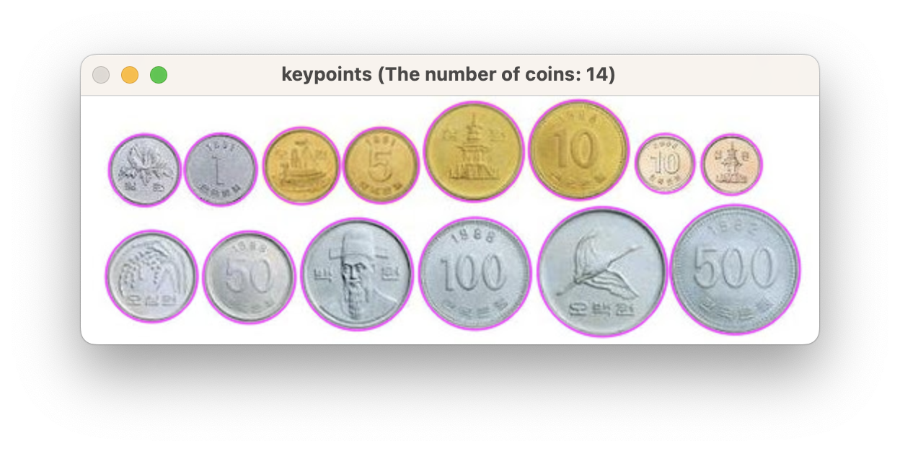
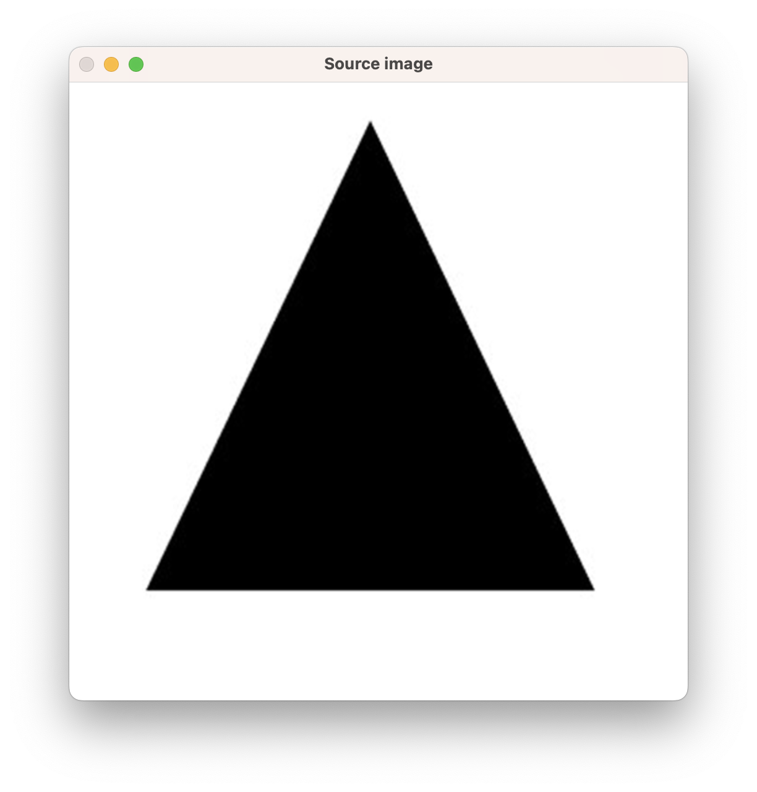
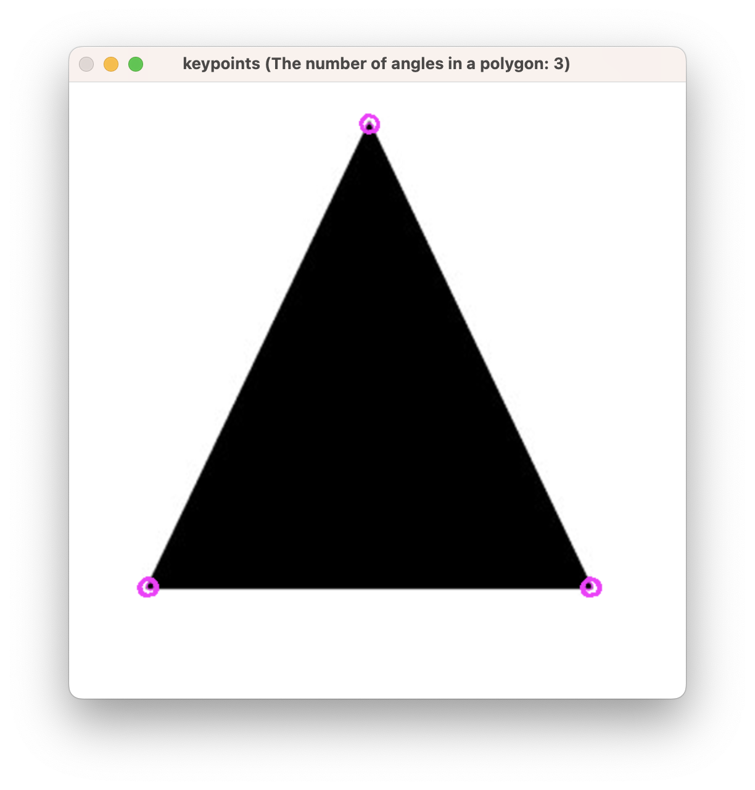
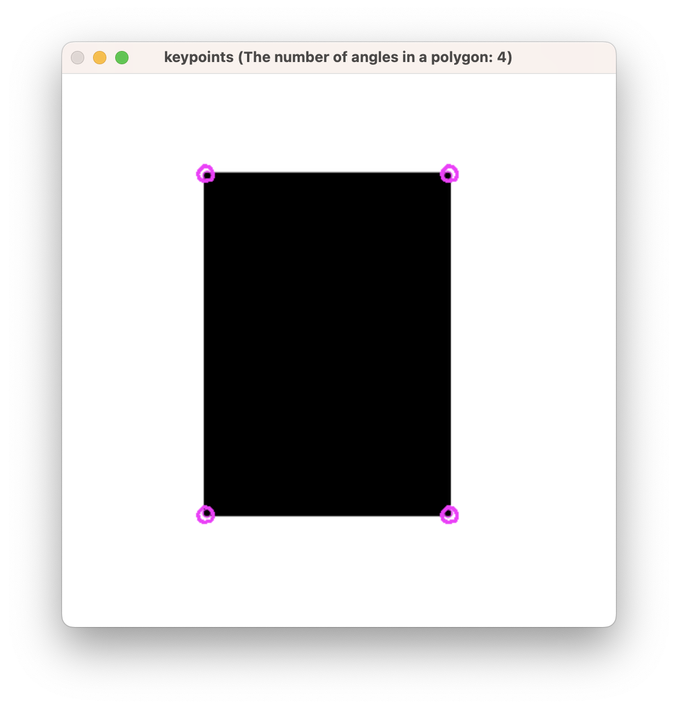
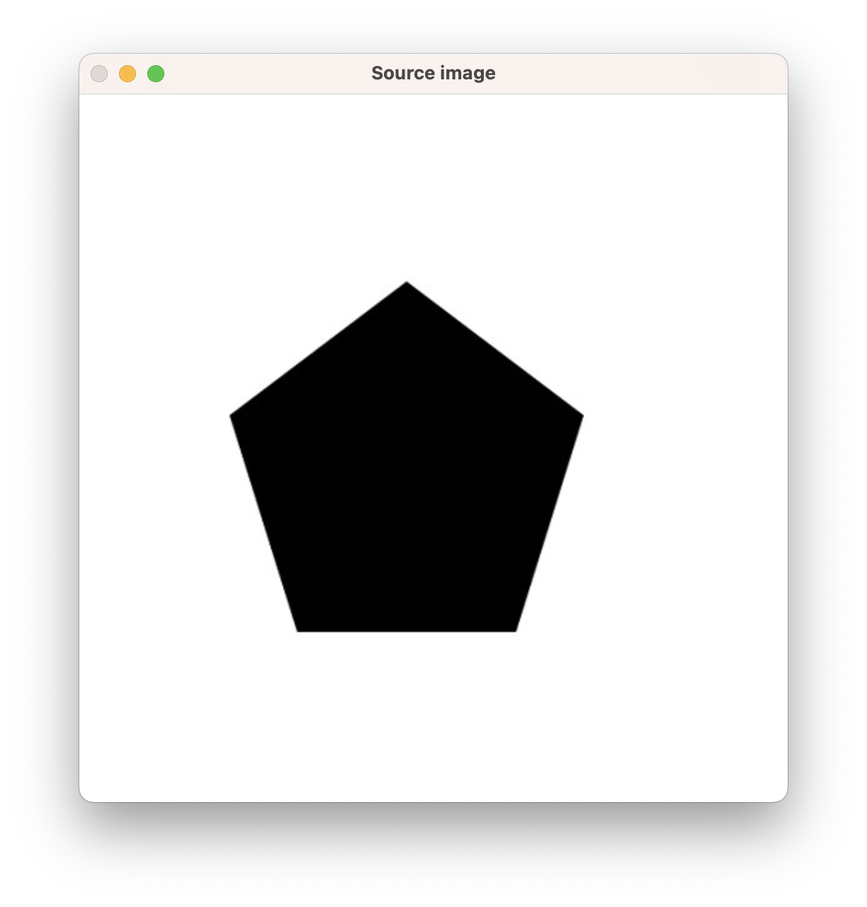
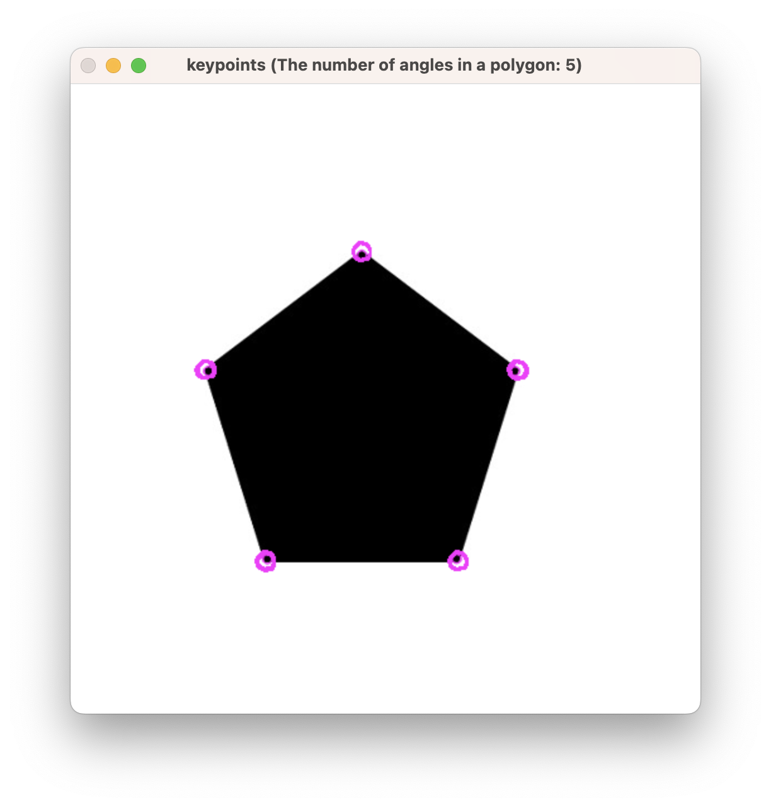
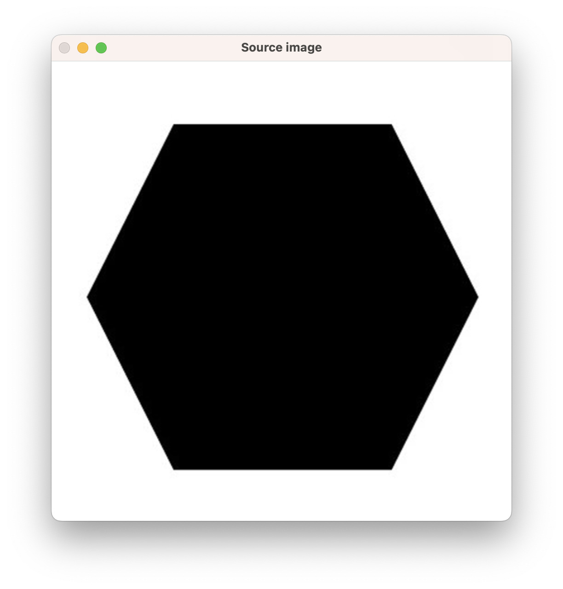
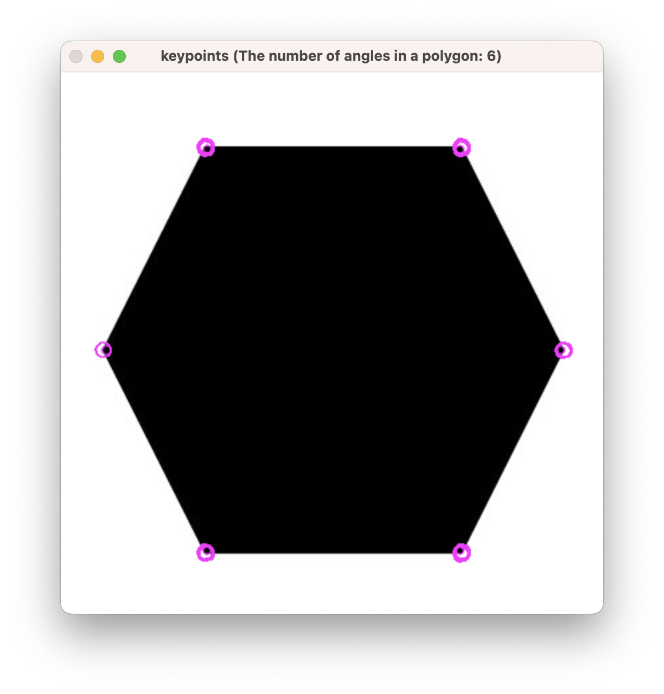

# Local Features and SIFT

## 1. 개요

1. coin.png의 동전 개수를 알아내는 프로그램을 구현
2. OpenCV의 corner detection과 circle detection을 이용해 삼각형, 사각형, 오각형, 육각형의 영상을 순차적으로 읽어와 각각 몇 각형인지 알아내는 프로그램을 구현
3. church.jpg에 투시 변환(perspective change)과 밝기 변화를 같이 수행한 후 SIFT 특징점을 구했을 때, 원본 영상의 SIFT 특징점이 보존되는지 확인해볼 것

## 2. 상세 설계 내용

### (1) coin.png의 동전 개수를 알아내는 프로그램을 구현

```cpp
void cvBlobCoinDetection(Mat &img)
{
    SimpleBlobDetector::Params params;
    params.minThreshold = 5;    // 최소 threshold값
    params.maxThreshold = 500;  // 최대 threshold값
    params.filterByArea = true; // 최소 최대 면적 제한
    params.minArea = 120;       // 최소
    params.maxArea = 9000;      // 최대

    params.filterByCircularity = true; // 원형에 얼마나 가까운지 제한
    params.minCircularity = 0.65;

    params.filterByConvexity = true; // 내부가 얼마나 볼록히 채워지는지 제한
    params.minConvexity = 0.9;

    params.filterByInertia = true; // 타원이 원에 얼마나 가까운지 제한
    params.minInertiaRatio = 0.01;

    Ptr<SimpleBlobDetector> detector = SimpleBlobDetector::create(params); // SimpleBlobDetector 선언
    std::vector<KeyPoint> keypoints;
    detector->detect(img, keypoints); // img에서 keypoints 감지

    Mat result;
    drawKeypoints(img, keypoints, result,
                  Scalar(255, 0, 255), DrawMatchesFlags::DRAW_RICH_KEYPOINTS);

    imshow("keypoints (The number of coins: " + to_string(keypoints.size()) + ")", result); // size()를 통해 원의 개수 구하기
    waitKey(0);
    destroyAllWindows();
}
```

원 모양의 동전을 찾기 위해 cvBlobCoinDetection 함수를 설계하였다.

SimpleBlobDetector::Params를 통해 원의 특징을 설정하였고, SimpleBlobDetector::create를 통해 SimpleBlobDetector를 선언하였다. 그 후, detect 함수를 통해 원의 특징을 감지하고, drawKeypoints 함수를 통해 원의 특징을 그린다. 그리고 size()를 통해 원의 개수, 즉 동전의 개수를 구하도록 하였다.

### (2) OpenCV의 corner detection과 circle detection을 이용해 삼각형, 사각형, 오각형, 육각형의 영상을 순차적으로 읽어와 각각 몇 각형인지 알아내는 프로그램을 구현

```cpp
void cvPolygonDetection(Mat polygon[4])
{
    for (int i = 0; i < 4; i++)
    { // 사각형부터 육각형까지 4~6
        Mat img = polygon[i];

        if (img.empty())
        {
            cout << "Empty image!\n";
            exit(1);
        }

        Mat result = cvHarrisCorner(img);
        cvBlobDetection(result); // blob detection 실행
        imshow("Source image", img);
        waitKey(0);
    }
    destroyAllWindows();
}
```

위 cvPolygonDetection 함수는 사각형부터 육각형까지의 영상을 순차적으로 읽어와 각각 몇 각형인지 알아내는 함수이다. cvHarrisCorner 함수를 통해 corner detection을 수행하고, cvBlobDetection 함수를 통해 blob detection을 수행한다.

<br>

아래는 cvHarrisCorner 함수이다.

```cpp
Mat cvHarrisCorner(Mat &img)
{
    resize(img, img, Size(500, 500), 0, 0, INTER_CUBIC);

    Mat gray;
    cvtColor(img, gray, COLOR_BGR2GRAY);

    // < Do Harris Corner Detection >
    Mat harr;
    cornerHarris(gray, harr, 5, 3, 0.05, BORDER_DEFAULT);
    normalize(harr, harr, 0, 255, NORM_MINMAX, CV_32FC1, Mat());

    // < Get abs for Harris visualization >
    Mat harr_abs;
    convertScaleAbs(harr, harr_abs);

    // < Print corners >
    int thresh = 125;
    Mat result = img.clone();
    for (int y = 0; y < harr.rows; y++)
    {
        for (int x = 0; x < harr.cols; x++)
        {
            if ((int)harr.at<float>(y, x) > thresh)
            {
                circle(result, Point(x, y), 7, Scalar(255, 0, 255), 0, 4, 0);
            }
        }
    }

    return result;
}
```

cvHarrisCorner 함수에서는 cornerHarris 함수를 통해 corner detection을 수행하고, normalize 함수를 통해 정규화를 수행한다. 그 후, convertScaleAbs 함수를 통해 harr의 절대값을 구하고, harr의 값이 125보다 크면 원을 그리도록 하였다.

cvBlobDetection 함수는 앞서 구현한 cvBlobCoinDetection 함수와 유사하므로 생략한다.

### (3) church.jpg에 투시 변환(perspective change)과 밝기 변화를 같이 수행한 후 SIFT 특징점을 구했을 때, 원본 영상의 SIFT 특징점이 보존되는지 확인해볼 것

```cpp
Mat cvFeatureSIFT(Mat &img)
{
    Mat gray;
    cvtColor(img, gray, COLOR_BGR2GRAY);

    Ptr<SiftFeatureDetector> detector = SiftFeatureDetector::create();
    vector<KeyPoint> keypoints;
    detector->detect(gray, keypoints);

    Mat result;
    drawKeypoints(img, keypoints, result, Scalar::all(-1), DrawMatchesFlags::DRAW_RICH_KEYPOINTS);

    return result;
}
```

위 cvFeatureSIFT 함수는 SIFT 특징점을 구하는 함수이다. SIFT 특징점을 구하기 위해 SiftFeatureDetector를 선언하고, detect 함수를 통해 특징점을 구한다. 그 후, drawKeypoints 함수를 통해 특징점을 그린다.

<br>

투시 변환(perspective change)을 수행하기 위한 cvWarpPerspective 함수는 아래와 같다.

```cpp
Mat cvWarpPerspective(Mat &src)
{
    Mat dst;
    Point2f src_p[4], dst_p[4];

    int row = src.rows;
    int col = src.cols;

    // 변환되기 전 포인트의 지점 지정
    src_p[0] = Point2f(0, 0);
    src_p[1] = Point2f(col, 0);
    src_p[2] = Point2f(0, row);
    src_p[3] = Point2f(col, row);

    // 변환시킬 포인트의 지점 지정
    dst_p[0] = Point2f(0, 0);
    dst_p[1] = Point2f(col, 0);
    dst_p[2] = Point2f(0, row);
    dst_p[3] = Point2f(col - 200, row - 200);

    Mat perspect_mat = getPerspectiveTransform(src_p, dst_p);
    warpPerspective(src, dst, perspect_mat, Size(col, row));

    return dst;
}
```

cvWarpPerspective 함수에서는 변환되기 전 포인트의 지점과 변환시킬 포인트의 지점을 지정한 후, OpenCV의 getPerspectiveTransform 함수를 통해 투시 변환 행렬을 구한다. 그 후, OpenCV의 warpPerspective 함수를 통해 투시 변환을 수행한다.

<br>

밝기를 변화시키기 위한 changeIntensity 함수는 아래와 같다.

```cpp
Mat changeIntensity(Mat &src, int value)
{
    Mat dst = src + Scalar(value, value, value);
    return dst;
}
```

changeIntensity 함수는 인자로 value를 받고, 입력 영상에 Scalar(value, value, value)를 더해주는 방식으로 밝기를 변화시킨다.

## 3. 실행 결과

### (1) coin.png의 동전 개수를 알아내는 프로그램을 구현

설계한 cvBlobCoinDetectionmain 함수를 사용하는 main 함수에서는 단순히 coin.png를 불러온 후, cvBlobCoinDetection 함수를 호출하였다.



위 결과를 확인하면, 동전이 모두 탐지가 되었고, window의 제목에 동전의 개수가 정확히 출력되었다.

### (2) OpenCV의 corner detection과 circle detection을 이용해 삼각형, 사각형, 오각형, 육각형의 영상을 순차적으로 읽어와 각각 몇 각형인지 알아내는 프로그램을 구현

```cpp
int main()
{
    Mat polygon[4]; // 삼각형, 사각형, 오각형, 육각형 이미지를 읽어 polygon 배열에 넣음
    polygon[0] = imread("triangle.jpg");
    polygon[1] = imread("rectangle.jpg");
    polygon[2] = imread("pentagon.jpg");
    polygon[3] = imread("hexagon.jpg");

    cvPolygonDetection(polygon);

    return 0;
}
```

위 main 함수에서는 삼각형, 사각형, 오각형, 육각형 이미지를 읽어 polygon 배열에 넣고, cvPolygonDetection 함수를 호출하였다. main 함수의 실행 결과는 아래와 같다.

아래 결과들을 확인하면, corner detection을 통해 각각의 영상이 잘 탐지되었음을 확인할 수 있다.

#### 삼각형

- 원본 영상
  - 
- corner detection 결과
  - 

#### 사각형

- 원본 영상
  - 
- corner detection 결과
  - 

#### 오각형

- 원본 영상
  - 
- corner detection 결과
  - 

#### 육각형

- 원본 영상
  - 
- corner detection 결과
  - 

### (3) church.jpg에 투시 변환(perspective change)과 밝기 변화를 같이 수행한 후 SIFT 특징점을 구했을 때, 원본 영상의 SIFT 특징점이 보존되는지 확인해볼 것

```cpp
int main()
{
    // < 원본 영상에서 SIFT 특징점 구하기 >
    Mat origin_img = imread("church.jpg", 1);
    Mat origin_sift_result = cvFeatureSIFT(origin_img);

    // < 투시 변환 및 밝기 변환을 수행한 영상에 SIFT 특징점 구하기 >
    Mat warped_img = changeIntensity(origin_img, -50);
    warped_img = cvWarpPerspective(warped_img);
    Mat warped_sift_result = cvFeatureSIFT(warped_img);

    // < 결과 영상 출력 >
    Mat sift_results;
    hconcat(origin_sift_result, warped_sift_result, sift_results);
    imshow("Left: SIFT of the original image / Right: SIFT of the transformed image", sift_results);
    waitKey(0);
    destroyAllWindows();
    return 0;
}
```

위 main 함수에서는 원본 영상에서 SIFT 특징점을 구한 후, 투시 변환 및 밝기 변환을 수행한 영상에 SIFT 특징점을 구하였다. 그 후, 두 영상의 SIFT 특징점을 가로로 붙여서 출력하였다. 출력 결과는 아래에 나타내었다.


위 결과의 왼쪽은 원본 영상의 SIFT 특징점이고, 오른쪽은 투시 변환 및 밝기 변환을 수행한 영상의 SIFT 특징점이다. 결과를 확인하면, 원본 영상의 SIFT 특징점이 투시 변환 및 밝기 변환을 수행한 영상에서의 SIFT 특징점과 완벽히 일치하지는 않지만, 대체적으로 비슷한 위치에 존재하고, 비슷한 방향을 가리키는 것을 확인할 수 있다.

원본 영상과 변환된 영상의 SIFT 특징점이 완벽히 일치하지 않는 이유는 투시 변환과 밝기 변화가 영상의 특징을 변형시키기 때문이다.

SIFT 알고리즘은 영상의 픽셀 값이 아니라 주변 영역의 그래디언트 정보를 이용하여 특징점을 검출하고 기술(descript)한다. 따라서 영상에 투시 변환과 밝기 변화가 적용되면, 픽셀 값의 변화와 영상의 기하학적 변형으로 인해 SIFT 특징점의 위치와 방향이 변할 수 있다.
