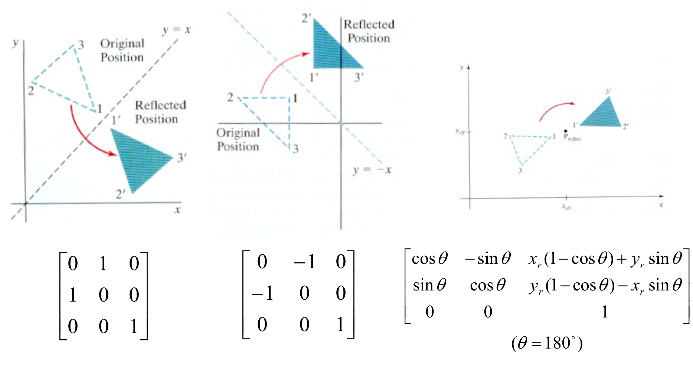

# Image Transformation (with Math Review)

- Topic
  - [Homogeneous coordinates](#homogeneous-coordinates-동차좌표계)
  - [2D transformations in homogeneous coordinates](#2d-transformations)
  - [3D transformations in homogeneous coordinates](#3d-transformations)

## Homogeneous Coordinates (동차좌표계)

### Conversion to/from **Cartesian coordinates**

### Invariant to scaling

Point in Cartesian is ray in homogeneous

### 기하 연산에서의 장점

투영 변환이 필요한 과정에서는 Homogeneous coordinates를 사용하지 않으면, 수학이 복잡해진다.

- 평행, 회전, 크기 변환을 공통의 행렬연산으로 구현 
  - 2차원 좌표 변환: 모두 3×3 **행렬 곱셈**으로 표현
  - 3차원 좌표 변환: 모두 4×4 **행렬 곱셈**으로 표현
- 최종 행렬 하나로서 전체 변환 적용
  - 중간 연산 결과를 이용할 필요 없음
  - 수많은 vertex에 대한 반복적인 그래픽 연산에서 효율적임
- 무한 지점의 좌표를 표현 가능
  - $h=0$인 경우

### Line/Point Duality

Line과 Point의 역할을 서로 바꾸어도 결과는 똑같다.

- Line equation: $ax+by+c=0$

$$
\mathbf{line}\_{i} = \begin{bmatrix}
        a_{i} \\ b_{i} \\ c_{i}
    \end{bmatrix}
$$

- Append 1 to pixel coordinate to get homogeneous coordinate

$$
\mathbf{p}\_{i} = \begin{bmatrix}
        u_{i} \\ v_{i} \\ 1
    \end{bmatrix}
$$

- Line given by cross product of two points
  - $\mathbf{line}\_{i} = \mathbf{p}\_{i} \times \mathbf{p}\_{j}$
- Intersection of two lines given by cross product of the lines
  - $\mathbf{q}\_{i} = \mathbf{line}\_{i} \times \mathbf{line}\_{j}$

## Vanishing Points and Lines

Parallel lines in the world intersect in the image at a "**vanishing point** (소실점)"

 
현실 세계에서는 평행한 두 선이, 사진 상에선 원근 효과에 의해 만나게 된다.

 
Vanishing Point들이 이루는 선을 Vanishing Line이라고 한다. (e.g., 수평선)

- Vanishing point = point at infinity
- Vanishing line = line at infinity
- Vanishing plane = plane at infinity

## 2D transformations

### 2D Translation

$$
\begin{bmatrix}
{x^{\prime}} \\ y^{\prime} \\ 1
\end{bmatrix} = \begin{bmatrix}
1 & 0 & -t_{x} \\
0 & 1 & t_{y} \\
0 & 0 & 1 \\
\end{bmatrix}
\begin{bmatrix}
x \\ y \\ 1
\end{bmatrix}
\Rightarrow
\mathbf{P}^{\prime} = \mathbf{T}(t_x, t_y) \cdot \mathbf{P}
$$

#### Inverse translation

$$
\begin{bmatrix}
x \\ y \\ 1
\end{bmatrix} =
\begin{bmatrix}
1 & 0 & -t_{x} \\
0 & 1 & -t_{y} \\
0 & 0 & 1 \\
\end{bmatrix}
\begin{bmatrix}
x^{\prime} \\ y^{\prime} \\ 1
\end{bmatrix}
\Rightarrow
\mathbf{T}^{-1} = \mathbf{T}(-t_x, -t_y)
$$

#### Composite translations (Commutative)

$$
\begin{bmatrix}
1 & 0 & t_{2x} \\
0 & 1 & t_{2y} \\
0 & 0 & 1 \\
\end{bmatrix}
\begin{bmatrix}
1 & 0 & t_{1x} \\
0 & 1 & t_{1y} \\
0 & 0 & 1 \\
\end{bmatrix} =
\begin{bmatrix}
1 & 0 & t_{1x} + t_{2x} \\
0 & 1 & t_{1y} + t_{2y} \\
0 & 0 & 1 \\
\end{bmatrix}
\Rightarrow
\mathbf{T}(t_{2x}, t_{2y}) \cdot \mathbf{T}(t_{1x}, t_{1y}) = \mathbf{T}(t_{1x} + t_{2x}, t_{1y} + t_{2y})
$$

 

### 2D Rotation

$$
\begin{bmatrix}
x^{\prime} \\ y^{\prime} \\ 1
\end{bmatrix} =
\begin{bmatrix}
\cos \theta & -\sin \theta & 0 \\
\sin \theta & \cos \theta & 0 \\
0 & 0 & 1 \\
\end{bmatrix}
\begin{bmatrix}
x \\ y \\ 1
\end{bmatrix}
\Rightarrow
\mathbf{P}^{\prime} = \mathbf{R}(\theta) \cdot \mathbf{P}
$$

#### Inverse rotation

$$
\begin{bmatrix}
x \\ y \\ 1
\end{bmatrix} =
\begin{bmatrix}
\cos \theta & \sin \theta & 0 \\
-\sin \theta & \cos \theta & 0 \\
0 & 0 & 1 \\
\end{bmatrix}
\begin{bmatrix}
x^{\prime} \\ y^{\prime} \\ 1
\end{bmatrix}
\Rightarrow
\mathbf{R}^{-1}(\theta) = \mathbf{R}(-\theta)
$$

#### Composite rotation (Commutative)

$$
\begin{bmatrix}
\cos \phi & -\sin \phi & 0 \\
\sin \phi & \cos \phi & 0 \\
0 & 0 & 1 \\
\end{bmatrix}
\begin{bmatrix}
\cos \theta & -\sin \theta & 0 \\
\sin \theta & \cos \theta & 0 \\
0 & 0 & 1 \\
\end{bmatrix} =
\begin{bmatrix}
\cos (\theta + \phi) & -\sin (\theta + \phi) & 0 \\
\sin (\theta + \phi) & \cos (\theta + \phi) & 0 \\
0 & 0 & 1 \\
\end{bmatrix}
\Rightarrow
\mathbf{R}(\phi) \cdot \mathbf{R}(\theta) = \mathbf{R}(\theta + \phi)
$$

 

### 2D Scaling

$$
\begin{bmatrix}
x^{\prime} \\ y^{\prime} \\ 1
\end{bmatrix} =
\begin{bmatrix}
s_{x} & 0 & 0 \\
0 & s_{y} & 0 \\
0 & 0 & 1 \\
\end{bmatrix}
\begin{bmatrix}
x \\ y \\ 1
\end{bmatrix}
\Rightarrow
\mathbf{P}^{\prime} = \mathbf{S}(s_{x}, s_{y}) \cdot \mathbf{P}
$$

#### Inverse scaling

$$
\begin{bmatrix}
x \\ y \\ 1
\end{bmatrix} =
\begin{bmatrix}
\frac{1}{s_{x}} & 0 & 0 \\
0 & \frac{1}{s_{y}} & 0 \\
0 & 0 & 1 \\
\end{bmatrix}
\begin{bmatrix}
x^{\prime} \\ y^{\prime} \\ 1
\end{bmatrix}
\Rightarrow
\mathbf{S}^{-1} = \mathbf{S}(\frac{1}{s_{x}}, \frac{1}{s_{y}})
$$

#### Composite scaling (Commutative)

$$
\begin{bmatrix}
s_{2x} & 0 & 0 \\
0 & s_{2y} & 0 \\
0 & 0 & 1 \\
\end{bmatrix}
\begin{bmatrix}
s_{1x} & 0 & 0 \\
0 & s_{1y} & 0 \\
0 & 0 & 1 \\
\end{bmatrix} =
\begin{bmatrix}
s_{1x} \cdot s_{2x} & 0 & 0 \\
0 & s_{1y} \cdot s_{2y} & 0 \\
0 & 0 & 1 \\
\end{bmatrix}
\Rightarrow
\mathbf{S}(s_{2x}, s_{2y}) \cdot \mathbf{S}(s_{1x}, s_{1y}) = \mathbf{S}(s_{1x} \cdot s_{2x}, s_{1y} \cdot s_{2y})
$$

 

### 2D Composite Transformation (1) - Rotation about a pivot point

#### Composite transformation matrix

### 2D Composite Transformation (2) - Scaling about a fixed-point

#### Composite transformation matrix

### Other Transformations - Reflection

### 2D Coordinate Transformations

(Cartesian 좌표계 기준)

- **T**ranslation (T)
  - $x^{\prime} = x + t$
- **E**ucledian (R+T)
  - $x^{\prime} = Rx + t$
- **S**imilarity (R+T+S)
  - $x^{\prime} = sRx + t$
- **A**ffine (원근을 포함하지 않는 임의의 변환)
  - $x^{\prime} = Ax + t$
- **P**rojective (원근을 포함하는 일반화된 임의의 변환)
  - $\underline{x}^{\prime} \cong H\underline{x}$
  - $\underline{x} = (x, y, 1)^{T}$
    - $\underline{x}$ is a homogeneous coordinate
- These all from a nested group
  - $T \subset E \subset S \subset A \subset P$

### Hierarchy of 2D Transformations

## 3D transformations

3차원 동차 좌표계를 이용한 평행 이동 표현

$$
\begin{bmatrix}
x^{\prime} \\ y^{\prime} \\ z^{\prime} \\ 1
\end{bmatrix} =
\begin{bmatrix}
1 & 0 & 0 & t_{x} \\
0 & 1 & 0 & t_{y} \\
0 & 0 & 1 & t_{z} \\
0 & 0 & 0 & 1 \\
\end{bmatrix}
\begin{bmatrix}
x \\ y \\ z \\ 1
\end{bmatrix}
\Rightarrow
\mathbf{P}^{\prime} = \mathbf{T}(t_{x}, t_{y}, t_{z}) \cdot \mathbf{P}
$$

 

### 3D Rotation about Z-axis

$$
\begin{bmatrix}
x^{\prime} \\ y^{\prime} \\ z^{\prime} \\ 1
\end{bmatrix} =
\begin{bmatrix}
\cos \theta & -\sin \theta & 0 & 0 \\
\sin \theta & \cos \theta & 0 & 0 \\
0 & 0 & 1 & 0 \\
0 & 0 & 0 & 1 \\
\end{bmatrix}
\begin{bmatrix}
x \\ y \\ z \\ 1
\end{bmatrix}
\Rightarrow
\mathbf{P}^{\prime} = \mathbf{R}_{\mathbf{z}}(\theta) \cdot \mathbf{P}
$$

- $z$ 좌표는 변함없고, $x, y$ 좌표만 회전 변환됨
- 반시계 회전 방향 = 양의 $\theta$ 방향

 

### 3D Rotation about X-axis, Y-axis

#### X-axis

$$
\begin{bmatrix}
x^{\prime} \\ y^{\prime} \\ z^{\prime} \\ 1
\end{bmatrix} =
\begin{bmatrix}
1 & 0 & 0 & 0 \\
0 & \cos \theta & -\sin \theta & 0 \\
0 & \sin \theta & \cos \theta & 0 \\
0 & 0 & 0 & 1 \\
\end{bmatrix}
\begin{bmatrix}
x \\ y \\ z \\ 1
\end{bmatrix}
\Rightarrow
\mathbf{P}^{\prime} = \mathbf{R}_{\mathbf{x}}(\theta) \cdot \mathbf{P}
$$

#### Y-axis

$$
\begin{bmatrix}
x^{\prime} \\ y^{\prime} \\ z^{\prime} \\ 1
\end{bmatrix} =
\begin{bmatrix}
\cos \theta & 0 & \sin \theta & 0 \\
0 & 1 & 0 & 0 \\
-\sin \theta & 0 & \cos \theta & 0 \\
0 & 0 & 0 & 1 \\
\end{bmatrix}
\begin{bmatrix}
x \\ y \\ z \\ 1
\end{bmatrix}
\Rightarrow
\mathbf{P}^{\prime} = \mathbf{R}_{\mathbf{Y}}(\theta) \cdot \mathbf{P}
$$

 

### 3D Scaling

- Simple scaling

$$
\begin{bmatrix}
x^{\prime} \\ y^{\prime} \\ z^{\prime} \\ 1
\end{bmatrix} =
\begin{bmatrix}
s_{x} & 0 & 0 & 0 \\
0 & s_{y} & 0 & 0 \\
0 & 0 & s_{z} & 0 \\
0 & 0 & 0 & 1 \\
\end{bmatrix}
\begin{bmatrix}
x \\ y \\ z \\ 1
\end{bmatrix}
\Rightarrow
\mathbf{P}^{\prime} = \mathbf{S}(s_{x}, s_{y}, s_{z}) \cdot \mathbf{P}
$$

### Other 3D Transformations - Reflection

### Hierachy of 3D Transformations

# References

1. 디지털영상처리설계 (ICE4027), 인하대학교 정보통신공학과 박인규
2. Digital Image Processing 4th Edition, Rafael C. Gonzalez and Richard E. Woods
3. [Computer Vision: Algorithms and Applications 2nd Edition, Richard Szeliski](https://szeliski.org/Book/)
4. [Vanishing point - Wikipedia](https://en.wikipedia.org/wiki/Vanishing_point)
5. [Image Processing - Image formation: Geometric primitives and transformations, Cosimo Distante](http://people.isasi.cnr.it/~c.distante/resources/EI/2.1Geometry.pdf)
