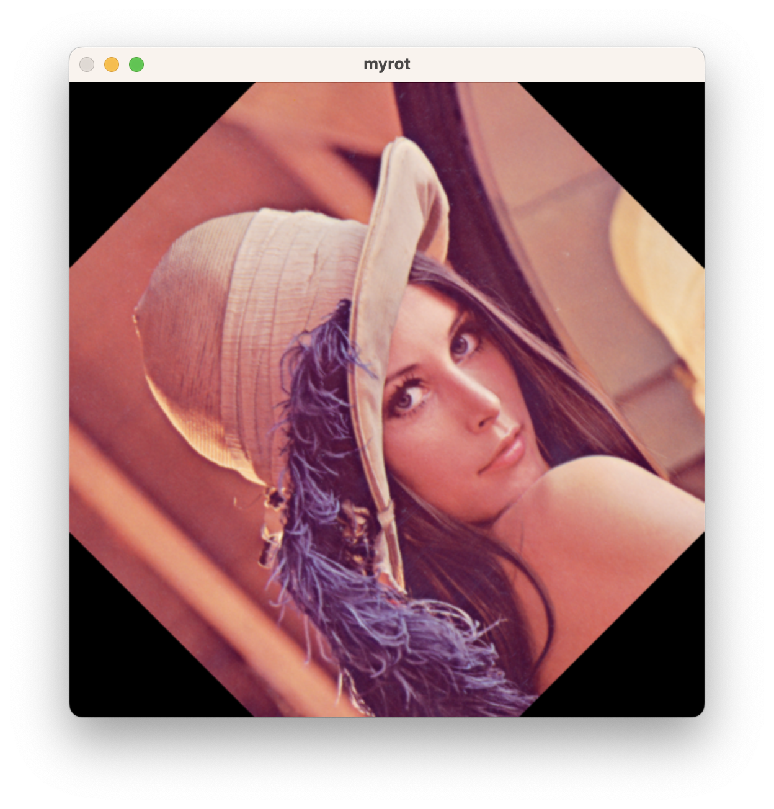
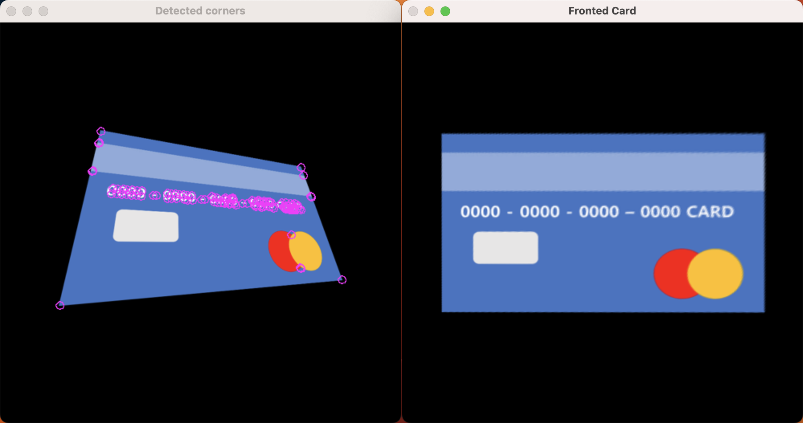

# Image Transformation

## 1. 개요

### 과제 1

- getRotationMatrix()과 동일한 getMyRotationMatrix() 함수를 직접 구현하고 두 결과가 동일한지 검증하라
- Scale 변화는 구현하지 않아도 됨
- 45도 변화 결과가 동일한지 비교하면 됨

### 과제2

- card_per.png 영상을 getPerspectiveTransform() 함수를 이용해 카드의 면이 시선정면을 향하도록 정렬시켜라.

## 2. 상세 설계 내용 및 결과

### 과제 1

#### (1) getMyRotationMatrix() 함수 구현

```cpp
Mat getMyRotationMatrix(Point center, double x, double y)
{
    double angle = x * CV_PI / 180.0;

    float mcos = cos(angle);
    float a = y * mcos;
    float msin = sin(angle);
    float b = y * msin;

    Mat matrix = (Mat_<float>(2, 3) << a, b, (1 - a) * center.x - b * center.y,
                  -b, a, b * (center.x) + (1 - a) * center.y);

    return matrix;
}
```

getMyRotationMatrix() 함수는 인자로 center, x, y를 받는다. center는 회전의 중심이 되는 점의 좌표이고, x는 회전할 각도이고, y는 확대/축소 비율이다. 이 함수는 회전 변환 행렬을 반환한다.

#### (2) myRotation() 함수 구현

```cpp
void myRotation()
{
    Mat src = imread("Lenna.png", 1);
    Mat dst, matrix;

    Point center = Point(src.cols / 2, src.rows / 2);
    matrix = getMyRotationMatrix(center, 45.0, 1.0);
    warpAffine(src, dst, matrix, src.size());

    imwrite("nonrot.jpg", src);
    imwrite("rot.jpg", dst);

    imshow("mynonrot", src);
    imshow("myrot", dst);
    waitKey(0);
}
```

myRotation() 함수는 getMyRotationMatrix() 함수를 이용하여 회전 변환 행렬을 구하고, warpAffine() 함수를 이용하여 회전 변환을 수행한다. 결과는 다음과 같다.



#### (3) getRotationMatrix()를 사용하는 cvRotation() 함수 구현

```cpp
void cvRotation()
{
    Mat src = imread("Lenna.png", 1);
    Mat dst, matrix;

    Point center = Point(src.cols / 2, src.rows / 2);
    matrix = cv::getRotationMatrix2D(center, 45.0, 1.0);
    warpAffine(src, dst, matrix, src.size());

    imwrite("nonrot.jpg", src);
    imwrite("rot.jpg", dst);

    imshow("nonrot", src);
    imshow("rot", dst);
    waitKey(0);

    destroyAllWindows();
}
```

cvRotation() 함수는 getRotationMatrix() 함수를 이용하여 회전 변환 행렬을 구하고, warpAffine() 함수를 이용하여 회전 변환을 수행한다. 결과는 다음과 같다.


#### (4) 결과 비교

두 함수를 이용하여 회전 변환을 수행한 결과가 동일하다는 것을 확인할 수 있다.

### 과제 2

#### (1) Corner 클래스 정의

```cpp
class Corner
{
public:
    int x, y;
};
```

Corner 클래스는 x, y 좌표를 가지는 클래스이다.

#### (2) cardPerspectiveTransform() 함수 구현

```cpp
void cardPerspectiveTransform()
{
    Mat src = imread("card_per.png", 1);

    Mat gray;
    cvtColor(src, gray, CV_BGR2GRAY); // 흑백 이미지로 변환

    Mat harr;
    cornerHarris(gray, harr, 2, 3, 0.06, BORDER_DEFAULT);        // Harris Corner 검출
    normalize(harr, harr, 0, 255, NORM_MINMAX, CV_32FC1, Mat()); // 정규화
    Mat harr_abs;
    convertScaleAbs(harr, harr_abs); // 절댓값으로 변환

    Corner corner[200]; // Corner 클래스의 객체 생성
    Point2f srcQuad[4]; // 원본 이미지의 카드 꼭짓점

    int i = 0;

    // Print corners
    int threshold = 113;
    Mat result = src.clone();
    for (int y = 0; y < harr.rows; y += 1)
    {
        for (int x = 0; x < harr.cols; x += 1)
        {
            if ((int)harr.at<float>(y, x) > threshold) // threshold 값보다 작다면
            {
                if ((int)harr.at<float>(y, x) > (int)harr.at<float>(y - 1, x) && // 같은 좌표에 여러개의 코너 감지를 방지
                    (int)harr.at<float>(y, x) > (int)harr.at<float>(y + 1, x) &&
                    (int)harr.at<float>(y, x) > (int)harr.at<float>(y, x - 1) &&
                    (int)harr.at<float>(y, x) > (int)harr.at<float>(y, x + 1))
                {
                    circle(result, Point(x, y), 5, Scalar(255, 0, 255), 0, 4, 0); // 코너부분을 원으로 표시
                    corner[i].x = x;                                              // 좌표를 corner클래스 배열에 추가
                    corner[i].y = y;
                    i++;
                }
            }
        }
    }
    imshow("Detected corners", result);

    int max_y = 0;
    int min_y = 0;

    // srcQuad[0] : 좌상단, srcQuad[1] : 우상단, srcQuad[2] : 좌하단, srcQuad[3] : 우하단

    // 좌상단 : x좌표가 가로 중앙값보다 작고 y좌표가 가장 작은 값
    for (int j = 0; j < i; j++)
    {
        if (j == 0)
            min_y = corner[j].y;
        if (min_y >= corner[j].y && harr.cols / 2 > corner[j].x)
        {
            min_y = corner[j].y;
            srcQuad[0] = Point2f(corner[j].x, corner[j].y); // y가 최솟값일 때 x,y 좌표 값을 srcQuad[0]으로 설정
        }
    }

    // 우상단 : x좌표가 가로 중앙값보다 크고 y좌표가 가장 작은 값
    for (int j = 0; j < i; j++)
    {
        if (j == 0)
            max_y = corner[j].y;
        if (max_y <= corner[j].y && harr.cols / 2 > corner[j].x)
        {
            max_y = corner[j].y;
            srcQuad[1] = Point2f(corner[j].x, corner[j].y); // y가 최댓값일 때 x, y좌표 값을 srcQuad[1]로 설정
        }
    }

    // 좌하단 : x좌표가 가로 중앙값보다 작고 y좌표가 가장 큰 값
    for (int j = i - 1; j >= 0; j--)
    {
        if (j == i - 1)
            min_y = corner[j].y;
        if (min_y >= corner[j].y && harr.cols / 2 <= corner[j].x)
        {
            min_y = corner[j].y;
            srcQuad[2] = Point2f(corner[j].x, corner[j].y); // y가 최솟값일 때 x, y좌표 값을 srcQuad[2]로 설정
        }
    }

    // 우하단 : x좌표가 가로 중앙값보다 크고 y좌표가 가장 큰 값
    for (int j = 0; j < i; j++)
    {
        if (j == 0)
            max_y = corner[j].y;
        if (max_y <= corner[j].y && harr.cols / 2 <= corner[j].x)
        {
            max_y = corner[j].y;
            srcQuad[3] = Point2f(corner[j].x, corner[j].y); // y가 최대일 때 x, y좌표 값을 srcQuad[3]로 설정
        }
    }

    Mat dst, matrix;
    Point2f dstQuad[4]; // dst 이미지의 카드 꼭짓점
    dstQuad[0] = Point2f(50, 140);
    dstQuad[1] = Point2f(50, 360);
    dstQuad[2] = Point2f(450, 140);
    dstQuad[3] = Point2f(450, 360);

    matrix = getPerspectiveTransform(srcQuad, dstQuad); // src가 dst의 위치로 대응됨
    warpPerspective(src, dst, matrix, src.size());      // src를 dst의 위치로 원근 변환

    imwrite("card_front.png", dst);

    imshow("Original Card", src);
    imshow("Fronted Card", dst);

    waitKey(0);
    destroyAllWindows();
}
```

cardPerspectiveTransform() 함수는 카드 이미지에서 **네 꼭지점을 자동으로 탐색하여** 원근 변환을 수행하는 함수이다. 이 함수는 다음과 같은 단계를 거쳐 실행된다:

1. 입력 이미지를 cvtColor() 함수를 사용하여 그레이스케일로 변환 후, 해리스 코너 검출 알고리즘을 적용하여. 카드의 모서리로 추정되는 코너를 식별한다.
2. 해리스 코너 응답값을 정규화하고 절댓값으로 변환하여 스케일을 조정한다.
3. 반복문으로 해리스 응답 이미지를 순회하면서, 특정 임계값보다 큰 응답값을 가진 코너를 찾으며, 코너가 해당 지역에서 지역 최댓값임을 확인한다.
4. 찾아낸 코너를 result 이미지 상에 원으로 표시합니다.
5. 가장 낮은 y-좌표와 가장 높은 y-좌표를 가지는 네 개의 코너를 각각 식별하여 원본 이미지 상의 카드 모서리 위치를 결정하고, srcQuad 배열에 저장한다.
6. getPerspectiveTransform() 함수를 사용하여 원근 변환 행렬을 계산한다.
7. 실제 원근 변환은 warpPerspective() 함수를 사용하여 수행한다.

요약하면, cardPerspectiveTransform() 함수는 해리스 코너 검출 알고리즘을 적용하여 이미지에서 카드의 모서리를 식별한다. 그런 다음, 원근 변환을 수행하여 카드의 앞면을 분리하여 별도의 이미지로 저장한다.

결과는 아래와 같다.


