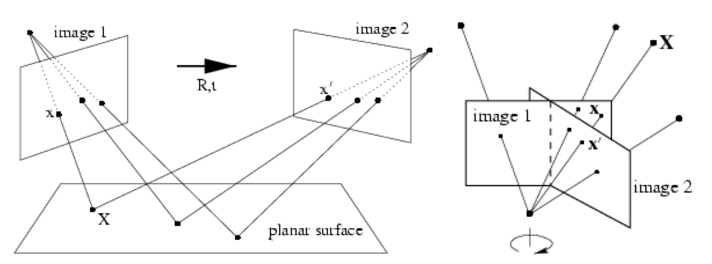

# Homography and Image Stitching (Panorama)

- Stitch together several images into a seamless composite
- Algorithm
  - Feature extraction (e.g., SIFT, Blob detector) & matching
  - [Robust **homography** estimation (RANSAC)](#robust-estimation-by-ransac)
  - [Image warping](#planar-panorama) + [blending](#image-blending)

## Image Alignment

Two broad approaches:

1. Direct (pixel-based) alignment
   - Search for alignment where most pixels agree
2. **Feature-based alignment**
   - Search for **2D transformation** where extracted features agree
   - Can be verified using pixel-based alignment

## Fitting an Affine Transformation

- How many matches (correspondence pairs) do we need to solve for the transformation parameters?
  - 최소 3 pairs (6/2)
- Once we have solved for the parameters, how do we compute the coordinates of the corresponding point for $(x_new, y_new)$?

## Fitting a Projective Transformation (**Homography**)

- A projective transformation is a mapping between any two PPs with the **same center of projection**
- Feature correspondence model = homography matrix $\mathbf{H}$
- Homography 행렬이 존재하는 경우
  1. 시점이 다른 두 카메라가 동일한 3차원 평면을 바라볼 때
  2. 카메라의 위치와 시점은 고정되어 있고, 바라보는 방향과 줌인만 바뀔 때

## Robust Estimation by RANSAC

- Intution: outlier is less than inlier, hence outlier will not get much support from the rest of point
- RANSAC algorithm
  1. **Randomly select** a seed group of points on which to base transformation estimate (e.g., a group of matches)
  2. **Compute transformation** from seed group
  3. **Find inliers** to this transformation
  4. **Repeat** steps 1-3 for n loop or until minimum n inlier is reached
  5. Keep the **transformation** that produce **largest number of inlier**

## Planar Panorama

- 동일한 공통 평면의 여러 이미지를, Image Stitching을 이용하여 공통 평면에 나타내는 파노라마 기법
- 공통 평면에 대한 투영 변환 행렬을 구하고, 이를 이용하여 이미지를 이동시키는 방식으로 구현
- 이 방법으로는 360 degree panorama를 구할 수 없음
  - [Cylindrical Panorama](#cylindrical-panorama) 혹은 [Spherical Panorama](#spherical-panorama) 방법을 사용해야 함

## Cylindrical Panorama

- level camera (좌우로 움직이는 카메라)를 사용하여 촬영한 이미지를 원기둥 면에 투영시킨 후, 이를 이용하여 파노라마를 구성하는 방법
- 원기둥 투영 방법을 사용하면, 이미지의 좌우가 연결되는 효과를 얻을 수 있음
- 과정
  - 

## Spherical Panorama

- 360 카메라를 이용하여 촬영한 이미지를 구면(spherical) 면에 투영시킨 후, 이를 이용하여 파노라마를 구성하는 방법
- 특징
  - 이미지의 상하가 왜곡됨
  - Spherical Image들을 Aligning할 때, Homography가 아닌 $\theta$를 **translation** 해야 함
- 과정
  - 

## Image Blending

- Image warping을 통해 이미지를 이동시킨 후, 이를 합성하는 과정
- 여러 개의 이미지를 단순히 합성하면, 이미지의 경계 부분에서 불연속성이 발생함
- 따라서 Image Blending 기술로 경계 부분을 부드럽게 합성해야 함

## Image Rectification using Homography

- Image Rectification이란 Homography를 이용하여 원근 왜곡을 없애고, 이미지를 평면으로 변환하는 과정이다.
- Rectify된 영상이 표시될 가상의 평면 (virtual plane)을 설정하고, 원하는 이미지를 가상의 평면에 투영시킨다.
- 이때, 같은 평면을 바라보지 않는 영역을 Rectification 한다면, 영상의 왜곡이 발생한다.
  - Homography는 동일한 평면을 바라보는 영상에 대해서만 적용 가능하기 때문
- 사용 예시
  - Video summarization and compression
  - Around view monitoring system (AVM)
  - Document scan and OCR

# References

1. 디지털영상처리설계 (ICE4027), 인하대학교 정보통신공학과 박인규
2. Digital Image Processing 4th Edition, Rafael C. Gonzalez and Richard E. Woods
3. [Computer Vision: Algorithms and Applications 2nd Edition, Richard Szeliski](https://szeliski.org/Book/)
