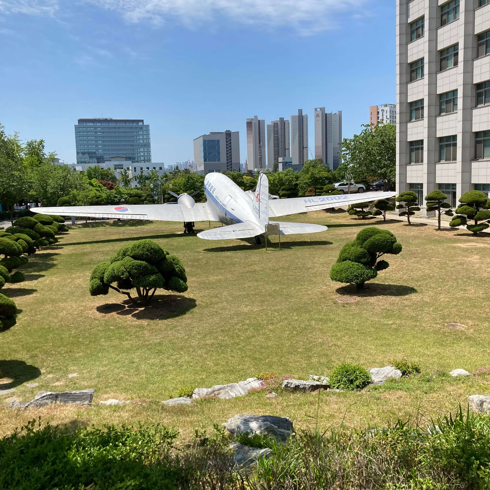
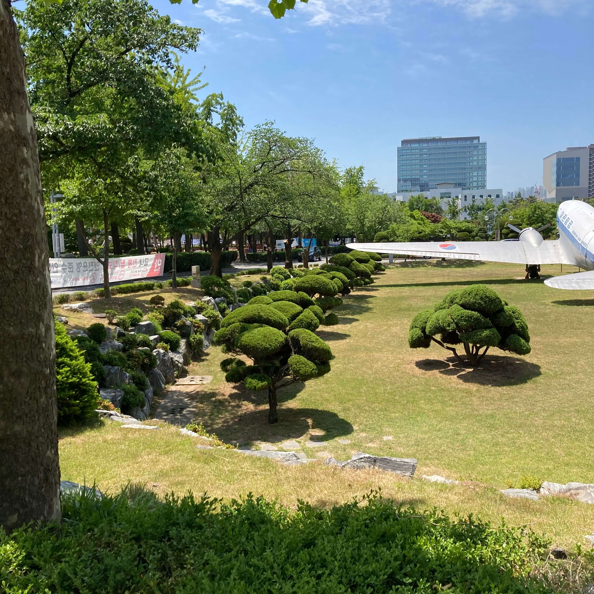
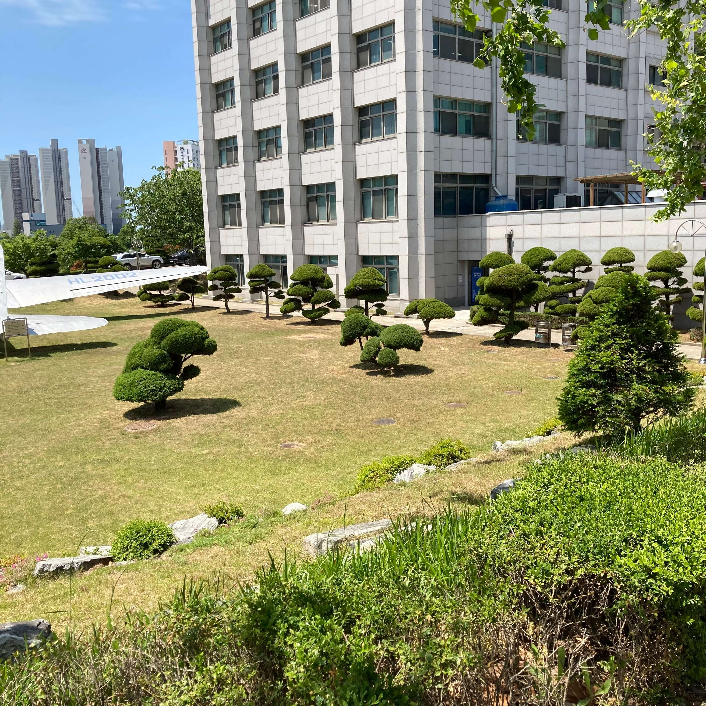
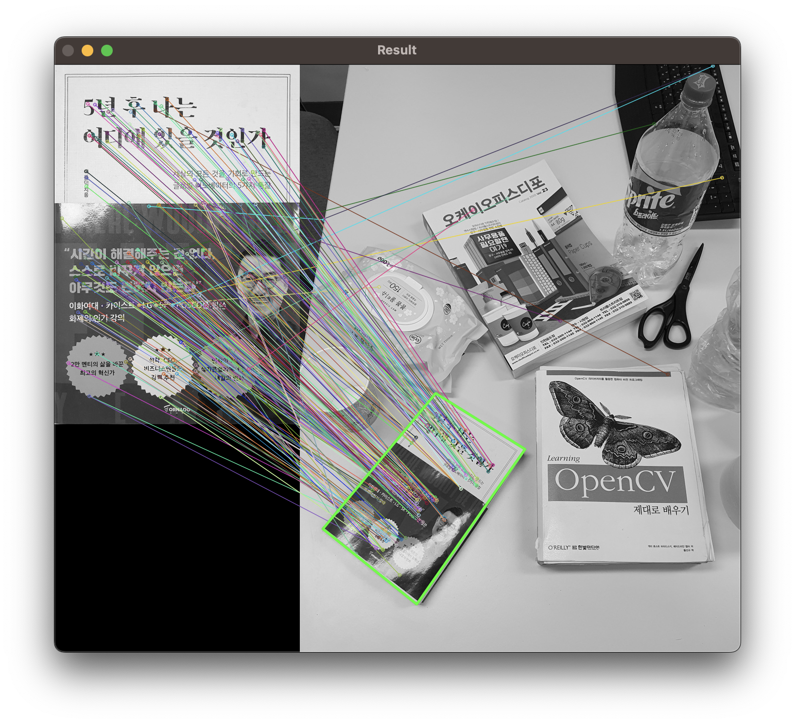
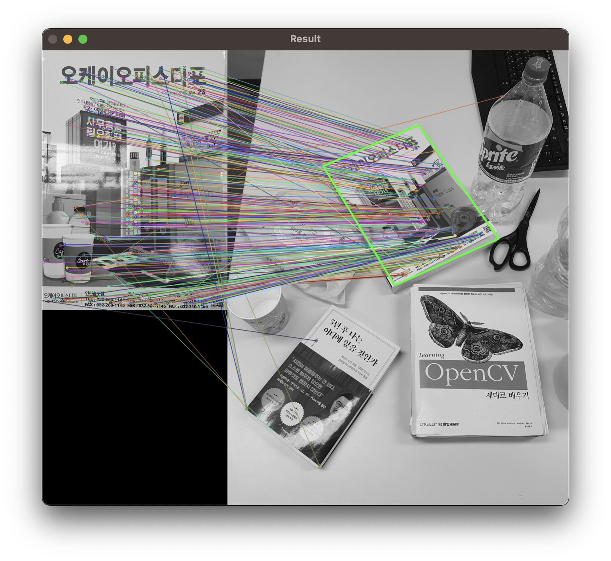
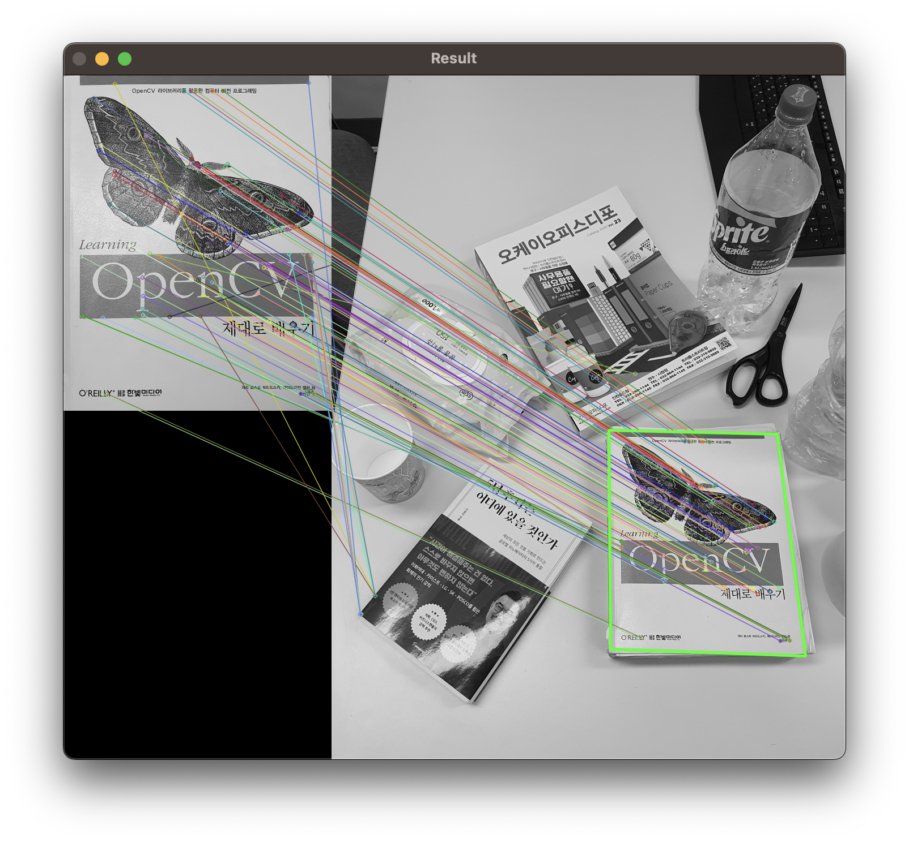

# Panorama Stitching

## 1. 개요

### HW1

- 직접 촬영한 영상 세 장으로 panorama stitching을 수행해볼 것
- OpenCV의 Stitcher를 이용하는 방법과 SURF 특징점과 기술자를 추출하여 brute force 매칭을 수행하는 방법을 각각 사용할 것
- Tip. 주변 대상이 적어도 5m 이상 떨어져 있고, 특징점이 많이 추출될 수 있는 장면에서 수행할 것

### HW2

- Book1.jpg, Book2.jpg, Book3.jpg가 주어졌을 때 Scene.jpg에서 각각의 책 이미지의 윤곽을 찾아 그려주는 프로그램을 구현할 것
- SIFT 특징점 추출, brute force 매칭, findHomograpy()를 사용해 구현할 것
- 상세한 코드 설명과 주석을 첨부할 것

## 2. 상세 설계 내용 및 결과

### HW1: Panorama Stitching

Panorama Stitching을 수행하기위해 준비한 사진은 아래와 같다.

<br>
<br>
<br>

먼저, OpenCV의 Stitcher를 이용하여 Panorama Stitching을 수행하는 방법을 살펴보자.

```cpp
// Stitcher를 이용한 파노라마 영상 생성
void cvPanorama()
{
    Mat img;
    vector<Mat> imgs;
    img = imread("img/img1.jpg", IMREAD_COLOR);
    imgs.push_back(img);
    img = imread("img/img2.jpg", IMREAD_COLOR);
    imgs.push_back(img);
    img = imread("img/img3.jpg", IMREAD_COLOR);
    imgs.push_back(img);

    Mat result;
    Ptr<Stitcher> stitcher = Stitcher::create(Stitcher::PANORAMA);
    Stitcher::Status status = stitcher->stitch(imgs, result);
    if (status != Stitcher::OK)
    {
        // 공통되는 영역이 너무 적으면 error code 1을 출력
        cout << "Can't stitch images, error code = " << int(status) << endl;
        exit(-1);
    }

    imshow("hw01_cvPanorama_result", result);
    waitKey();
    destroyAllWindows();
}
```

위 cvPanorama() 함수는 OpenCV의 Stitcher를 이용하여 Panorama Stitching을 수행하는 함수이다. Stitcher::create() 함수를 이용하여 Stitcher 객체를 생성하고, stitch() 함수를 이용하여 Stitching을 수행한다. Stitching이 완료되면 결과 영상을 출력한다.

출력된 결과는 아래와 같다.


다음으로, SURF 특징점과 기술자를 추출하여 brute force 매칭을 수행하는 방법을 살펴보자.

```cpp
Mat makePanorama(Mat img_l, Mat img_r, int thresh_dist, int min_matches)
{
    // [ SURF 특징점 (feature) 추출 ]

    // < Grayscale로 변환 >
    Mat img_gray_l, img_gray_r;
    cvtColor(img_l, img_gray_l, CV_BGR2GRAY);
    cvtColor(img_r, img_gray_r, CV_BGR2GRAY);

    // < 특징점 (key point) 추출 >
    Ptr<SurfFeatureDetector> Detector = SURF::create(300);
    vector<KeyPoint> kpts_obj, kpts_scene;
    Detector->detect(img_gray_l, kpts_obj);
    Detector->detect(img_gray_r, kpts_scene);

    // < 특징점 시각화 >
    Mat img_kpts_l, img_kpts_r;
    drawKeypoints(img_gray_l, kpts_obj, img_kpts_l,
                  Scalar::all(-1), DrawMatchesFlags::DEFAULT);
    drawKeypoints(img_gray_r, kpts_scene, img_kpts_r,
                  Scalar::all(-1), DrawMatchesFlags::DEFAULT);

    // [ 기술자 (descriptor) 추출 및 brute force 매칭 ]

    // < 기술자 (descriptor) 추출 >
    Ptr<SurfDescriptorExtractor> Extractor =
        SURF::create(100, 4, 3, false, true);
    Mat img_dst_obj, img_dst_scene;
    Extractor->compute(img_gray_l, kpts_obj, img_dst_obj);
    Extractor->compute(img_gray_r, kpts_scene, img_dst_scene);

    // < 기술자를 이용한 특징점 매칭 >
    BFMatcher matcher(NORM_L2);
    vector<DMatch> matches;
    matcher.match(img_dst_obj, img_dst_scene, matches);

    // < 매칭 결과 시각화 >
    Mat img_matches;
    drawMatches(img_gray_l, kpts_obj, img_gray_r, kpts_scene,
                matches, img_matches, Scalar::all(-1), Scalar::all(-1),
                vector<char>(), DrawMatchesFlags::NOT_DRAW_SINGLE_POINTS);

    // [ 매칭 결과 정제 ]

    // 매칭 거리가 작은 우수한 매칭 결과를 정제하는 과정
    // 최소 매칭 거리의 3배 또는 우수한 매칭 결과 60 이상까지 정제
    double dist_max = matches[0].distance;
    double dist_min = matches[0].distance;
    double dist;
    for (int i = 0; i < img_dst_obj.rows; i++)
    {
        dist = matches[i].distance;
        if (dist < dist_min)
            dist_min = dist;
        if (dist > dist_max)
            dist_max = dist;
    }
    printf("max_dist : %f\n", dist_max); // max는 사실상 불필요
    printf("min_dist : %f\n", dist_min);

    vector<DMatch> matches_good;
    do
    {
        vector<DMatch> good_matches2;
        for (int i = 0; i < img_dst_obj.rows; i++)
        {
            if (matches[i].distance < thresh_dist * dist_min)
                good_matches2.push_back(matches[i]);
        }
        matches_good = good_matches2;
        thresh_dist -= 1;
    } while (thresh_dist != 2 && matches_good.size() > min_matches);

    // < 우수한 매칭 결과 시각화 >
    Mat img_matches_good;
    drawMatches(img_gray_l, kpts_obj, img_gray_r, kpts_scene,
                matches_good, img_matches_good, Scalar::all(-1), Scalar::all(-1),
                vector<char>(), DrawMatchesFlags::NOT_DRAW_SINGLE_POINTS);

    // [ Homography 행렬 추출 및 시점 역 변환]

    // < 매칭 결과 좌표 추출 >
    vector<Point2f> obj, scene;
    for (int i = 0; i < matches_good.size(); i++)
    {
        obj.push_back(kpts_obj[matches_good[i].queryIdx].pt);     // img1
        scene.push_back(kpts_scene[matches_good[i].trainIdx].pt); // img2
    }

    // < 매칭 결과로부터 homography 행렬을 추출 >
    Mat mat_homo = findHomography(scene, obj, RANSAC);
    // 이상치 제거를 위해 RANSAN 추가

    // < Homography 행렬을 이용해 시점 역변환 >
    Mat img_result;
    warpPerspective(img_r, img_result, mat_homo,
                    Size(img_l.cols * 2, img_l.rows * 1.2),
                    INTER_CUBIC);
    // 영상이 잘리는 것을 방지하기 위해 여유 공간을 부여

    // [ 기준 영상과 역변환된 시점 영상 합체 (stitching) ]
    Mat img_pano;
    img_pano = img_result.clone();
    Mat roi(img_pano, Rect(0, 0, img_l.cols, img_l.rows));
    img_l.copyTo(roi);

    // < 검은 여백 잘라내기 >
    int cut_x = 0, cut_y = 0;
    for (int y = 0; y < img_pano.rows; y++)
    {
        for (int x = 0; x < img_pano.cols; x++)
        {
            if (img_pano.at<Vec3b>(y, x)[0] == 0 &&
                img_pano.at<Vec3b>(y, x)[1] == 0 &&
                img_pano.at<Vec3b>(y, x)[2] == 0)
            {
                continue;
            }
            if (cut_x < x)
                cut_x = x;
            if (cut_y < y)
                cut_y = y;
        }
    }

    Mat img_pano_cut;
    img_pano_cut = img_pano(Range(0, cut_y), Range(0, cut_x));

    return img_pano_cut;
}
```

위 makePanorama 함수는 SURF 특징점 및 기술자 (descriptor)를 추출하고 brute force 매칭하여, 결과를 정제한 뒤, Homography 행렬 추출 및 시점 역 변환을 거친 후, 기준 영상과 역변환된 시점 영상을 합체하는 과정을 거친다.

```cpp
void myPanorama()
{
    Mat matImg1 = imread("img/img1.jpg", IMREAD_COLOR);
    Mat matImg2 = imread("img/img2.jpg", IMREAD_COLOR);
    Mat matImg3 = imread("img/img3.jpg", IMREAD_COLOR);
    if (matImg1.empty() || matImg2.empty() || matImg3.empty())
        exit(-1);

    Mat result;
    flip(matImg1, matImg1, 1);
    flip(matImg2, matImg2, 1);
    result = makePanorama(matImg1, matImg2, 3, 60);
    flip(result, result, 1);
    result = makePanorama(result, matImg3, 3, 60);

    imshow("hw01_myPanorama_result", result);
    // imwrite("result/hw01_myPanorama_result.png", result);
    waitKey();
    destroyAllWindows();
}
```

다음으로 위 myPanorama 함수는 makePanorama 함수를 이용하여, 3장의 영상을 합체하는 과정을 거친다.

파노라마의 결과는 아래와 같다.


두 가지 방법으로 Panoarama를 구현하였는데, 두 방법의 결과는 서로 다르다.

OpenCV의 Stitcher를 이용한 결과는 세 사진이 자연스럽게 블렌딩되어 이어지는 반면, 직접 구현한 결과는 세 사진이 뚜렷하게 구분되어 이어지는 것을 볼 수 있다.

또한, OpenCV의 Stitcher를 이용한 파노라마의 결과는 검은 여백이 거의 없는 반면, 직접 구현한 결과는 검은 여백이 눈에 띄게 존재한다. 그리고 직접 구현한 결과의 경우, Stitcher를 이용한 결과보다 실행 속도가 현저히 느렸다.

하지만, 직접 구현한 방법의 경우, Stitcher를 이용한 방법보다 세 사진 사이의 왜곡이 적어 현실적인 결과를 보여준다고 생각된다.

이러한 차이들은 Stitcher의 내부 알고리즘과, 직접 구현한 방법의 차이에서 비롯된다고 생각된다.

### HW2: Finding Book

```cpp
void findBook(Mat book, int threshDist, int minMatches)
{
    // [ SIFT 특징점 (feature) 추출 ]

    Mat scene = imread("img/scene.jpg", 1);

    // < Grayscale로 변환 >
    Mat sceneGray, imgGray;
    cvtColor(scene, sceneGray, CV_BGR2GRAY);
    cvtColor(book, imgGray, CV_BGR2GRAY);

    // < SIFT를 이용한 특징점 (key point) 추출 >
    Ptr<SiftFeatureDetector> detector = SiftFeatureDetector::create();
    std::vector<KeyPoint> sceneKeypoints, imgKeypoints;
    detector->detect(sceneGray, sceneKeypoints); // scene에서 keypoints 감지
    detector->detect(imgGray, imgKeypoints);     // book에서 keypoints 감지

    // [ SIFT를 이용한 기술자 (descriptor) 추출 및 brute force 매칭 ]

    // < 기술자 (descriptor) 추출 >
    Ptr<SiftDescriptorExtractor> Extractor = SIFT::create(100, 4, 3, false, true);
    Mat imgDscBook, imgDscScene;
    Extractor->compute(imgGray, imgKeypoints, imgDscBook);
    Extractor->compute(sceneGray, sceneKeypoints, imgDscScene);

    // < 기술자를 이용한 특징점 매칭 >
    BFMatcher matcher(NORM_L2); // 거리 측정 시, L2 distance를 사용
    vector<DMatch> matches;
    matcher.match(imgDscBook, imgDscScene, matches);

    // < 매칭 결과 시각화 >
    Mat img_matches;
    drawMatches(imgGray, imgKeypoints, sceneGray, sceneKeypoints, matches, img_matches, Scalar::all(-1),
                Scalar::all(-1), vector<char>(), DrawMatchesFlags::NOT_DRAW_SINGLE_POINTS);

    // [ 매칭 결과 정제 ]

    // 매칭 거리가 작은 우수한 매칭 결과를 정제하는 과정
    // 최소 매칭 거리의 3배 또는 우수한 매칭 결과 60 이상까지 정제
    double maxDist = matches[0].distance; // distance는 기술자 간의 거리
    double minDist = matches[0].distance;
    double dist;

    // 가장 작은 매칭 거리 찾기
    for (int i = 0; i < imgDscBook.rows; i++)
    {
        dist = matches[i].distance;
        if (dist < minDist)
            minDist = dist;
        if (dist > maxDist)
            maxDist = dist; // max는 사실상 불필요
    }
    printf("maxDist : %f\n", maxDist);
    printf("minDist : %f\n", minDist);

    // < 우수한 매칭 결과 찾기 >
    vector<DMatch> goodMatches;
    do
    {
        vector<DMatch> goodMatches2;
        for (int i = 0; i < imgDscBook.rows; i++)
        {
            if (matches[i].distance < threshDist * minDist) // 최소매칭결과의 3배보다 작으면
                goodMatches2.push_back(matches[i]);         // 우수 매칭 결과
        }
        goodMatches = goodMatches2;
        threshDist -= 1;
    } while (threshDist != 2 && goodMatches.size() > minMatches); // 우수 매칭 결과 60이상이 될때까지

    // < 우수한 매칭 결과 시각화 >
    Mat imgMatchesGood;
    drawMatches(imgGray, imgKeypoints, sceneGray, sceneKeypoints, goodMatches, imgMatchesGood,
                Scalar::all(-1), Scalar::all(-1), vector<char>(), DrawMatchesFlags::NOT_DRAW_SINGLE_POINTS);

    // [ Homography 행렬 추출 및 시점 역 변환]

    // < 매칭 결과 좌표 추출 >
    vector<Point2f> b, s;
    for (int i = 0; i < goodMatches.size(); i++)
    {
        b.push_back(imgKeypoints[goodMatches[i].queryIdx].pt);   // book 기술자리스트에 저장된 인덱스의 좌표
        s.push_back(sceneKeypoints[goodMatches[i].trainIdx].pt); // scene 기술자리스트에 저장된 인덱스 좌표
    }

    // < 매칭 결과로부터 homography 행렬을 추출 >
    Mat homographyMatrix = findHomography(b, s, RANSAC);
    // 이상치 제거를 위해 RANSAC추가

    // < imgGray 이미지 꼭짓점을 corner1에 넣고 homography 행렬에 따라 투시변환 >
    vector<Point2f> imgCorners, sceneCorners;
    imgCorners.push_back(Point2f(0, 0));
    imgCorners.push_back(Point2f(imgGray.cols - 1, 0));
    imgCorners.push_back(Point2f(imgGray.cols - 1, imgGray.rows - 1));
    imgCorners.push_back(Point2f(0, imgGray.rows - 1));
    perspectiveTransform(imgCorners, sceneCorners, homographyMatrix);

    // < homography로 변환된 코너를 dstCorners에 대입 >
    vector<Point> dstCorners;
    for (Point2f pt : sceneCorners)
        dstCorners.push_back(Point(cvRound(pt.x + imgGray.cols), cvRound(pt.y)));

    // < dstCorners로부터 책의 윤곽 그리기 >
    polylines(imgMatchesGood, dstCorners, true, Scalar(0, 255, 0), 4, LINE_AA);

    // 결과 출력 및 저장
    imshow("Result", imgMatchesGood);

    waitKey(0);
    destroyAllWindows();
}
```

findBook 함수는 책의 표지를 찾아내는 함수이다. 이 함수는 책의 표지를 찾아내는 과정을 담고 있다. 이 함수는 다음과 같은 과정을 거친다.

1. 책의 표지를 찾기 위해 책의 표지를 찾아내고자 하는 이미지와 책의 표지 이미지를 불러온다.
2. 책의 표지를 찾아내고자 하는 이미지와 책의 표지 이미지를 흑백으로 변환하고, 특징점을 추출하여 매칭한다.
3. 매칭 결과를 정제한다.
4. 정제된 매칭 결과로부터 Homography 행렬을 추출한다.
5. Homography 행렬을 이용하여 책의 표지를 찾아낸다.
6. 책의 표지를 찾아낸 결과를 출력한다.

```cpp
int main()
{
    Mat book1 = imread("img/Book1.jpg", IMREAD_COLOR);
    Mat book2 = imread("img/Book2.jpg", IMREAD_COLOR);
    Mat book3 = imread("img/Book3.jpg", IMREAD_COLOR);
    findBook(book1);
    findBook(book2);
    findBook(book3);
    return 0;
}
```

위와 같이 main 함수를 구성했을 때, 다음과 같은 결과를 얻을 수 있다.

<br>
<br>
<br>

확인 결과, 책의 표지를 찾아내는데 성공하였다.
