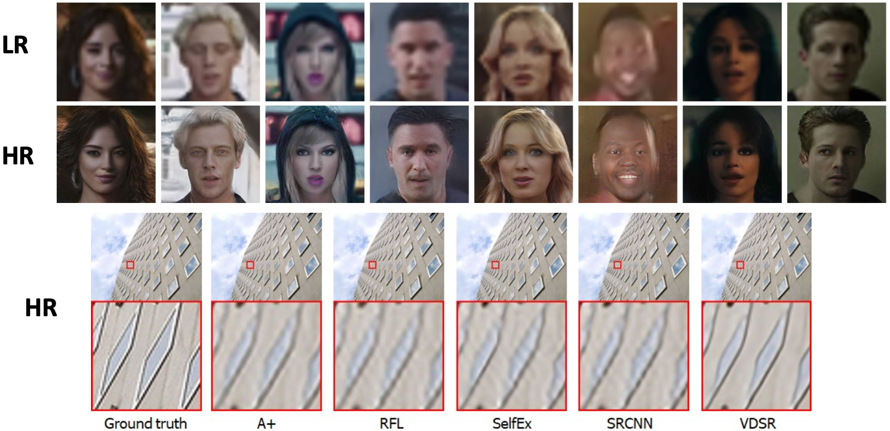
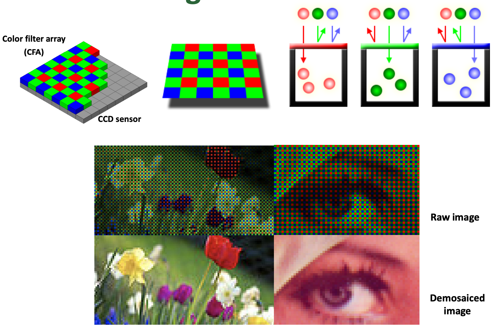

# Computational Photography

- Topics
  - [High Dynamic Range (HDR)](#dynamic-range)
  - [Super-resolution](#super-resolution)
  - Denoising
  - [Demosaicing](#demosaicing)
  - [Blur removal](#image-deblurring)
    - motion blur or defocus blur
  - Image matting and compositing
  - Inpainting
  - Reflection removal
  - Video stabilization

## Image Sensing Pipeline

 

## The Ultimate Camera

- Ideal camera with
  - Infinite resolution
  - Infinite zoom control
  - Desired object(s) are in focus
  - No noise
  - No motion blur
    - Shutter speed is $\frac{1}{\infin}$
  - Infinite dynamic range (can seek dark and bright things simultaneously)
- But there is no such a camera
  - 사실 어느 하나도 만족할 수 없음
  - That's why "_computational camera_(HW) and **computational photography**(SW)" is important

## Camera Calibration

- Geometric Calibration (기하학적 보정)
- Photometric Calibration (광학적 보정)
  - To recover **camera response function** from measurement
  - 

### Photometric Calibration Method

1. Integrating sphere
2. Macbeth color checker chart
3. **Multiple images with different exposure times**

## Dynamic Range

- Problem
  - The real-world brightness has high dynamic range
  - Typical camera has limited dynamic range
- What can we do?
  - Solution: **merge multiple images with different exposure times**

### HDR (High Dynamic Range)

- Before HDR
  

 

- After HDR
  

### But

- Camera is not a Photometer
  - **Limited dynamic range**
    - Use multiple exposures?
  - Unknown, **non-linear response**
    - Not possible to convert pixel values to radiance
- Solution
  - Recover response curve from **multiple exposures**, then reconstruct the **radiance map**

## Imaging System Response Function

$$\log \mathbf{Exposure} = \log \left( \mathbf{Radiance} \times \Delta \mathbf{t} \right) = \log \mathbf{Radiance} + \log \Delta \mathbf{t}$$

$$\left(\textbf{Pixel Value} \ Z = f \left( \mathbf{Exposure} \right) \right)$$
$$\left( \mathbf{Exposure} = \mathbf{Radiance} \times \Delta \mathbf{t} \right)$$

### Radiance and Response curve Estimation

- Let $g(z)$ be the discrete inverse response function
- For each pixel position $i$ in each image $j$, we want
  $$\log \mathbf{Radiance_{i}} + \log \Delta t_{j} = g \left( Z_{ij} \right)$$
- Solve the over-determined linear system:
  $$\sum^{N}\_{i=1} \sum^{P}\_{j=1} \left( \log \mathbf{Radiance_{i}} + \log \Delta t_{j} - g \left( Z_{ij} \right) \right)\_{i} + \lambda \sum^{Z_{\max}}\_{z=Z_{\min}} g^{\prime \prime} \left( z \right)^{2}$$

### Tone Mapping

- Linear Scaling을 하면 문제가 생김.
  - Brightness가 너무 낮아짐

#### Solution: Simple Global Operator (Non-linear)

- Compression curve needs to
  - Bring everything within range
  - Leave dark areas alone
    - 어두운 부분을 디테일하게 표현해야 함
- In other words
  - Asymptote at 255
  - Derivative (slope) is 1 at 0

$$ L*{display} = \frac{L*{world}}{1 + L\_{world}}$$

## Super-resolution

- Build high-resolution image from low-resolution one

## Demosaicing

## Image Deblurring

# References

1. 디지털영상처리설계 (ICE4027), 인하대학교 정보통신공학과 박인규
2. Digital Image Processing 4th Edition, Rafael C. Gonzalez and Richard E. Woods
3. [Computer Vision: Algorithms and Applications 2nd Edition, Richard Szeliski](https://szeliski.org/Book/)
